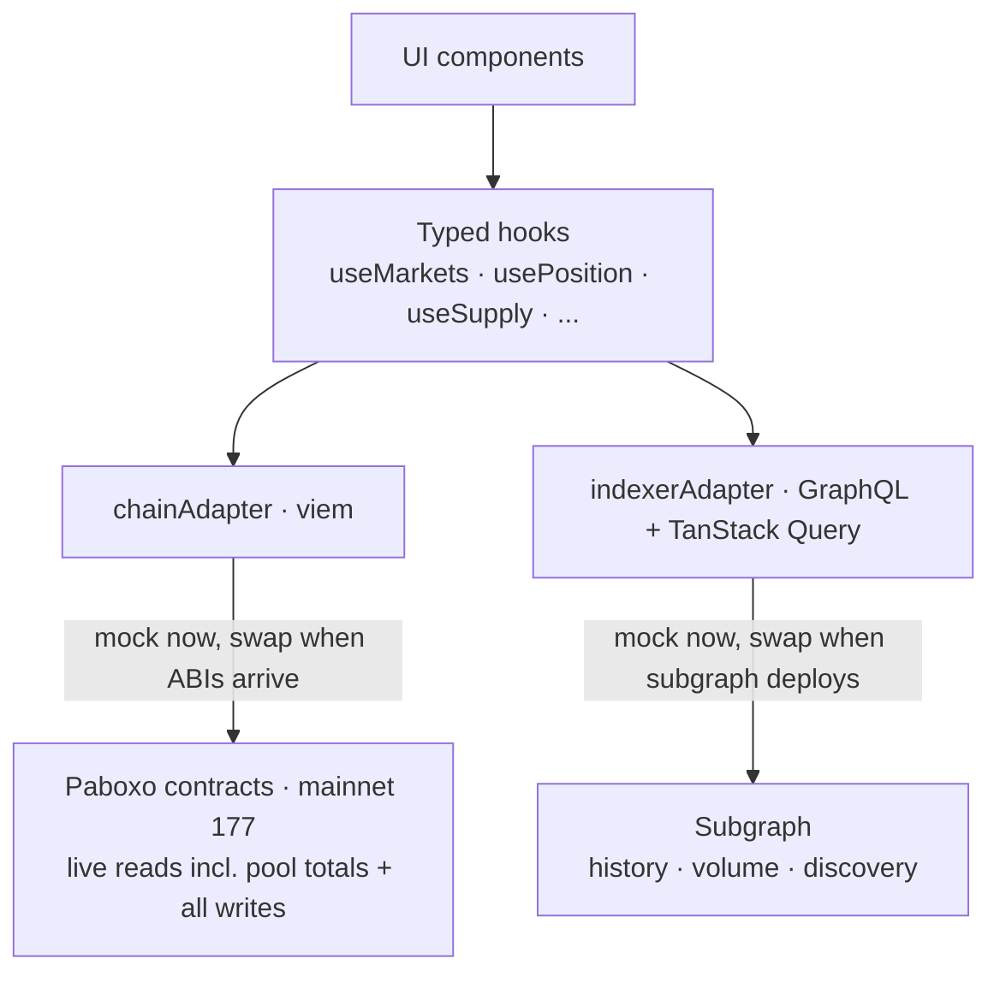
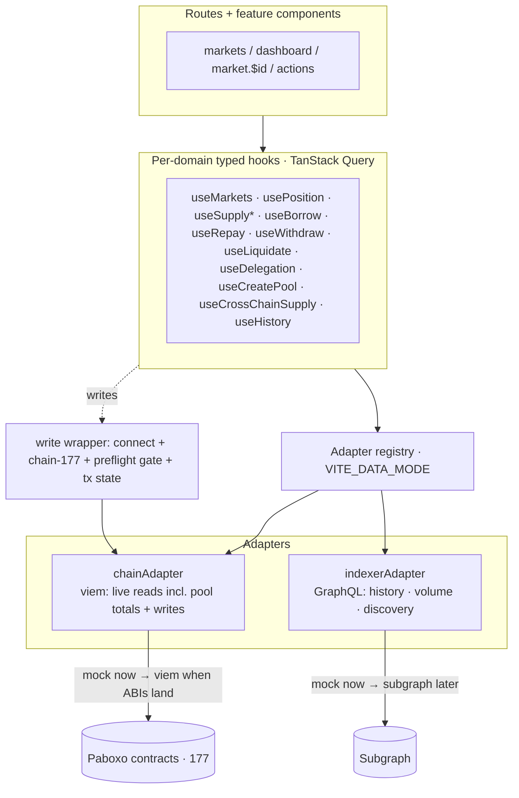

# Paboxo Frontend Integration - Plan

## Goal Capsule

- **Objective:** Build the frontend dApp that drives the Paboxo money market on HashKey Chain mainnet (177), covering every user action, on a swappable data layer — starting from a thin technical foundation so UI builds against stable hooks and real data wires in later.
- **Product authority:** ahmadzz (owner of this frontend).
- **Open blockers (external, not FE code):**
  - ABIs provided by the user after contract (re)deploy — until then no real on-chain wiring.
  - Indexer/subgraph not yet deployed — indexer reads mocked until then.
  - `PaboxoCCIPSender` must be deployed on Base for the cross-chain flow.

## Product Contract

### Summary

A full Paboxo money-market frontend on the existing TanStack Start scaffold: supply, borrow, repay, withdraw, liquidate, delegation, pool creation, and cross-chain supply from Base. Data flows through two adapters behind stable typed hooks — a contract adapter (viem) for every value a write reverts on plus all writes, and a GraphQL indexer adapter for transaction history, cumulative volume, and discovery. Both adapters ship mock-backed and swap to real (viem / subgraph) behind the hooks with no UI change; because ABIs and the subgraph arrive on different timelines, the interim window is handled explicitly.

### Problem Frame

The repository is currently a bare TanStack Start scaffold (React 19, TanStack Router, Tailwind 4) with no Web3 code — no wallet connect, no contract calls, only `index` and `about` routes. The Paboxo contracts are already live on mainnet 177, but the pieces the frontend would read from arrive on different timelines: ABIs come from the user after deploy, and the indexer/subgraph does not exist yet. The build must therefore progress without either real data source present, then absorb them behind a seam when they land — otherwise UI work stalls waiting on infrastructure, or gets rewritten when it arrives.

### Key Decisions

- **Two-adapter data seam behind typed hooks.** A `chainAdapter` (contract reads + writes via viem) and an `indexerAdapter` (GraphQL over TanStack Query) sit behind stable hooks (`useMarkets`, `usePosition`, `useSupply`, …). UI depends only on the hooks; swapping mock → real happens inside the adapters with no UI change.
- **Both adapters start mocked; they swap on independent timelines.** ABIs arrive first (enabling the real `chainAdapter`), the subgraph later (enabling the real `indexerAdapter`). During the interim window — `chainAdapter` live, `indexerAdapter` still mock — indexer-backed surfaces are handled explicitly so a real write is never contradicted by stale mock data (see R29).
- **Read every value the target write reverts on, live from the contract; use the indexer only for event-derivable data.** All transaction-critical values (health, max-borrow, current debt, allowances, price freshness, available pool liquidity, mint-≥1-share, swap slippage) are read live from the contract (router RPC) at action time — the indexer may lag and never gates a write. Live pool totals (TVL, utilization) are also RPC-sourced because they are not in events. The indexer serves transaction history, cumulative volume, and market discovery only.
- **ABIs and addresses are injected configuration, not hardcoded logic.** Contracts may be redeployed (ABIs supplied post-deploy, addresses can change). Logic reads them from config so a redeploy is a config swap, not a code edit.
- **Markets hardcoded to the four known pools until the indexer lands.** There is no on-chain pool list; dynamic discovery is deferred. A pool a user creates (R25) is reached directly by its creator until discovery exists.
- **Stack: wagmi v3 + viem, wallet connection via Reown AppKit, indexer fetch via GraphQL + TanStack Query** (mutations, caching, invalidation).
- **Build sequence: thin technical foundation first.** Providers, wallet connect, and the adapter seam with mock-backed hooks come first; UI builds against those stable hooks; real ABI/indexer wiring slots in behind the hooks last.

### Actors

- A1. **Lender** — supplies borrow-token liquidity, holds supply shares, withdraws liquidity.
- A2. **Borrower** — supplies collateral, borrows pxUSDT, repays, withdraws collateral.
- A3. **Liquidator** — repays an unhealthy borrower's debt and seizes collateral (permissionless).
- A4. **Delegator / Delegate** — grants and exercises borrow or withdraw rights on another user's position.
- A5. **Cross-chain supplier** — supplies into a HashKey pool from Base via CCIP.
- A6. **Pool creator** — creates a new lending pool and seeds its initial liquidity.

### Requirements

**Foundation & data seam**

- R1. The app uses wagmi v3 + viem for chain access and Reown AppKit for wallet connection, integrated with the existing TanStack Start / React 19 setup.
- R2. All protocol data is accessed through stable typed hooks backed by two adapters — `chainAdapter` (contract reads/writes via viem) and `indexerAdapter` (GraphQL via TanStack Query). UI components never call an adapter or the chain directly.
- R3. Contract addresses and ABIs are supplied as injected configuration; no address or ABI is hardcoded inside business logic.
- R4. `indexerAdapter` ships mock-backed and is swappable to the real GraphQL subgraph with no change to hooks or UI.
- R5. `chainAdapter` also ships mock-backed until ABIs are supplied, then swaps to live viem reads/writes with no change to hooks or UI.
- R6. The market set is hardcoded to the four known pools (pxWHSK, pxWBTC, pxWETH, cross-chain pxWHSK — all borrow pxUSDT) until indexer-driven discovery exists; a pool created via R25 is reachable directly by its creator until discovery lands.
- R7. The two-address rule is honored: writes and `HelperUtils.*` target the `LendingPool`; `IsHealthy.*`, `InterestRateModel.*`, and accounting-state reads target the `router` (= `LendingPool.router()`).
- R8. Token decimals are read per token via `decimals()`, never hardcoded (pxUSDT 6, others 18/8).

**Live pre-flight reads (from contract)**

- R9. Before any write, the FE reads every value that write reverts on — live from the contract (router RPC), never from the indexer — and disables/blocks the action when a check fails. The set covers: health (`IsHealthy.checkLiquidatable`), max-borrow (`HelperUtils.getMaxBorrowAmount`), current debt (see Appendix formula), ERC20 and delegation allowances, price freshness (`TokenDataStream.latestRoundData` `updatedAt`), available pool liquidity (`totalSupplyAssets − totalBorrowAssets`, for borrow/withdraw), a non-zero supply amount that mints ≥1 share (initial-liquidity minimum applies only when the pool is empty), and `amountOutMinimum`/slippage for repay swap modes.
- R10. When a price feed a value depends on is older than 1h, the FE blocks the dependent action (the feed reverts past 1h). A near-stale grace window may warn-only, but past 1h is a hard block.

**Read & display surfaces**

- R11. A market view shows per-market borrow APY (from `InterestRateModel`), derived supply APY, utilization, and prices.
- R12. A user dashboard shows supply-share balance and value, collateral, borrow position with current debt, health/liquidatable status, and max-borrow.
- R13. Live pool totals (TVL, utilization, current pool state) are read from the `chainAdapter` (router RPC); the `indexerAdapter` serves only event-derivable data — transaction history, cumulative volume, and market discovery.
- R14. Each display surface (market view, dashboard, history/aggregates) specifies its loading, empty (new user with no supply/collateral/debt; no transactions), and error/unavailable states, including the indexer-unreachable case.

**Wallet & network**

- R15. The wallet-disconnected experience is defined: which surfaces are viewable read-only without a wallet, and a connect-first prompt that gates the dashboard and every write action.
- R16. Every write verifies the connected chain is 177 and prompts a network switch before building or sending the transaction.

**Write actions (per market, on `LendingPool`)**

- R17. Supply liquidity: approve → `supplyLiquidity`, with shares credited to a chosen address (on-behalf supported).
- R18. Supply collateral: approve → `supplyCollateral` into the user's Position (auto-created).
- R19. Borrow same-chain via `borrowDebt` (self-borrow, and third-party borrow gated on a prior `approveBorrowDelegation`).
- R20. Repay mode A (direct repay in the borrow token) ships in the first delivery alongside the core borrow/withdraw loop. Repay modes B (wallet swap via DODO with slippage + fee tier) and C (from-position by selling collateral) are deferred to a follow-on delivery (see Scope Boundaries) once the core loop is exercised and DODO fee-tier/slippage UX is resolved.
- R21. Withdraw collateral and withdraw liquidity, funds always to `userAddr`, with withdraw-delegate support.
- R22. Liquidate an unhealthy borrower (permissionless): approve debt assets → `liquidation([borrower])`, liquidator receives seized collateral.
- R23. Delegation: `approveBorrowDelegation` and `approveWithdrawDelegation`, plus reading current `borrowDelegation` / `withdrawDelegation` allowances.
- R24. Every ERC20 write pre-checks allowance and prompts approval to the correct spender — the `LendingPool` for supply/repay/liquidate, the `Factory` for `createLendingPool`. Approvals are scoped to the exact (or clearly bounded) action amount — never unlimited/max-uint — and the approved amount is surfaced to the user before signing.
- R25. Create lending pool (A6): approve the borrow token to the `Factory`, then `createLendingPool` seeding initial liquidity at or above the factory minimum (`minAmountSupplyLiquidity`); the creator is routed directly to the new pool until discovery lands.
- R30. The FE surfaces current ERC20 allowances per pool and lets the user revoke them (approve 0) and reset any intentional over-approval (e.g., the liquidation over-approval in AE4), so residual allowances do not persist as a standing drain surface.

**Cross-chain (from Base)**

- R26. Cross-chain supply from Base via `PaboxoCCIPSender`: quote the CCIP fee, approve, then `supplyToHashKey` with `msg.value = fee`, including multi-chain wallet and network-switch handling. This flow is built mock-UI-first until `PaboxoCCIPSender` is deployed on Base.
- R27. Cross-chain supply is modeled as a two-hop async flow: after the Base transaction confirms, delivery is tracked via `messageId` (`SupplySent` → `InboundSupply`), and a "bridging / pending on HashKey" state — distinct from the local tx states — is surfaced until the destination event lands.

**Transaction UX**

- R28. Writes expose pending / confirmed / failed states, surface revert reasons, and invalidate the relevant TanStack Query caches on success.
- R29. During the interim window (`chainAdapter` live, `indexerAdapter` still mock), indexer-backed surfaces (transaction history, cumulative volume) are badged as placeholder or optimistically patched with the just-sent transaction, so a successful on-chain write is never contradicted by stale mock data.

### Data seam



### Key Flows

- F1. **Borrow against collateral**
  - **Trigger:** A2 wants to borrow pxUSDT on a chosen market.
  - **Steps:** verify chain 177; approve collateral (exact amount) → `supplyCollateral`; read live max-borrow, health, and available pool liquidity; `borrowDebt({ amount, chainId: 177, destGasLimit: 0 }, self)`; funds to caller.
  - **Covered by:** R7, R9, R16, R18, R19, R24.
- F2. **Repay (mode A first)**
  - **Trigger:** A2 (or anyone, on-behalf) repays debt in the first delivery.
  - **Steps:** read live debt shares (Appendix formula); approve borrow token (exact) → `repayWithSelectedToken` in mode A. Modes B/C follow in a later delivery with fee-tier + `amountOutMinimum`.
  - **Covered by:** R9, R20, R24.
- F3. **Liquidate**
  - **Trigger:** A3 finds an unhealthy borrower.
  - **Steps:** `checkLiquidatable` live → compute debt assets (Appendix) → approve pxUSDT (slightly over-approve, then reset) → `liquidation([borrower])`; receive collateral + bonus.
  - **Covered by:** R9, R22, R24.
- F4. **Cross-chain supply from Base**
  - **Trigger:** A5 on Base supplies into a HashKey pool.
  - **Steps:** ensure Base network; `quote(...)` fee → approve token to sender → `supplyToHashKey(...)` with `value: fee`; after Base confirm, track `messageId` and show "bridging / pending on HashKey" until `InboundSupply`.
  - **Covered by:** R26, R27.
- F5. **Create lending pool**
  - **Trigger:** A6 creates a new market.
  - **Steps:** verify chain 177; approve borrow token to the Factory (exact seed amount ≥ `minAmountSupplyLiquidity`) → `createLendingPool(params)`; route the creator to the new pool address.
  - **Covered by:** R16, R24, R25.

### Acceptance Examples

- AE1. **Stale price blocks.** **Given** a feed's `updatedAt` is older than 1h, **when** the user opens an action that depends on it, **then** the FE blocks the action and flags the feed as stale rather than sending a tx that would revert. **Covers R9, R10.**
- AE2. **Insufficient allowance.** **Given** the ERC20 allowance to the `LendingPool` is below the action amount, **when** the user initiates a supply/repay/liquidate, **then** the FE prompts an exact-amount approval to the `LendingPool` (not the router) first. **Covers R24.**
- AE3. **Borrow above live max or liquidity.** **Given** the indexer would show a higher stale max-borrow, **when** the user borrows, **then** the amount is validated against live `getMaxBorrowAmount` and available pool liquidity before sending. **Covers R9, R19.**
- AE4. **Liquidation debt sizing.** **Given** interest has accrued since the last indexer sync, **when** a liquidator approves the debt token, **then** the approval is computed from live `userBorrowShares → debtAssets` and slightly over-approved, then reset afterward. **Covers R9, R22, R24.**
- AE5. **Third-party borrow without delegation.** **Given** no prior `approveBorrowDelegation` from the borrower, **when** a delegate attempts `borrowDebt` on-behalf, **then** the FE blocks it and surfaces the missing delegation. **Covers R19, R23.**
- AE6. **Wrong network on a same-chain write.** **Given** the wallet is connected to a chain other than 177, **when** the user initiates any write, **then** the FE prompts a switch to 177 before building the transaction. **Covers R16.**
- AE7. **Cross-chain in-flight.** **Given** the Base supply transaction has confirmed but `InboundSupply` has not fired, **when** the user views status, **then** the FE shows "bridging / pending on HashKey" rather than a completed position. **Covers R27.**

### Scope Boundaries

**Deferred for later**
- Repay modes B (DODO wallet swap) and C (from-position) — deferred to a follow-on delivery after the core loop and DODO fee-tier/slippage UX are settled (R20).
- Dynamic market discovery — until discovery exists, markets stay hardcoded (R6). A lightweight `getLogs`-on-Factory discovery path (decoupled from the full subgraph) is an option to land this earlier; see Outstanding Questions.
- Real subgraph wiring for the indexer adapter — mock-backed until deployed (R4).

**Outside this product's identity (not FE work)**
- Backend keepers: oracle cron (price freshness), liquidation bot, AI rebalance agent — external services the FE depends on but does not build.
- Deploying the subgraph/indexer and deploying `PaboxoCCIPSender` on Base — external infrastructure the FE consumes.
- AI rebalance delegation (`approveRebalanceDelegation`) — a backend/agent concern, not part of this FE's user actions.

### Dependencies / Assumptions

- Paboxo contracts are live on HashKey mainnet 177 (per `INTEGRATION-FRONTEND.md`); addresses may change on redeploy, so they are treated as config.
- ABIs are provided by the user after (re)deploy — real on-chain wiring is blocked until then; both adapters start mocked and the chain adapter wires to real mainnet once ABIs arrive.
- ABIs and the subgraph arrive on independent timelines (ABIs first, subgraph later); the interim window is handled by R29.
- The indexer/subgraph does not yet exist; `indexerAdapter` is mock-backed until it is deployed.
- Live pool totals (`totalSupplyAssets`, `totalBorrowAssets/Shares`) are not emitted as events — they are read from the router via RPC, not the indexer.
- Price freshness depends on the backend oracle keeper pushing feeds within the 1h window.
- The cross-chain flow requires `PaboxoCCIPSender` deployed on Base; until then R26 is mock-UI-only.
- All current markets use ERC20 tokens; the native-HSK (`0x…0001`) sentinel path is not needed unless a native-token market is added.

### Outstanding Questions

**Deferred to planning**
- Confirm Reown AppKit's wagmi v3 adapter version compatibility. (The SSR cookie mechanism is now specified in KTD1/U1 as a spike-first task, not open.)
- Supply-APY derivation inputs (reserve-factor source) and the precise formula surfaced in R11.
- DODO fee-tier defaults and slippage UX for the deferred repay modes B and C (R20), ensuring a swap can never be sent with `amountOutMinimum = 0`.
- Whether to land dynamic market discovery early via `getLogs` on the Factory (decoupled from the full subgraph), given pool creation (R25) can produce pools before discovery exists.
- Mock indexer data shape — mirror the subgraph entities in `INTEGRATION-INDEXER.md` so the swap is drop-in.

### Sources / Research

- `references/paboxo-sc/docs/INTEGRATION-FRONTEND.md` — user actions, reads, two-address rule, units, gotchas (primary source).
- `references/paboxo-sc/docs/INTEGRATION-INDEXER.md` — event/entity reference for the indexer adapter and mock shape; confirms pool totals are RPC-only.
- `references/paboxo-sc/docs/INTEGRATION-BACKEND.md` — keeper roles the FE depends on (price freshness).
- `references/paboxo-sc/src/LendingPoolRouter.sol`, `LendingPoolFactory.sol` — verified `minAmountSupplyLiquidity` applies to initial liquidity only (empty pool / pool creation).
- `references/paboxo-sc/broadcast/` — deployed addresses per script run (until ABIs are provided directly).

### Appendix — Formulas & Units

Verbatim from `INTEGRATION-FRONTEND.md §6`, captured here so implementers apply them unambiguously.

- **Current debt (borrow-token, pxUSDT 6dp):** `debt = userBorrowShares × totalBorrowAssets / totalBorrowShares` (0 when `totalBorrowShares == 0`).
- **Supply value (borrow-token decimals):** `supplyAssets ≈ shares × totalSupplyAssets / totalSupplyShares`, where `totalSupplyShares = sharesToken.totalSupply() × 10^underlyingDecimals / 1e18` (no direct getter). A lender's `shares = sharesToken.balanceOf(user)` (18dp).
- **Utilization (WAD, 1e18 = 100%):** `totalBorrowAssets × 1e18 / totalSupplyAssets` (0 when `totalSupplyAssets == 0`).
- **Available pool liquidity:** `totalSupplyAssets − totalBorrowAssets` (gates borrow/withdraw).
- **Units — do not mix:** `HelperUtils.*` returns borrow-token decimals; `IsHealthy.*` returns 1e18 USD; price feeds return 8-dp USD (`1e8 = $1`).

---

## Planning Contract

**Product Contract preservation:** unchanged. Cross-chain sequencing (built last, mock-first) and repay phasing (mode A first) were already captured as R26 and R20; this enrichment adds HOW only. `execution: code`, plan depth **Deep**, target repo `praboxo-fe`.

### Key Technical Decisions

- KTD1. **Provider stack (grounded in Reown docs).** `@reown/appkit` + `@reown/appkit-adapter-wagmi` + `wagmi` (v3) + `@tanstack/react-query`. Build the config outside React: `WagmiAdapter({ networks, projectId, ssr: true, customRpcUrls })` and `createAppKit({ adapters, networks, defaultNetwork, projectId, metadata, customRpcUrls })`. HashKey 177 is a **custom network** (`defineChain`, RPC `https://mainnet.hsk.xyz`), not a built-in. SSR reads the request `Cookie` header via `getWebRequest()`/`getHeaders()` from `@tanstack/react-start/server` in the `src/routes/__root.tsx` loader (NOT from `RootDocument`, which is a synchronous shell with no request access), feeds it to `cookieToInitialState(wagmiAdapter.wagmiConfig, cookie)`, and passes the result as `WagmiProvider initialState`; the adapter is configured with `cookieStorage` so `ssr:true` round-trips. This mechanism is **spike-first in U1** — if TanStack Start does not expose the request cookie at SSR render, fall back to client-only wagmi init. `projectId` comes from the Reown dashboard via env.
- KTD2. **Data seam = per-domain adapter interfaces behind typed hooks.** Domain hooks (`useMarkets`, `usePosition`, `useSupplyLiquidity`, …) depend only on injected adapter interfaces, never on viem/GraphQL directly. A single registry resolves the implementation (mock vs live) from `VITE_DATA_MODE`. This is the seam the whole build is organized around (R2).
- KTD3. **Two adapter families, both starting as mock modules.** `chainAdapter` (viem reads/writes, incl. live pool totals + all pre-flight reads) and `indexerAdapter` (GraphQL over TanStack Query: history, cumulative volume, discovery). Each ships a `.mock.ts` returning fixtures and a real impl swapped in later (R4, R5, R13).
- KTD4. **Addresses + ABIs are injected config.** `src/lib/contracts/` holds address maps and typed ABI modules read from config; a redeploy is a config edit. ABIs are placeholders until the user supplies them post-deploy — the mock `chainAdapter` needs no ABI (R3).
- KTD5. **One shared pre-flight gate.** `src/lib/tx/preflight.ts` reads every revert-condition value live from `chainAdapter` and returns `{ enabled, reason }`, consumed by every write hook — encodes R9/R10 (health, max-borrow, debt, allowance, price freshness, available liquidity, mint-≥1-share, swap slippage).
- KTD6. **Mock mechanism: plain TS mock adapter modules** (fixtures behind the interface), toggled by `VITE_DATA_MODE=mock|live`. No MSW — mocking lives at the adapter boundary, not the network. Mock write failures throw **viem-shaped errors** (`shortMessage` + `cause` chain) so the revert-reason UI path is exercised in mock mode rather than first discovered at U18; both adapters feed a shared `normalizeRevertReason()` boundary.
- KTD7. **Formulas centralized and unit-tested.** `src/lib/math/` implements the Appendix formulas (debt, supply value, utilization, available liquidity, decimals) once; adapters and hooks reuse them so agents don't re-derive them (addresses the review's formula-explicitness concern).
- KTD8. **Write wrapper enforces guards, parameterized by target chain.** `src/lib/tx/useWriteAction.ts` takes a `requiredChainId` (default `177`; Base `8453` for the CCIP path), verifies wallet connected + on that chain (prompt switch), runs the pre-flight gate, drives the tx state machine (pending/confirmed/failed/**rejected**) with an **extension point for the R27 post-confirm async destination-event state** ("bridging / pending on HashKey"), and invalidates TanStack Query keys on success (R15, R16, R27, R28). Every write path — including cross-chain — composes this one wrapper; none is bespoke.
- KTD9. **Interim window handled at the query layer.** When `chainAdapter` is live but `indexerAdapter` is still mock, indexer-backed surfaces are badged placeholder or optimistically patched with the just-sent tx (R29).
- KTD10. **Real writes use `@wagmi/core` imperative actions, not React hooks.** `chainAdapter` writes are implemented with `writeContract` / `simulateContract` / `waitForTransactionReceipt` from `@wagmi/core` bound to the `WagmiConfig` — never the `useWriteContract` hook — so every write stays an awaitable adapter method behind the interface. Reads likewise use `@wagmi/core` / viem `readContract`, not `useReadContract`. This is what keeps the mock↔real swap free of hook/UI changes.

### High-Level Technical Design



Build order (phased): **Foundation → Read/Display → Write core → Advanced → Cross-chain (last, mock) → Real wiring**.

---

## Output Structure

Feature-based layout. `src/lib/` holds cross-domain infrastructure (web3, contracts, math, data seam, tx); `src/features/<domain>/` holds each domain's hooks + components; shared UI in `src/components/`. Authoritative per-unit `**Files:**` lists override this tree if implementation reveals a better split.

```text
src/
  lib/
    web3/
      chains.ts            # defineChain hashkey-177 (RPC mainnet.hsk.xyz)
      appkit.ts            # WagmiAdapter + createAppKit (ssr, customRpcUrls)
      Web3Provider.tsx     # WagmiProvider + QueryClientProvider + AppKit; SSR initialState
    config/
      env.ts               # VITE_* access: projectId, VITE_DATA_MODE, rpc override
    contracts/
      addresses.ts         # injected core + market address maps
      abis/                # typed ABI modules (placeholders until supplied)
      index.ts
    math/
      units.ts debt.ts shares.ts utilization.ts liquidity.ts index.ts
    data/
      types.ts             # ChainAdapter + IndexerAdapter interfaces, domain models
      registry.ts          # resolves mock|live from VITE_DATA_MODE
      chain/  chainAdapter.ts  chainAdapter.mock.ts
      indexer/  indexerAdapter.ts  indexerAdapter.mock.ts  queries.ts
      fixtures/            # mock data (4 markets, sample positions, history)
    tx/
      chainGuard.ts preflight.ts useWriteAction.ts
  features/
    markets/    hooks/useMarkets.ts        components/MarketList.tsx MarketCard.tsx
    position/   hooks/usePosition.ts       components/PositionDashboard.tsx
    supply/     hooks/useSupplyLiquidity.ts useSupplyCollateral.ts components/SupplyPanel.tsx
    borrow/     hooks/useBorrow.ts          components/BorrowPanel.tsx
    repay/      hooks/useRepay.ts           components/RepayPanel.tsx
    withdraw/   hooks/useWithdraw.ts        components/WithdrawPanel.tsx
    liquidate/  hooks/useLiquidate.ts       components/LiquidatePanel.tsx
    delegation/ hooks/useDelegation.ts useAllowances.ts components/DelegationPanel.tsx AllowanceManager.tsx
    pool-create/ hooks/useCreatePool.ts     components/CreatePoolPanel.tsx
    crosschain/ hooks/useCrossChainSupply.ts components/CrossChainSupplyPanel.tsx
    history/    hooks/useHistory.ts useProtocolStats.ts components/HistoryList.tsx StatsStrip.tsx
  components/
    wallet/ConnectButton.tsx NetworkGuard.tsx
    states/Loading.tsx EmptyState.tsx ErrorState.tsx
    tx/TxStatus.tsx
  routes/                  # TanStack Start file routes: markets, dashboard, market.$id, ...
```

---

## Implementation Units

### Phase 1 — Foundation

#### U1. Web3 provider + wallet connect (SSR)
- **Goal:** Wire wagmi + Reown AppKit + TanStack Query into the app so a user can connect a wallet, on HashKey 177.
- **Requirements:** R1.
- **Dependencies:** none.
- **Files:** `src/lib/web3/chains.ts`, `src/lib/web3/appkit.ts`, `src/lib/web3/Web3Provider.tsx`, `src/lib/config/env.ts`, `src/routes/__root.tsx` (mount provider + SSR `cookieToInitialState`), `src/components/wallet/ConnectButton.tsx`, `src/lib/web3/appkit.test.ts`.
- **Approach:** Build `wagmiAdapter`/`createAppKit` outside React per Reown docs (KTD1); custom `defineChain` for 177 with `customRpcUrls`; obtain the SSR cookie via `getWebRequest()`/`getHeaders()` from `@tanstack/react-start/server` in the `__root.tsx` loader, feed `cookieToInitialState`, and wrap `{children}` with `WagmiProvider initialState` + `QueryClientProvider`. `ConnectButton` uses AppKit's connect modal.
- **Execution note:** spike the SSR cookie retrieval first — confirm TanStack Start exposes the request cookie header at render; fall back to client-only wagmi init if it does not.
- **Patterns to follow:** existing `RootDocument` shell in `src/routes/__root.tsx`; path alias `#/*`/`@/*`.
- **Test scenarios:** config builds with a valid `projectId` and the 177 network present; `env.ts` throws a clear error when `projectId` missing. **Test expectation:** provider render/connect UI is integration-verified in U7, not unit-mocked here.
- **Verification:** app boots with providers mounted, no hydration mismatch; connect modal opens and reports the connected chain.

#### U2. Config, contracts & network map
- **Goal:** Hold addresses, ABIs, and env as injected config so a redeploy is a config swap.
- **Requirements:** R3, R6, R7.
- **Dependencies:** U1.
- **Files:** `src/lib/contracts/addresses.ts`, `src/lib/contracts/abis/` (typed placeholders), `src/lib/contracts/index.ts`, `src/lib/config/env.ts`.
- **Approach:** Address maps for core singletons + the 4 markets (from Product Contract table), each market carrying pool + derived `router` (resolved via `LendingPool.router()` at runtime, KTD/R7). ABI modules exported as typed placeholders to be replaced when the user supplies them. `VITE_DATA_MODE` read here.
- **Patterns to follow:** none local; keep pure data + types.
- **Test scenarios:** `Covers R6.` address map exposes exactly the 4 known markets with distinct pxWHSK vs cross-chain pxWHSK collateral addresses; unknown market key throws.
- **Verification:** importing config in mock mode requires no ABI; types compile.

#### U3. Data seam: adapter interfaces, registry & hook scaffold
- **Goal:** Establish the swappable seam — interfaces, a mode registry, and empty domain hooks — so UI can build against stable hooks.
- **Requirements:** R2, R4, R5.
- **Dependencies:** U2.
- **Files:** `src/lib/data/types.ts`, `src/lib/data/registry.ts`, `src/lib/data/chain/chainAdapter.mock.ts`, `src/lib/data/indexer/indexerAdapter.mock.ts`, `src/lib/data/fixtures/`, `src/lib/data/registry.test.ts`.
- **Approach:** Define `ChainAdapter` and `IndexerAdapter` interfaces (read + write method signatures for every domain — writes are plain awaitable signatures, backed by `@wagmi/core` imperative actions in the real impl per KTD10), domain model types, and a `registry` that returns mock or live impls per `VITE_DATA_MODE` (KTD2, KTD6). Ship mock impls returning fixtures for the 4 markets.
- **Patterns to follow:** interface-first; UI never imports an adapter directly.
- **Test scenarios:** `Covers R4, R5.` registry returns mock impls under `VITE_DATA_MODE=mock`; both adapters satisfy their interface; swapping the mode flag changes the returned impl without touching hook call sites (typecheck-level).
- **Verification:** hooks resolve data through the registry; mode flag is the only swap point.

#### U4. Math library + pre-flight gate
- **Goal:** Centralize the Appendix formulas and the shared revert-condition gate.
- **Requirements:** R8, R9, R10.
- **Dependencies:** U3.
- **Files:** `src/lib/math/{units,debt,shares,utilization,liquidity,index}.ts`, `src/lib/tx/preflight.ts`, `src/lib/math/debt.test.ts`, `src/lib/math/utilization.test.ts`, `src/lib/tx/preflight.test.ts`.
- **Approach:** Implement debt/supply-value/utilization/available-liquidity/decimals per Appendix (KTD7). `preflight.ts` composes chain reads into `{ enabled, reason }` per action type (borrow/withdraw/supply/repay/liquidate), including price-staleness block > 1h (KTD5).
- **Test scenarios:** `Covers R9, R10.` debt formula matches `shares × tbA / tbS` incl. `tbS==0 → 0`; utilization `0` when `totalSupplyAssets==0`; supply below mint-≥1-share is rejected; borrow above available liquidity is rejected even when under max-borrow; feed older than 1h yields `enabled:false` with a stale reason; decimals never hardcoded (read from token). **Covers AE1, AE3.**
- **Verification:** all formula/gate tests green; every write hook can call one gate.

### Phase 2 — Read & display

#### U5. Market view
- **Goal:** List markets with APY, utilization, prices from `useMarkets` (mock).
- **Requirements:** R11, R13.
- **Dependencies:** U4.
- **Files:** `src/features/markets/hooks/useMarkets.ts`, `src/features/markets/components/{MarketList,MarketCard}.tsx`, `src/routes/markets.tsx`, `src/features/markets/hooks/useMarkets.test.ts`.
- **Approach:** `useMarkets` reads market list + per-market borrow APY, derived supply APY, utilization, prices. Live totals (utilization inputs, TVL) come from `chainAdapter` even in the read path (R13); mock returns fixtures now.
- **Test scenarios:** happy path renders 4 markets with APY/utilization/price; supply APY derived from borrow rate + utilization; price displayed at 8-dp scaling.
- **Verification:** `/markets` renders 4 markets from mock; swapping to live later needs no component change.

#### U6. User dashboard
- **Goal:** Show the connected user's position via `usePosition` (mock).
- **Requirements:** R12.
- **Dependencies:** U4, U5.
- **Files:** `src/features/position/hooks/usePosition.ts`, `src/features/position/components/PositionDashboard.tsx`, `src/routes/dashboard.tsx`, `src/features/position/hooks/usePosition.test.ts`.
- **Approach:** supply-share balance + value, collateral, borrow position + current debt (Appendix), health/liquidatable, max-borrow — all live-read shaped (mock now).
- **Test scenarios:** happy path shows balances + health for a user with a position; debt uses the shared formula; liquidatable flag reflects `checkLiquidatable` shape.
- **Verification:** dashboard renders position for a mock user; values trace to `src/lib/math`.

#### U7. Display states + wallet gating
- **Goal:** Define loading/empty/error states and the wallet-disconnected experience across surfaces.
- **Requirements:** R14, R15.
- **Dependencies:** U5, U6.
- **Files:** `src/components/states/{Loading,EmptyState,ErrorState}.tsx`, `src/components/wallet/NetworkGuard.tsx`, wiring in markets/position/history components.
- **Approach:** Standard state components consumed by every surface; new-user empty vs data; indexer-unreachable error path; read-only vs connect-gated per surface (market view public, dashboard connect-gated).
- **Test scenarios:** `Covers R14.` each surface shows loading while pending, empty for a new user with no position/history, and an error/unavailable state when the adapter throws (incl. indexer-unreachable); `Covers R15.` dashboard prompts connect when no wallet while market view stays viewable.
- **Verification:** toggling mock adapters to throw/empty renders the right state on every surface.

#### U8. History & protocol stats surface
- **Goal:** Transaction history + aggregates from `indexerAdapter` (mock); TVL/utilization from `chainAdapter`.
- **Requirements:** R13.
- **Dependencies:** U7.
- **Files:** `src/features/history/hooks/{useHistory,useProtocolStats}.ts`, `src/features/history/components/{HistoryList,StatsStrip}.tsx`, `src/lib/data/indexer/queries.ts`, `src/features/history/hooks/useHistory.test.ts`.
- **Approach:** `useHistory`/aggregates from indexer mock; `useProtocolStats` sources TVL/utilization from `chainAdapter` (R13). GraphQL query docs authored against `INTEGRATION-INDEXER.md` entities so the real swap is drop-in.
- **Test scenarios:** history renders from indexer mock; TVL/utilization come from the chain adapter, not indexer; empty history renders the empty state.
- **Verification:** stats strip TVL traces to chain adapter; history to indexer adapter.

#### U20. App shell, navigation & market-detail route
- **Goal:** Global nav + the route that hosts every action panel, so features are reachable.
- **Requirements:** R11, R15, R16.
- **Dependencies:** U1, U5.
- **Depended on by:** U10–U17 (each write panel mounts into this route).
- **Files:** `src/routes/__root.tsx` (mount global header), `src/components/layout/AppHeader.tsx`, `src/routes/market.$id.tsx`, `src/features/markets/components/MarketActions.tsx`.
- **Approach:** Mount a persistent header in `RootDocument` with links to markets/dashboard, the `ConnectButton`, and network status. Create the `market.$id` route as the host for a market's action panels (Supply/Borrow/Repay/Withdraw/Liquidate/Delegation), reached from `MarketCard`; create-pool and cross-chain get their own entry points. Panel units (U10–U17) render into this route rather than inventing their own.
- **Patterns to follow:** existing `RootDocument`/`Header` in `src/routes/__root.tsx`, `src/components/Header.tsx`.
- **Test scenarios:** `Covers R15.` header renders nav links + connect button on every route (read-only market view without a wallet, dashboard connect-gated); `market.$id` renders the action panels for a valid market and an error state for an unknown id; navigation from a `MarketCard` reaches the correct market's actions.
- **Verification:** every action panel is reachable from the running UI; nav + connect/network status persist across routes.

### Phase 3 — Write core

#### U9. Write infrastructure (guard + approval + tx state)
- **Goal:** One write wrapper enforcing connect + chain-177 + pre-flight + approval + tx state + cache invalidation.
- **Requirements:** R16, R24, R28, R9.
- **Dependencies:** U4.
- **Files:** `src/lib/tx/chainGuard.ts`, `src/lib/tx/useWriteAction.ts`, `src/lib/tx/normalizeRevertReason.ts`, `src/components/tx/TxStatus.tsx`, `src/features/*/hooks` (approval helper), `src/lib/tx/useWriteAction.test.ts`, `src/lib/tx/normalizeRevertReason.test.ts`.
- **Approach:** `useWriteAction({ requiredChainId })` composes: verify connected + on `requiredChainId` (default 177; Base `8453` for CCIP; prompt switch via AppKit), run `preflight`, ensure exact-amount approval to the correct spender (LendingPool; Factory for create-pool), send via `@wagmi/core` (KTD10), track pending/confirmed/failed/rejected, invalidate query keys on success (KTD8). Failures pass through `normalizeRevertReason` (viem `shortMessage` + `cause`) for `TxStatus`; wallet rejection is a distinct non-error outcome.
- **Test scenarios:** `Covers R16, AE6.` a write on a chain other than its `requiredChainId` triggers a switch prompt before send; `Covers R24, AE2.` insufficient allowance triggers an exact-amount approval to the LendingPool (not router) first; unlimited/max-uint is never requested; wallet rejection returns to pre-submit cleanly, distinct from a reverted tx; `Covers R28.` a mock write failure throws a viem-shaped error and `normalizeRevertReason` surfaces its `shortMessage` (not blank); success invalidates the affected domain queries.
- **Verification:** every downstream write hook reuses this wrapper; guards fire before any send.

#### U10. Supply liquidity + collateral
- **Goal:** Lender supplies liquidity; borrower supplies collateral.
- **Requirements:** R17, R18.
- **Dependencies:** U9.
- **Files:** `src/features/supply/hooks/{useSupplyLiquidity,useSupplyCollateral}.ts`, `src/features/supply/components/SupplyPanel.tsx`, `src/features/supply/hooks/useSupplyLiquidity.test.ts`.
- **Approach:** approve → `supplyLiquidity(user, amount)` / `supplyCollateral(user, amount)` via `useWriteAction`; shares/collateral credited to a chosen address (on-behalf supported for liquidity).
- **Test scenarios:** happy path supplies with exact approval; on-behalf credits the passed address; pre-flight rejects a supply that would mint 0 shares.
- **Verification:** mock write transitions through pending→confirmed and invalidates market + position queries.

#### U11. Borrow (same-chain)
- **Goal:** Borrow pxUSDT against collateral, self and delegated.
- **Requirements:** R19, R9.
- **Dependencies:** U9, U10.
- **Files:** `src/features/borrow/hooks/useBorrow.ts`, `src/features/borrow/components/BorrowPanel.tsx`, `src/features/borrow/hooks/useBorrow.test.ts`.
- **Approach:** `borrowDebt({ amount, chainId: 177, destGasLimit: 0 }, onBehalf)`; pre-flight validates max-borrow + available liquidity + health live; third-party borrow requires prior `approveBorrowDelegation`.
- **Test scenarios:** `Covers AE3.` borrow above live max-borrow or available liquidity is blocked pre-send; `Covers AE5.` delegated borrow with no prior delegation is blocked with a clear reason; self-borrow happy path books debt to caller.
- **Verification:** blocked cases never reach send; happy path invalidates position.

#### U12. Repay mode A + Withdraw
- **Goal:** Direct repay and both withdrawals, with delegate support.
- **Requirements:** R20 (mode A), R21.
- **Dependencies:** U9, U11.
- **Files:** `src/features/repay/hooks/useRepay.ts`, `src/features/repay/components/RepayPanel.tsx`, `src/features/withdraw/hooks/useWithdraw.ts`, `src/features/withdraw/components/WithdrawPanel.tsx`, `src/features/repay/hooks/useRepay.test.ts`.
- **Approach:** repay mode A: read live debt shares (Appendix) → approve → `repayWithSelectedToken({ …, fromPosition:false, fee:0 })`. Withdraw collateral/liquidity to `userAddr`, withdraw-delegate honored; withdraw re-checks health via pre-flight.
- **Test scenarios:** repay mode A closes debt using live shares; withdraw beyond health limit is blocked pre-send; withdraw funds route to `userAddr` even when a delegate triggers it.
- **Verification:** repay/withdraw invalidate position + market queries.

### Phase 4 — Advanced

#### U13. Liquidation
- **Goal:** Liquidate an unhealthy borrower.
- **Requirements:** R22, R9.
- **Dependencies:** U9.
- **Files:** `src/features/liquidate/hooks/useLiquidate.ts`, `src/features/liquidate/components/LiquidatePanel.tsx`, `src/features/liquidate/hooks/useLiquidate.test.ts`.
- **Approach:** `checkLiquidatable` live → compute debt assets (Appendix) → exact/over-approve pxUSDT then reset → `liquidation([borrower])`.
- **Test scenarios:** `Covers AE4.` approval computed from live `userBorrowShares → debtAssets`, slightly over-approved then reset; a healthy borrower cannot be liquidated (button disabled by pre-flight).
- **Verification:** only unhealthy borrowers are actionable; approval reset after seize.

#### U14. Delegation + allowance management
- **Goal:** Grant/read borrow & withdraw delegation; view and revoke ERC20 allowances.
- **Requirements:** R23, R30.
- **Dependencies:** U9.
- **Files:** `src/features/delegation/hooks/{useDelegation,useAllowances}.ts`, `src/features/delegation/components/{DelegationPanel,AllowanceManager}.tsx`, `src/features/delegation/hooks/useAllowances.test.ts`.
- **Approach:** `approveBorrowDelegation`/`approveWithdrawDelegation` + read `borrowDelegation`/`withdrawDelegation`; allowance manager lists per-pool ERC20 allowances, revokes (approve 0), and resets liquidation over-approvals (R30).
- **Test scenarios:** delegation write records the allowance and reads it back; allowance manager lists a residual allowance and revokes it to 0; a post-liquidation over-approval is surfaced for reset.
- **Verification:** allowances visible and revocable per pool.

#### U15. Create lending pool
- **Goal:** Pool creator (A6) creates a market with seed liquidity.
- **Requirements:** R25, R6.
- **Dependencies:** U9.
- **Files:** `src/features/pool-create/hooks/useCreatePool.ts`, `src/features/pool-create/components/CreatePoolPanel.tsx`, `src/features/pool-create/hooks/useCreatePool.test.ts`.
- **Approach:** approve borrow token to the Factory (exact seed ≥ `minAmountSupplyLiquidity`) → `createLendingPool(params)`; on success route the creator to the new pool address (not in the hardcoded list until discovery, R6).
- **Test scenarios:** seed below `minAmountSupplyLiquidity` is blocked pre-send; happy path returns a new pool address and routes to it; the new pool is not assumed present in the hardcoded market list.
- **Verification:** create flow guarded by chain-177 + exact Factory approval.

#### U16. Repay modes B & C
- **Goal:** DODO wallet-swap repay (B) and from-position repay (C).
- **Requirements:** R20 (B, C).
- **Dependencies:** U12.
- **Files:** `src/features/repay/hooks/useRepay.ts` (extend), `src/features/repay/components/RepayPanel.tsx` (mode picker), `src/features/repay/hooks/useRepay.modes.test.ts`.
- **Approach:** mode B: approve other token → `repayWithSelectedToken({ fromPosition:false, fee:<tier>, amountOutMinimum })`; mode C: `fromPosition:true` (only `user`/operator). Slippage floor and fee-tier default from planning-resolved DODO UX.
- **Execution note:** **Follow-on delivery — not part of this delivery's Definition of Done.** Gated on the DODO fee-tier/slippage Outstanding Question being resolved first; land after the core loop (mode A) is exercised (R20 phasing).
- **Test scenarios:** mode B never sends with `amountOutMinimum = 0`; mode C is gated to `user`/operator; mode picker surfaces slippage + fee tier.
- **Verification:** both modes reuse `useWriteAction` and the pre-flight slippage check.

### Phase 5 — Cross-chain (last, mock-first)

#### U17. Cross-chain supply from Base (mock UI)
- **Goal:** Build the Base→HashKey CCIP supply UI with async in-flight state, against a mock.
- **Requirements:** R26, R27.
- **Dependencies:** U9.
- **Files:** `src/features/crosschain/hooks/useCrossChainSupply.ts`, `src/features/crosschain/components/CrossChainSupplyPanel.tsx`, `src/features/crosschain/hooks/useCrossChainSupply.test.ts`.
- **Approach:** built on `useWriteAction({ requiredChainId: 8453 })` (KTD8) so it reuses the same guard/pre-flight/tx-state as same-chain writes; ensure Base network → quote fee (mock) → approve → `supplyToHashKey(..., { value: fee })`; after the Base tx confirms, model the two-hop delivery via `messageId` and show "bridging / pending on HashKey" until `InboundSupply` (mock resolves the second hop on a timer/fixture) using the tx-state R27 extension point. Built mock-first until `PaboxoCCIPSender` is deployed on Base.
- **Execution note:** last phase; keep entirely on the mock adapter until the Base contract lands.
- **Test scenarios:** `Covers AE7.` after Base confirm, status shows "bridging/pending on HashKey" distinct from local tx state; the destination event flips it to complete; network switch to Base is enforced before quote.
- **Verification:** in-flight state renders on the mock two-hop flow.

### Phase 6 — Real wiring (when inputs arrive)

#### U18. Swap chainAdapter mock → real viem
- **Goal:** Replace the mock chain adapter with real viem reads/writes once ABIs are supplied.
- **Requirements:** R5, R29.
- **Dependencies:** U10–U17.
- **Files:** `src/lib/data/chain/chainAdapter.ts`, `src/lib/contracts/abis/` (real ABIs), `src/lib/data/chain/chainAdapter.test.ts`.
- **Approach:** implement the `ChainAdapter` interface using injected ABIs/addresses — writes via `@wagmi/core` imperative actions and reads via `@wagmi/core`/viem `readContract` (KTD10); enable via `VITE_DATA_MODE=live` with no hook/UI change. Apply interim behavior (R29) while indexer stays mock.
- **Execution note:** blocked on user-supplied ABIs; until then this unit is not started.
- **Test scenarios:** adapter satisfies the interface against injected ABIs; two-address rule honored (writes → pool, state reads → router); interim placeholder/optimistic-append behavior when indexer is still mock.
- **Verification:** flipping to live drives real reads/writes with the UI unchanged.

#### U19. Swap indexerAdapter mock → real subgraph
- **Goal:** Replace the mock indexer with the real GraphQL subgraph; optionally add getLogs discovery.
- **Requirements:** R4, R6.
- **Dependencies:** U8, U18.
- **Files:** `src/lib/data/indexer/indexerAdapter.ts`, `src/lib/data/indexer/queries.ts`, `src/lib/data/indexer/indexerAdapter.test.ts`.
- **Approach:** implement the `IndexerAdapter` interface against the deployed subgraph using the pre-authored queries; optionally add a lightweight `getLogs`-on-Factory discovery path so created pools appear before full discovery (Outstanding Question).
- **Execution note:** blocked on subgraph deployment.
- **Test scenarios:** queries map subgraph entities to the domain models the mock produced; discovery lists created pools when enabled.
- **Verification:** history/volume/discovery render from the real subgraph with no UI change.

---

## Verification Contract

| Gate | Command | Applies to | Done signal |
|---|---|---|---|
| Unit tests | `bun run test` | U1–U19 feature-bearing units | all scenarios green |
| Typecheck | `bun run typecheck` (`tsc --noEmit`; add this script to package.json) | all units | no type errors; interfaces satisfied |
| Lint | `bun run lint` | all units | clean |
| Format | `bun run check` | all units | clean |
| Routes | `bun run generate-routes` | U5, U6, U20 (new routes) | `routeTree.gen.ts` regenerated |
| Manual smoke (mock) | `bun run dev` | Phase 1–5 | connect wallet, browse markets/dashboard, run each action against mocks through pending→confirmed |

Mock mode (`VITE_DATA_MODE=mock`) is the default verification environment through Phase 5; live mode is exercised in Phase 6 once ABIs/subgraph land.

## Definition of Done

- Foundation (U1–U4): providers mount SSR-clean, wallet connects on 177, the adapter seam + registry + math/pre-flight are in place and unit-tested — reviewable before any UI.
- Read/display (U5–U8): markets, dashboard, history, and all loading/empty/error + wallet-gating states render from mocks.
- Write core (U9–U12): supply, borrow, repay-A, withdraw run through the guarded write wrapper (connect + chain-177 + pre-flight + exact approval + tx state + invalidation) against mocks.
- Advanced (U13–U15): liquidation, delegation + allowance management, and create-pool complete against mocks. Repay modes B/C (U16) are a **follow-on delivery** gated on the DODO fee-tier/slippage Outstanding Question — not part of this delivery's DoD.
- Cross-chain (U17): mock UI shows the two-hop async bridging state.
- Real wiring (U18–U19) is explicitly deferred until the user supplies ABIs and the subgraph deploys; the swap requires no hook/UI change.
- All Verification Contract gates pass in mock mode; Product Contract R1–R30 are each advanced by at least one unit; no unlimited approvals and no write bypasses the expected-chain + pre-flight guards.
