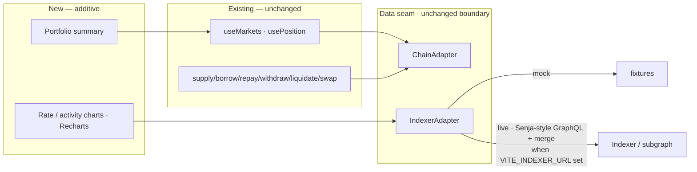

# Blue Theme + Portfolio/Charts/Indexer from Senja - Plan

## Goal Capsule

- **Objective:** Reskin Paboxo from the green coastal-glass theme to a full blue theme (landing-page azure `#0690d4`) with flatter surfaces, and add three capabilities Paboxo lacks — cross-pool **portfolio**, **charts/analytics**, and a live **indexer/GraphQL** layer — modeled on the sibling project **Senja** (`references/senja-fe-v2`), added *alongside* Paboxo's existing (untouched) hooks through the adapter seam.
- **Product authority:** This plan, enriched from the 2026-07-09 brainstorm dialogue and the user's plan-review narrowing.
- **Open blockers:** None. Soft external dependency: the indexer/subgraph endpoint is not deployed, so the live indexer path stays behind mock until an endpoint exists.

---

## Product Contract

### Summary

Two coordinated changes to the running Paboxo money-market app: **(1)** a full theme retone from green/teal coastal-glass to a blue-dominant palette (azure `#0690d4`, the landing page's accent) with cleaner/flatter surfaces, keeping only the semantic risk colors (green/amber/red) intact; **(2)** three additive capabilities Paboxo lacks — cross-pool portfolio aggregation, charts/analytics, and a live indexer/GraphQL layer — modeled on Senja's proven logic and wired through Paboxo's existing `ChainAdapter`/`IndexerAdapter` seam. Paboxo's tested core read/write hooks are **not** rewritten; the Senja adoption is scoped to the three gap-features only.

### Problem Frame

- The current green coastal-glass theme (`--palm: #2f6a4a` and the teal/green family) doesn't fit the brand; the landing page (`references/paboxo-landingpage`) uses blue `#0690d4`. The app should match, thoroughly.
- Paboxo's feature hooks work (17 units, 161 tests) but lack three things Senja — a sibling DeFi lending frontend with near-identical domain logic — has proven: cross-pool portfolio aggregation, charts/analytics, and a real indexer/GraphQL integration. The value is in adopting that *logic* (adapted to Paboxo's stack, added behind the seam), not in rewriting the working core.

### Requirements

**Theme**
- **R1.** Retone the design-system palette fully to blue-dominant, using the landing accent `#0690d4` as the primary/action color (replacing `--palm` green) — including the neutral/ink tokens (navy-blue, not neutral gray). Keep the coastal token *names*; change their *values*.
- **R2.** Flatten and clean surfaces toward the landing page's minimalism (reduce heavy glass texture/gradients) while keeping the calm, readable feel.
- **R3.** Keep only the semantic risk colors unchanged — safe = green, caution = amber, danger = red — so health-factor and liquidation signals stay legible against the blue brand.
- **R4.** Apply the theme to both light and dark modes, and update the RainbowKit wallet-modal accent to match.

**Additive capabilities from Senja**
- **R5.** Add cross-pool portfolio aggregation to the dashboard — deposits / loans / collaterals and USD totals across all markets — modeled on Senja's portfolio logic, reading through the existing hooks/adapter (no rewrite of `usePosition`/`useMarkets`).
- **R6.** Add charts/analytics Paboxo lacks — rate history and activity — from Senja's chart logic, rendered with a charting library, sourced through the `IndexerAdapter` (mock now, live when an endpoint exists).
- **R7.** Add a live indexer/GraphQL implementation of the `IndexerAdapter`, modeled on Senja's queries + live-on-chain / indexed-fallback merge; advances the previously-deferred subgraph work. Falls back to the mock adapter when no endpoint is configured.

### Actors

- **A1. Lender / borrower** (existing end user) — experiences the blue theme, a cross-pool portfolio summary, and rate/activity charts. Core supply/borrow/repay/withdraw/swap behavior is unchanged.
- **A2. Developer** — adds the three capabilities behind the existing seam; the tested core hooks stay put.

### Key Flows

- **F1. Retheme.** A user opens any surface → blue-branded UI (azure primary, flatter cards) in light and dark, with green/amber/red still signaling risk. Covers R1–R4.
- **F2. Portfolio.** A connected user opens the dashboard → sees aggregated deposits/loans/collaterals and USD totals across all pools, above the existing position detail. Covers R5.
- **F3. Analytics.** A user views a market or the dashboard → sees rate-history / activity charts sourced from the indexer adapter (mock now, live when an endpoint exists). Covers R6, R7.

### Acceptance Examples

- **AE1. Semantic legibility.** Given the full blue theme, when a position's health factor is low, then the health meter still renders in the danger (red) color, not blue. Covers R3.
- **AE2. Core untouched.** Given the additive work lands, when the app runs in `VITE_DATA_MODE=mock`, then the existing 161 tests pass unchanged and supply/borrow/repay/withdraw/liquidate/swap behave exactly as before. Covers R5, R6, R7.
- **AE3. Portfolio totals.** Given a user with positions in two markets, when they open the dashboard, then the portfolio summary sums deposits/loans/collaterals across both, with a coherent USD net worth (no NaN for an empty market). Covers R5.
- **AE4. Indexer fallback.** Given no indexer endpoint is configured, when a chart or history surface loads, then it falls back to the mock indexer adapter without error. Covers R7.

### Scope Boundaries

**Deferred for later**
- Deploying the actual subgraph/indexer endpoint — external infra. R7 builds the adapter; it stays mock-backed until an endpoint is deployed.

**Deferred to Follow-Up Work** (considered, held out to keep the tested core stable)
- Rewriting Paboxo's core read/write hooks (markets, position, supply/borrow/repay/withdraw/liquidate/swap) on Senja's aggregation/write-template logic — the larger migration. Not done; the additive features reuse the existing hooks.
- Form validation (react-hook-form + zod) on action panels.
- A full shared-lib reconcile against Senja's `format`/`errors`/`tx-state` — only the small helpers the new features need are added.

**Outside this product's identity (not taken from Senja)**
- LayerZero OFT cross-chain borrow (Paboxo uses Chainlink CCIP).
- Auth / SIWE + whitelist/waitlist gating (Paboxo is permissionless).
- Points / leaderboard / gamification.

### Dependencies / Assumptions

- **Senja source** at `references/senja-fe-v2` is a read-only reference (gitignored, in the main checkout). Logic is ported/adapted, not imported.
- **Landing blue** `#0690d4` is taken from `references/paboxo-landingpage/src/stores/themeStore.ts`.
- **New dependency:** a charting library (Recharts, matching Senja) for R6. No form-validation deps (validation is deferred).
- **Seam invariant:** the new features read through `getAdapters()` (the `ChainAdapter`/`IndexerAdapter`), not directly through `useReadContract`/`usePublicClient`, so mock mode survives.
- **Indexer endpoint** is not yet deployed; R7's live path is inert (falls back to mock) until `VITE_INDEXER_URL` is set.

### Sources / Research

- `references/senja-fe-v2` — the reference frontend. In-scope reuse targets: `src/hooks/pool/use-user-positions.ts` (portfolio aggregation), `src/hooks/graphql/use-pool-chart-data.ts` + `src/hooks/activity/*` (charts), `src/hooks/pool/use-pool-rate.ts` + `src/hooks/pool/use-market-pools.ts` (`applyIndexerRate` live-vs-indexed merge), `src/app/api/graphql/route.ts` (field-allowlist idea). Out-of-scope references (not adopted now): its read/write mutation hooks, `useTransactionState`, validation schemas.
- `references/paboxo-landingpage/src/stores/themeStore.ts:11` — landing blue `#0690d4`.
- Current theme tokens: `src/styles.css` (`--palm`, `--lagoon`, `--sea-ink`, `--sand`, semantic `--safe`/`--caution`/`--danger`).
- Paboxo's existing seam + hooks the new features build on (unchanged): `src/lib/data/*`, `src/features/markets/hooks/useMarkets.ts`, `src/features/position/hooks/usePosition.ts`, `src/lib/math/*`, `src/lib/format/*`.

---

## Planning Contract

**Product Contract preservation:** Product Contract authored in this run from the brainstorm dialogue, then **narrowed at plan review** — the Senja adoption was reduced from "rewrite the core hooks on Senja's basis" to "add only portfolio + charts + indexer alongside the untouched core," and form validation was deferred. `execution: code`, depth **Standard**, target repo `praboxo-fe`.

### Key Technical Decisions

- **KTD1. Token-value retone, not a rename.** Change the *values* of the existing coastal tokens (`--palm`, `--lagoon`, `--lagoon-deep`, `--sea-ink`, `--sea-ink-soft`, `--sand`, `--line`, `--chip-*`, `--header-bg`) to a blue family in `src/styles.css`; keep the token *names* so no component needs editing. `--palm` becomes the azure primary (`#0690d4`); the ink tokens go navy-blue (full retone). Semantic tokens keep their hues, but `--safe` gets its own green value now that `--palm` no longer doubles as green.
- **KTD2. Additive behind the seam — do not touch the tested core.** The three new features are *added*: portfolio reads through the existing `useMarkets`/`usePosition`/`getAdapters()`, charts read through `getAdapters().indexer`, and the indexer live impl slots into the existing `IndexerAdapter` interface. No existing read/write hook is rewritten. This preserves the 161-test baseline (AE2) and keeps mock/live swap working.
- **KTD3. Charts read through the IndexerAdapter.** Chart data (rate history, activity) is indexer-owned; chart hooks call `getAdapters().indexer`, never a chart lib's own fetch. Recharts is presentation only. Same mock/live swap as everything else.
- **KTD4. Indexer live impl advances the deferred subgraph work.** R7's `IndexerAdapter` live implementation is the real GraphQL adapter the prior integration plan deferred (its `indexerAdapter` stub + authored `queries.ts` already exist). Model the live-vs-indexed merge on Senja's `applyIndexerRate`. Gated behind an endpoint env var; absent → mock.

### High-Level Technical Design

The three additive features hang off the existing, unchanged seam. Nothing on the core read/write path moves.

---

## Implementation Units

### U1. Retone palette to blue

- **Goal:** Fully retone the green/teal coastal palette to blue-dominant (including ink tokens) in both light and dark, keeping semantic risk colors, and update the RainbowKit accent.
- **Requirements:** R1, R3, R4.
- **Dependencies:** none.
- **Files:** `src/styles.css`, `src/lib/web3/Web3Provider.tsx` (RainbowKit `lightTheme` accent).
- **Approach:** In `src/styles.css`, retone token *values* (KTD1): `--palm` → azure `#0690d4` (light) + a lighter azure for dark; `--lagoon`/`--lagoon-deep` → blue accent shades; `--sea-ink`/`--sea-ink-soft` → navy-blue ink; `--sand` → cool blue-gray; `--line`/`--chip-*`/`--header-bg` → blue-tinted. Give `--safe` its own green value now that `--palm` is blue; leave `--caution`/`--danger` as-is. Update the RainbowKit theme `accentColor` from `#2f6a4a` to `#0690d4`.
- **Patterns to follow:** the existing token block structure in `src/styles.css` (`:root`, `.dark`, `@media (prefers-color-scheme: dark)`); the `lightTheme({ accentColor })` call in `Web3Provider.tsx`.
- **Test scenarios:** `Test expectation: none — pure token/value restyle, no behavioral change.` Manual: light + dark render blue-branded; health meter danger stays red (Covers AE1); RainbowKit modal accent is azure.
- **Verification:** app renders blue in both modes; no component code changed except the RainbowKit accent value; semantic risk colors unchanged.

### U2. Flatten surfaces + sweep hardcoded greens

- **Goal:** Reduce the heavy glass/gradient texture toward the landing's flatter look, and eliminate any hardcoded greens that won't pick up the retoned tokens.
- **Requirements:** R1, R2.
- **Dependencies:** U1.
- **Files:** `src/styles.css` (glass/gradient utility classes — `island-shell`, backgrounds, shadows), plus any component with a literal green hex or green gradient (sweep `src/components/**`, `src/features/**`, `src/routes/**`).
- **Approach:** Soften/flatten the `island-shell` glass (less blur/gradient, cleaner borders) and any hero gradients toward the landing's minimalism (R2). Grep for literal greens (`#2f6a4a`, `#4fb8b2`, `#328f97`, `#6ec89a`, green gradients) and replace with the appropriate token or blue value. Verify the `Paboxo` logo dot gradient and any inline `background: 'var(--palm)'` styles read correctly.
- **Patterns to follow:** existing utility classes in `src/styles.css`; token references already used across components.
- **Test scenarios:** `Test expectation: none — styling only.` Manual: no residual green surfaces; flatter cards; text contrast still passes in both modes.
- **Verification:** a repo-wide search finds no hardcoded green hex outside the semantic `--safe` value; surfaces read flatter and consistently blue.

### U3. Cross-pool portfolio

- **Goal:** Add a portfolio summary aggregating deposits/loans/collaterals and USD totals across all markets, reading through the existing hooks/adapter — no rewrite of `usePosition`/`useMarkets`.
- **Requirements:** R5.
- **Dependencies:** none (reads existing hooks).
- **Files:** new `src/features/portfolio/hooks/usePortfolio.ts`, new `src/features/portfolio/components/PortfolioSummary.tsx`, `src/routes/dashboard.tsx` (mount above position detail), new `src/features/portfolio/hooks/usePortfolio.test.ts`.
- **Approach:** `usePortfolio` reads across all markets via the existing `getAdapters().chain` / the existing position read logic, summing per-market supply/collateral/debt into totals (deposits, loans, collaterals, net worth USD), modeled on Senja `use-user-positions.ts`. `PortfolioSummary` renders the totals (reusing `StatTile`) on the dashboard, inside the existing `NetworkGuard`. Reuse `src/lib/math` for values; add a small aggregation helper only if needed.
- **Patterns to follow:** Paboxo `usePosition` view-model + `getAdapters()` seam; `StatTile`/`PortfolioStrip` component style; Senja `references/senja-fe-v2/src/hooks/pool/use-user-positions.ts` (reference).
- **Test scenarios:** `Covers AE3.` a user with positions in two markets → totals sum across both; an empty/new-user portfolio shows zeros, not NaN; net worth = supplies + collateral − debt across pools; connect-gated on the dashboard; `usePortfolio` reads via the adapter, never wagmi directly.
- **Verification:** dashboard shows cross-pool totals; values trace to `src/lib/math`; mock tests green; existing position tests unchanged.

### U4. Indexer / GraphQL live adapter

- **Goal:** Implement the `IndexerAdapter` live impl on Senja's GraphQL + live-vs-indexed merge pattern, advancing the deferred subgraph work; fall back to mock when no endpoint is configured.
- **Requirements:** R7.
- **Dependencies:** none.
- **Files:** `src/lib/data/indexer/indexerAdapter.ts` (live impl), `src/lib/data/indexer/queries.ts` (extend authored queries with rate-history + activity), `src/lib/config/env.ts` (add `VITE_INDEXER_URL`), `src/lib/data/registry.ts` (wire live indexer + endpoint gate), `src/lib/data/indexer/indexerAdapter.test.ts`.
- **Approach:** Implement `getUserHistory` / `getProtocolAggregates` / `getCrossChainStatus` plus new rate-history + activity queries against a GraphQL endpoint using the authored `queries.ts`, modeling the live-vs-indexed merge on Senja's `applyIndexerRate` / `use-market-pools.ts` (KTD4). Registry gate: if `VITE_INDEXER_URL` is unset, `resolveAdapters('live').indexer` returns the mock (AE4). A typed `fetch` wrapper suffices — no heavy GraphQL client.
- **Patterns to follow:** Paboxo's `IndexerAdapter` interface + `indexerAdapter.mock.ts` + `queries.ts`; Senja `references/senja-fe-v2/src/hooks/pool/use-pool-rate.ts`, `use-market-pools.ts`, `src/app/api/graphql/route.ts` (reference).
- **Test scenarios:** `Covers AE4.` no endpoint → registry returns the mock indexer; endpoint set → adapter maps GraphQL entities to the domain models the mock produces; a query mapping is verified against the mock's output shape; malformed/empty response degrades to empty history, not a crash.
- **Verification:** mock fallback works with no endpoint; live path maps entities to domain models; UI unchanged across the swap.

### U5. Charts / analytics

- **Goal:** Add rate-history and activity charts, sourced through the indexer adapter and rendered with Recharts.
- **Requirements:** R6.
- **Dependencies:** U4.
- **Files:** `package.json` (+Recharts), new `src/features/analytics/hooks/useRateHistory.ts`, new `src/features/analytics/hooks/useActivity.ts`, new `src/features/analytics/components/{RateChart,ActivityList}.tsx`, mount points in `src/routes/market.$id.tsx` (rate chart) + `src/routes/dashboard.tsx` (activity), tests `src/features/analytics/hooks/useRateHistory.test.ts`.
- **Approach:** Per KTD3, chart hooks read from `getAdapters().indexer` (never a chart lib fetch). Add mock fixtures for rate history + activity so charts render in mock mode. Recharts components are presentation-only, themed to the blue palette. Scope: one rate-history chart on the market detail + an activity list on the dashboard.
- **Patterns to follow:** Paboxo's `StatsStrip`/`HistoryList` (adapter-backed component pattern); Senja `references/senja-fe-v2/src/hooks/graphql/use-pool-chart-data.ts`, `src/hooks/activity/*` (reference).
- **Test scenarios:** happy path renders a rate series from the indexer mock; empty series renders an empty state, not a broken chart; activity list renders newest-first from the indexer; chart hook never imports the chain adapter.
- **Verification:** charts render from mock; swap to live indexer needs no component change; themed blue.

---

## Verification Contract

| Gate | Command | Applies to | Done signal |
|---|---|---|---|
| Unit tests | `bun run test` | U3–U5 | new scenarios green; existing 161 tests still pass (AE2) |
| Typecheck | `bun run typecheck` | all units | no type errors |
| Lint | `bun run lint` | all units | clean |
| Build | `bun run build` | all units | green |
| Routes | `bun run generate-routes` | U3, U5 (new mounts) | `routeTree.gen.ts` regenerated if routes added |
| Manual smoke | `bun run dev` | U1, U2, U3, U5 | full blue theme in light+dark, semantic risk colors intact, portfolio + charts render on mock |

Default verification env is `VITE_DATA_MODE=mock`. The live indexer path (U4) is exercised only when `VITE_INDEXER_URL` is set.

---

## Definition of Done

- **Theme (U1–U2):** the app is fully blue-branded (azure `#0690d4` primary, navy ink) in light and dark, flatter surfaces, RainbowKit accent matched; semantic safe/caution/danger unchanged; no residual hardcoded greens.
- **Portfolio (U3):** the dashboard shows cross-pool deposits/loans/collaterals + USD totals, read through the existing hooks/adapter; core position/markets hooks untouched.
- **Indexer + charts (U4–U5):** the `IndexerAdapter` live impl + GraphQL merge are built (advancing the deferred subgraph work) and fall back to mock with no endpoint; rate-history + activity charts render through the indexer.
- **Core preserved (AE2):** the existing 161 tests pass unchanged; no core read/write hook was rewritten.
- All Verification Contract gates green.
