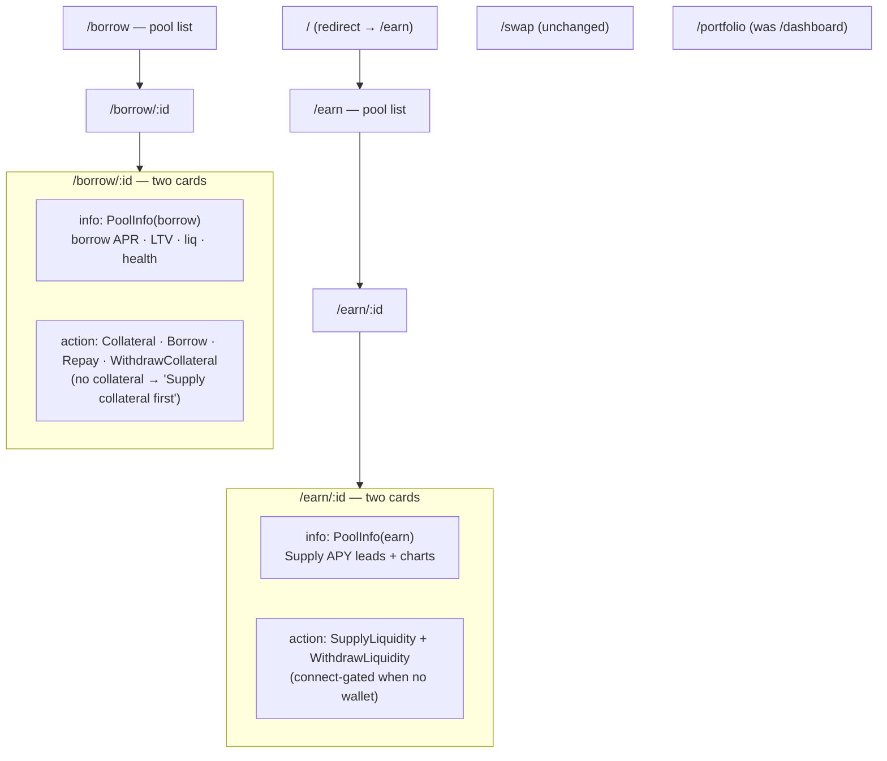

# Intent-Based Navigation (Earn / Borrow) - Plan

## Goal Capsule

- **Objective:** Reorganize the money-market UI from scattered per-action panels into intent-based navigation — `Earn · Borrow · Swap · Portfolio` — so the two supply actions (liquidity vs collateral) and two withdraw actions land on the page that matches the user's intent, with per-pool routing that respects isolated-pool risk.
- **Product authority:** ahmadzz (frontend owner).
- **Open blockers:** none — the underlying action hooks (supply liquidity/collateral, borrow, repay, withdraw, swap) and adapter seam already exist; this is a UI/IA reshaping plus one read-only hook exposure.

## Product Contract

### Summary

Split the money-market surface by user intent. **Earn** is the lender world (supply/withdraw pxUSDT liquidity to a chosen isolated pool, earning that pool's supply APY); **Borrow** is the borrower world (supply collateral, borrow pxUSDT, repay, withdraw collateral — one integrated position per pool). Each is a list of pools that drills into a per-pool page routed by the market id (`/earn/:id`, `/borrow/:id`). The standalone **Markets** page is removed; its pool info and charts move into the per-pool Earn/Borrow pages via a shared, context-aware component. `Swap` and `Portfolio` remain.

### Problem Frame

The four Paboxo markets are **isolated pools** (each a distinct collateral/pxUSDT pair; liquidity, collateral, and risk are ring-fenced per pool). The protocol exposes two supplies and two withdraws that serve completely different users: supply *liquidity* is a lender depositing pxUSDT for yield, supply *collateral* is a borrower enabling a loan. Presenting them together (or under a neutral "Markets" surface) forces the user to disambiguate "which supply?" every time. The current nav (`Markets · Swap · Dashboard`) is entity-first and leaves the action panels without a clear home. Grouping by intent removes the ambiguity and gives each action a natural page.

### Key Decisions

- **Navigation is intent-based, four items: Earn, Borrow, Swap, Portfolio.** The standalone Markets page is removed.
- **Earn owns the liquidity side; Borrow owns the collateral side.** Earn = supply liquidity + withdraw liquidity. Borrow = supply collateral + borrow + repay + withdraw collateral (integrated position). This is the split that resolves the two-supply / two-withdraw ambiguity.
- **Per-pool routing keyed by the market id (slug).** `/earn` and `/borrow` list all pools; `/earn/:id` and `/borrow/:id` act on one isolated pool, resolved by the existing slug id (e.g. `pxwhsk`). Every action targets exactly one pool.
- **Isolated-pool model is honored in copy and scope.** Supplying liquidity means supplying pxUSDT *to that specific pool* for *that pool's* supply APY; nothing is cross-pool except the Portfolio aggregate.
- **Per-pool page is a two-card layout.** Left card = shared pool info + charts; right card = the actions. When no wallet is connected, the action card is gated with a connect-wallet overlay (Aave-style); the info card stays visible.
- **Shared pool-info + charts component, context-aware.** The pool detail/IRM/rate visuals that lived on the removed `market.$id` move into the per-pool pages via one shared component. The **Earn** variant leads with Supply APY (interest/borrow rate still shown); the **Borrow** variant leads with borrow APR, LTV, liquidation threshold, and health.
- **Portfolio replaces "Dashboard"** as the cross-pool positions view (the existing PortfolioSummary already aggregates deposits, collateral, and loans).
- **No contract/write-hook logic changes; one read hook is newly exposed.** All action hooks and the data seam are reused. The one addition is exposing a per-pool position read hook (`useMarketPosition(id)`) around the already-present `loadMarketPosition` — read-only, no contract logic.

### Actors

- A1. **Lender** — supplies pxUSDT liquidity to a pool and withdraws it, on the Earn surface.
- A2. **Borrower** — supplies collateral, borrows pxUSDT, repays, and withdraws collateral for one pool's position, on the Borrow surface.

### Requirements

**Navigation & routing**

- R1. The top-level nav is exactly `Earn · Borrow · Swap · Portfolio`; the Markets nav item and standalone Markets page are removed.
- R2. Routes exist for `/earn` (pool list), `/earn/:id` (per-pool lend), `/borrow` (pool list), `/borrow/:id` (per-pool position), plus `/swap` and `/portfolio` (renamed from `/dashboard`).
- R3. An unknown or non-existent `:id` renders a not-found state (with a link back to the relevant list), not a crash.
- R4. Removing Markets does not orphan any capability: pool info, IRM curve, and rate-history charts are reachable from the per-pool Earn/Borrow pages.
- R11. The index route `/` redirects to `/earn` (Earn is the default landing).

**Earn surface**

- R5. `/earn` lists all pools with each pool's Supply APY and the connected user's supplied-liquidity balance (isolated per pool).
- R6. `/earn/:id` lets the user supply pxUSDT liquidity to that pool and withdraw it, and shows the pool's shared info card in the **Earn** variant — Supply APY leading, interest/borrow rate still visible.

**Borrow surface**

- R7. `/borrow` lists all pools with the user's collateral, debt, and health per pool (isolated).
- R8. `/borrow/:id` manages that pool's borrow position — supply collateral, borrow, repay, withdraw collateral — and shows the shared info card in the **Borrow** variant — borrow APR, LTV, liquidation threshold, and health leading.

**Shared component & positions**

- R9. One shared pool-info + charts component serves both per-pool pages, parameterized by an Earn/Borrow context that decides which metrics lead.
- R10. Portfolio is the cross-pool positions view (renamed from Dashboard) and aggregates lend and borrow positions across pools.

**Per-pool page states & flow**

- R12. Each per-pool page uses a two-card layout: an info card (shared PoolInfo) and an action card. When no wallet is connected, the action card is gated with a connect-wallet overlay; on the Earn/Borrow lists, user-scoped columns (your balance / your position) show a connect prompt instead of a zero value.
- R13. On the Borrow action card, when the user has no collateral yet, the primary CTA reads "Supply collateral first" (instead of "Borrow") and activating it switches the card to the supply-collateral action; borrow / repay / withdraw are disabled until collateral exists.
- R14. Each per-pool page carries a breadcrumb / back affordance returning to its list (e.g. `Earn / pxWHSK`).
- R15. The Earn and Borrow lists and both per-pool pages specify loading and empty states, matching the error / not-found coverage.

### Key Flows

- F1. **Lend to a pool**
  - **Trigger:** A1 wants yield on pxUSDT.
  - **Steps:** open `/earn` → pick a pool by its Supply APY → land on `/earn/:id` → supply pxUSDT liquidity (or withdraw) in the right-hand action card; the left info card shows the Earn variant (Supply APY + rates). Breadcrumb returns to `/earn`.
  - **Covered by:** R5, R6, R9, R12, R14.
- F2. **Open / manage a borrow position**
  - **Trigger:** A2 wants to borrow against collateral in a specific pool.
  - **Steps:** open `/borrow` → pick a pool → land on `/borrow/:id`; with no collateral the action card leads with "Supply collateral first" → supply collateral → borrow pxUSDT → later repay / withdraw collateral; the info card leads with borrow APR, LTV, liq-threshold, health.
  - **Covered by:** R7, R8, R9, R12, R13, R14.

### Acceptance Examples

- AE1. **Liquidity lands on Earn, collateral on Borrow.** **Given** a user on `/earn/:id`, **then** the only supply/withdraw actions offered are for pxUSDT *liquidity*; collateral actions appear only under `/borrow/:id`. **Covers R6, R8.**
- AE2. **Isolated-pool scope.** **Given** a user supplies liquidity on `/earn/:idA`, **then** the balance and APY shown are pool A's only, never aggregated with other pools (except on Portfolio). **Covers R5, R6.**
- AE3. **Context-aware info panel.** **Given** the same pool viewed under Earn vs Borrow, **then** Earn leads with Supply APY and Borrow leads with borrow APR / LTV / liq-threshold / health, from one shared component. **Covers R9.**
- AE4. **No orphaned charts after Markets removal.** **Given** Markets is gone, **when** a user opens a per-pool page, **then** the pool's info + IRM + rate charts are present. **Covers R4.**
- AE5. **Unknown pool.** **Given** `/earn/nope` with no matching pool, **then** a not-found state renders with a link back to `/earn`. **Covers R3.**
- AE6. **Disconnected action card.** **Given** no wallet connected on `/borrow/:id`, **then** the action card is gated with a connect-wallet overlay while the info card renders normally. **Covers R12.**
- AE7. **First-time borrower.** **Given** a connected user with no collateral in that pool, **then** the Borrow action card's CTA reads "Supply collateral first" and activating it switches to the supply-collateral action. **Covers R13.**

### Scope Boundaries

**Deferred for later**
- Repay modes B & C (swap / from-position) and cross-chain live wiring — separate work, not part of this IA reshaping.

**Outside this change**
- Contract calls and all write hooks — reused unchanged. The only non-UI addition is exposing a per-pool position **read** hook around existing internal logic; no contract or write-path logic changes.

### Dependencies / Assumptions

- The four markets are isolated pools, each identified by a slug `id` and a `pool` address in `src/lib/contracts/markets.ts`; routing keys on the slug `id`, resolved by the existing `getMarketConfig(id)`.
- All existing action hooks (supply liquidity/collateral, borrow, repay, withdraw, swap) and read hooks (markets, analytics charts) already exist and are reused; `loadMarketPosition` exists internally in `src/features/position/hooks/usePosition.ts` and is exposed as a per-pool read hook (KTD6).
- Portfolio/positions aggregation already exists (`src/features/portfolio/components/PortfolioSummary.tsx` shows deposits, collateral, loans, net) and becomes the renamed Dashboard surface — verified, so R10 is a rename.

---

## Planning Contract

**Product Contract preservation:** changed — added R11 (index `/`→`/earn`), R12–R15 (two-card layout + connect gating, first-time-borrower CTA, breadcrumb, loading/empty states), AE6–AE7, and the two route-lifecycle decisions (delete `market.$id`, rename `/dashboard`→`/portfolio`) from the plan-review and doc-review dialogue. Routing key changed from pool address to the slug `id` at the user's direction. Original R1–R10, A1–A2, F1–F2 (extended), AE1–AE5 preserved. Plan depth **Standard**; target repo `praboxo-fe`.

### Key Technical Decisions

- KTD1. **Reuse every action hook as-is; expose one read hook.** `useSupplyLiquidity`, `useSupplyCollateral`, `useBorrow`, `useRepay`, `useWithdraw` (both `withdrawCollateral` and `withdrawLiquidity`) and the market read hooks are reused unchanged. The one addition is a per-pool position **read** hook (KTD6); no write/contract logic changes.
- KTD6. **Expose `useMarketPosition(id)` around the existing `loadMarketPosition`.** `usePosition` today returns only a cross-pool aggregate (`healthFactor = Math.min(...)`, rows without pool identity), and `loadMarketPosition(config, …)` is internal. R5/R7 (per-pool balance/collateral/debt/health) and the Borrow-variant PoolInfo health need a single pool's position — expose a thin read hook wrapping the existing function; no new on-chain logic.
- KTD2. **The missing UI is the supply-*liquidity* panel.** `SupplyPanel` today wires only `useSupplyCollateral`. Earn needs a liquidity panel (pxUSDT, `useSupplyLiquidity`) + a withdraw-liquidity control (`useWithdraw.withdrawLiquidity`). Borrow reuses the existing collateral/borrow/repay/withdraw-collateral panels.
- KTD3. **Extract one context-aware PoolInfo component.** The pool's StatTiles live in `MarketDetail`; the IRM and rate charts are rendered as siblings by the `market.$id` route (not inside MarketDetail). PoolInfo absorbs both the MarketDetail StatTiles and the route-level charts, taking `context: 'earn' | 'borrow'` (reorders/emphasizes metrics) plus the pool's position/health for the Borrow variant.
- KTD4. **File-based routes keyed on the slug `id`, resolved via `getMarketConfig`.** New TanStack Start routes `earn.tsx`, `earn.$id.tsx`, `borrow.tsx`, `borrow.$id.tsx`; look the pool up with the existing `getMarketConfig(id)`; unknown id → the existing `ErrorState` not-found with a back-to-list link. Run `bun run generate-routes` after adding/removing route files.
- KTD5. **Route lifecycle:** delete `src/routes/market.$id.tsx` and `src/routes/markets.tsx`; rename `src/routes/dashboard.tsx` → `src/routes/portfolio.tsx` (path `/portfolio`); retarget the existing `src/routes/index.tsx` redirect from `/markets` to `/earn`. Nav in `AppHeader` becomes Earn · Borrow · Swap · Portfolio.

### High-Level Technical Design

Route map after the change (pages compose existing hooks/components; only the new read hook is added):

Removed: `/markets`, `/market/$id`. Nav: `Earn · Borrow · Swap · Portfolio`.

---

## Implementation Units

### U6. Expose per-pool position read hook
- **Goal:** Make a single pool's position (supplied balance, collateral, debt, health) readable by id, without changing on-chain logic.
- **Requirements:** R5, R7, R9.
- **Dependencies:** none.
- **Files:** `src/features/position/hooks/usePosition.ts` (export a `useMarketPosition(id)` wrapping the existing `loadMarketPosition`), `src/features/position/hooks/useMarketPosition.test.tsx`.
- **Approach:** Add a `useMarketPosition(id)` read hook that resolves the pool via `getMarketConfig(id)` and returns that pool's `PositionView` (supplies/borrows/health) from the already-present `loadMarketPosition`. Read-only; no write path, no contract change.
- **Patterns to follow:** the existing `usePosition` query shape and `loadMarketPosition` in the same file; `useMarkets` query pattern.
- **Test scenarios:** `Covers R5, R7.` returns a single pool's supplied balance / collateral / debt / health for a known id; returns an empty/zero position for a user with none; returns undefined-position (not a crash) for an unknown id; is disabled without a wallet.
- **Verification:** per-pool pages read one pool's position by id; no aggregate `Math.min` health leaks into a single-pool view.

### U1. Shared context-aware PoolInfo component
- **Goal:** One component that renders the pool info + charts leading with Earn or Borrow metrics by a `context` prop.
- **Requirements:** R4, R9.
- **Dependencies:** U6 (for the borrow-variant health).
- **Files:** `src/features/markets/components/PoolInfo.tsx`, `src/features/markets/components/PoolInfo.test.tsx`; reuse `src/features/analytics/components/MarketIrmChart.tsx`, `MarketRateChart.tsx`, `src/components/ui/StatTile.tsx`; StatTile composition pulled from `src/features/markets/components/MarketDetail.tsx`.
- **Approach:** Take `{ market: MarketView; context: 'earn' | 'borrow'; health?: number }` (health/position from U6, used by the Borrow variant). Earn: Supply APY tile first, then utilization/price, borrow rate still shown. Borrow: borrow APR + LLTV + liquidation threshold + health first. Both render the IRM + rate charts — absorb the StatTiles from `MarketDetail` and the charts that currently live in the `market.$id` route.
- **Patterns to follow:** existing `MarketDetail.tsx` StatTile layout; `formatPercent`.
- **Test scenarios:** `Covers AE3.` context='earn' leads with Supply APY and still shows the borrow rate; context='borrow' leads with borrow APR + LLTV + liq-threshold + health (from the `health` prop); both render IRM + rate charts; missing health renders without crashing.
- **Verification:** the same pool renders two metric orderings by context; charts present in both.

### U2. Supply-liquidity + withdraw-liquidity panel
- **Goal:** Add the Earn-side action panel — supply pxUSDT liquidity and withdraw it — mirroring the collateral `SupplyPanel`.
- **Requirements:** R6.
- **Dependencies:** none.
- **Files:** `src/features/supply/components/SupplyLiquidityPanel.tsx`, `src/features/supply/components/SupplyLiquidityPanel.test.tsx`; reuse `src/features/supply/hooks/useSupplyLiquidity.ts`, `src/features/withdraw/hooks/useWithdraw.ts` (`withdrawLiquidity`), `src/components/action/ActionPanel.tsx`.
- **Approach:** Compose `ActionPanel` with pxUSDT symbol/decimals for supply-liquidity (via `useSupplyLiquidity`) and a withdraw-liquidity action (via `useWithdraw.withdrawLiquidity`). Mirror `SupplyPanel` (collateral); no new hook logic.
- **Patterns to follow:** `src/features/supply/components/SupplyPanel.tsx`, `src/features/swap/components/SwapPanel.tsx`.
- **Test scenarios:** `Covers AE1.` the panel offers only pxUSDT *liquidity* supply/withdraw (no collateral action); a non-positive amount is blocked; submit routes through the write wrapper; the withdraw-liquidity path submits.
- **Verification:** Earn page supplies and withdraws pxUSDT liquidity via the mock adapter.

### U3. Earn routes (list + per-pool, two-card)
- **Goal:** Build `/earn` (pool list, Supply APY + your supplied balance) and `/earn/:id` (two cards: PoolInfo earn-variant + supply/withdraw-liquidity, connect-gated).
- **Requirements:** R2, R3, R5, R6, R12, R14, R15.
- **Dependencies:** U1, U2, U6.
- **Files:** `src/routes/earn.tsx`, `src/routes/earn.$id.tsx`, `src/features/earn/components/EarnList.tsx`, `src/features/earn/components/EarnList.test.tsx`; reuse `src/features/markets/hooks/useMarkets.ts`, `getMarketConfig`, `useMarketPosition` (U6), `src/components/wallet/NetworkGuard.tsx` / connect affordance, `src/components/ui/states/ErrorState.tsx`, `Loading`, `EmptyState`.
- **Approach:** `/earn` lists pools from `useMarkets` with Supply APY + the user's supplied-liquidity balance per pool (connect prompt when disconnected), each row linking to `/earn/:id`. `/earn/:id` resolves via `getMarketConfig(id)`; unknown → `ErrorState` not-found with a back-to-`/earn` link; otherwise a two-card layout — left `<PoolInfo context="earn">`, right `<SupplyLiquidityPanel>` gated with a connect-wallet overlay when no wallet. Breadcrumb `Earn / <symbol>` returns to `/earn`. List and page carry loading + empty states.
- **Patterns to follow:** `src/routes/markets.tsx`, `src/routes/market.$id.tsx` (route + loading/error), `src/features/markets/components/MarketList.tsx`.
- **Test scenarios:** `Covers R5.` list renders all pools with Supply APY + per-pool supplied balance; disconnected shows a connect prompt not zero; `Covers AE2.` per-pool page shows only that pool's APY/balance; `Covers AE5.` `/earn/nope` renders not-found with a back link; `Covers AE6.` disconnected gates the action card while the info card renders; loading and empty states render.
- **Verification:** `/earn` lists pools; a row lands on its lend page with two cards; unknown id → clean not-found; disconnected → gated action card.

### U4. Borrow routes (list + per-pool, two-card)
- **Goal:** Build `/borrow` (pool list with your collateral/debt/health) and `/borrow/:id` (two cards: PoolInfo borrow-variant + collateral/borrow/repay/withdraw-collateral, connect-gated, first-time CTA).
- **Requirements:** R2, R3, R7, R8, R12, R13, R14, R15.
- **Dependencies:** U1, U6.
- **Files:** `src/routes/borrow.tsx`, `src/routes/borrow.$id.tsx`, `src/features/borrow/components/BorrowList.tsx`, `src/features/borrow/components/BorrowList.test.tsx`; reuse `src/features/supply/components/SupplyPanel.tsx` (collateral), `src/features/borrow/components/BorrowPanel.tsx`, `src/features/repay/components/RepayPanel.tsx`, `src/features/withdraw/components/WithdrawPanel.tsx`, `useMarketPosition` (U6).
- **Approach:** `/borrow` lists pools with the user's collateral, debt, and health per pool from `useMarketPosition` (connect prompt when disconnected), each linking to `/borrow/:id`. `/borrow/:id` resolves via `getMarketConfig(id)`; unknown → not-found with a back link; otherwise two cards — left `<PoolInfo context="borrow" health>`, right the collateral/borrow/repay/withdraw-collateral actions, gated with a connect overlay when no wallet. When the connected user has no collateral, the action card's primary CTA reads "Supply collateral first" and switches to the supply-collateral action; borrow/repay/withdraw disabled until collateral exists. Breadcrumb + loading/empty states as in U3.
- **Patterns to follow:** `src/routes/market.$id.tsx`, existing action panels.
- **Test scenarios:** `Covers R7.` list shows per-pool collateral/debt/health (connect prompt when disconnected); `Covers AE1.` per-pool page offers collateral + borrow + repay + withdraw-collateral (no liquidity supply); `Covers AE7.` no-collateral user sees "Supply collateral first" that switches to the collateral action; `Covers AE5.` unknown id → not-found with back link; `Covers AE6.` disconnected gates the action card; loading and empty states render.
- **Verification:** `/borrow` lists positions; per-pool page manages the full borrow position; first-time and disconnected states behave.

### U5. Navigation + route cleanup
- **Goal:** Switch nav to Earn · Borrow · Swap · Portfolio; delete Markets + market-detail; rename dashboard → portfolio; redirect `/` → `/earn`; regenerate routes.
- **Requirements:** R1, R2, R4, R10, R11.
- **Dependencies:** U3, U4.
- **Files:** `src/components/layout/AppHeader.tsx`, delete `src/routes/markets.tsx` and `src/routes/market.$id.tsx`, rename `src/routes/dashboard.tsx` → `src/routes/portfolio.tsx`, `src/routes/index.tsx` (retarget redirect to `/earn`), `src/routeTree.gen.ts` (regenerated). Update any lingering `to="/markets"` / `to="/dashboard"` / `to="/market/..."` links.
- **Approach:** Rewrite the `AppHeader` `NAV` array to the four intent items. Delete the two market routes (charts already re-homed by U1). Rename the dashboard route file/path to `/portfolio`. Retarget the existing `index.tsx` redirect from `/markets` to `/earn`. Run `bun run generate-routes`; grep for stale `/markets`, `/market/`, `/dashboard` links and repoint them.
- **Execution note:** land after U3/U4 so nav never points at routes that don't exist yet.
- **Test scenarios:** `Covers R1.` nav renders exactly Earn/Borrow/Swap/Portfolio with correct active states; `Covers R11.` `/` redirects to `/earn`; `/portfolio` renders the positions view; no route references `/markets` or `/market/$id`; typecheck passes (no dangling `Link to`).
- **Verification:** app boots with the new nav; old routes gone; `/` lands on Earn; `bun run generate-routes` clean; typecheck clean.

---

## Verification Contract

| Gate | Command | Applies to | Done signal |
|---|---|---|---|
| Unit tests | `bun run test` | U1–U6 | all scenarios green |
| Routes | `bun run generate-routes` | U3, U4, U5 | `routeTree.gen.ts` regenerated, no stale routes |
| Typecheck | `bun run typecheck` | all units | no type errors; no dangling `Link to` |
| Lint | `bun run lint` | all units | clean |
| Format | `bun run check` | all units | clean |
| Manual smoke (mock) | `bun run dev` | all | `/` → `/earn`; browse Earn/Borrow lists (connect prompt when disconnected) → per-pool two-card pages; supply/withdraw liquidity on Earn; collateral/borrow/repay/withdraw-collateral on Borrow with "Supply collateral first" for a new borrower; charts present on both; disconnected gates the action card; unknown id → not-found with back link |

## Definition of Done

- Nav is Earn · Borrow · Swap · Portfolio; Markets and `market.$id` are deleted; `/` redirects to `/earn`; `/dashboard` is renamed to `/portfolio` (R1, R2, R10, R11).
- Earn lists pools with Supply APY + your supplied balance and drills into a per-pool two-card lend page (info + supply/withdraw pxUSDT liquidity) with the Earn-variant PoolInfo (R5, R6, R9, R12).
- Borrow lists pools with your collateral/debt/health and drills into a per-pool two-card position page (info + collateral/borrow/repay/withdraw-collateral) with the Borrow-variant PoolInfo, including the "Supply collateral first" first-time state (R7, R8, R9, R12, R13).
- A per-pool position read hook (`useMarketPosition`) reads one pool's position by id; no aggregate health leaks into a single-pool view (R5, R7).
- Disconnected wallet gates the action card and shows connect prompts on list user-columns; each per-pool page has a breadcrumb back to its list; lists and pages have loading + empty states; not-found has a back link (R3, R12, R14, R15).
- Pool info + IRM + rate charts are reachable on the per-pool pages; nothing orphaned by the Markets removal (R4).
- No contract or write-hook logic changed — only routing, page composition, the shared PoolInfo component, and one read-hook exposure.
- All Verification Contract gates pass in mock mode; every R1–R15 is advanced by at least one unit.
