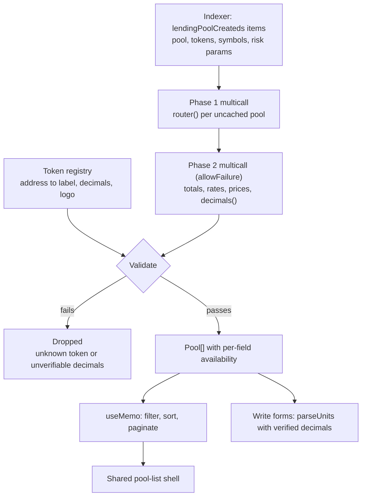
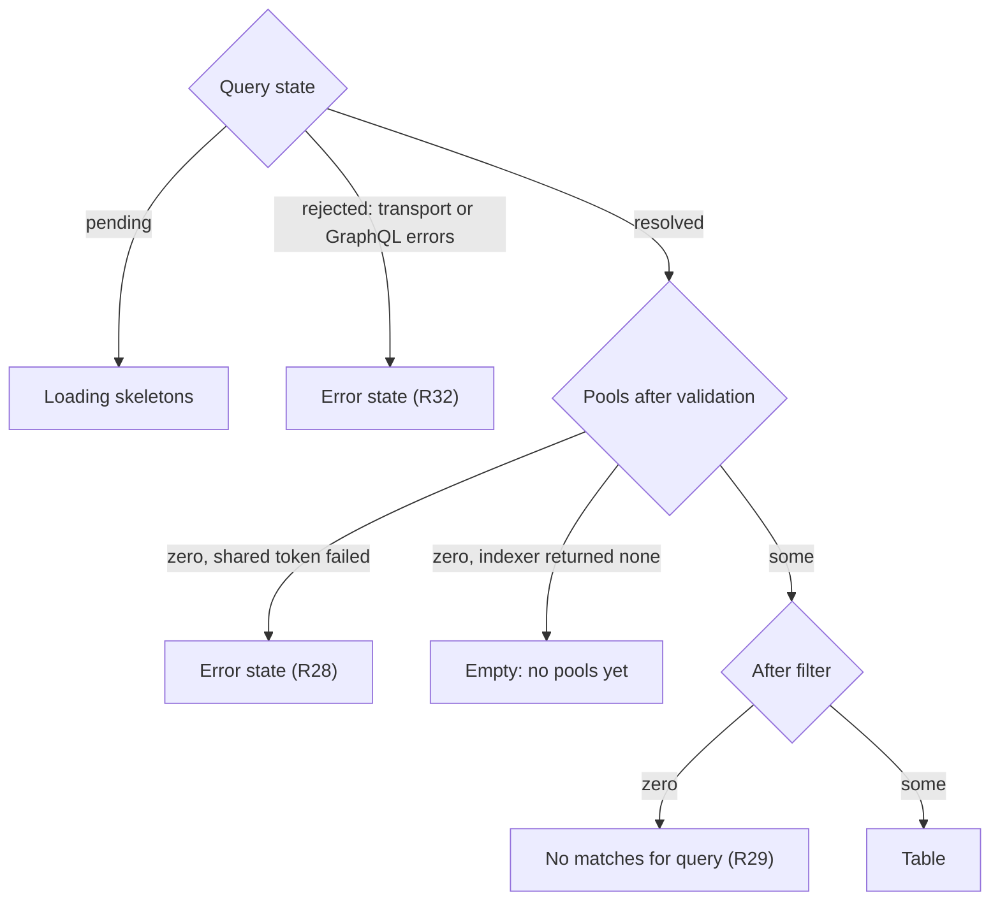

# Live Indexer, Pool Search, and Layout Repair - Plan

## Goal Capsule

- **Objective.** Replace every invented number in the Earn/Borrow surfaces with data from the live Ponder indexer at `https://hash.staifdev.codes/graphql` plus on-chain reads, add search and pagination over pools, pair token logos to token addresses, and change the layout: the container-width, detail-grid-ratio, and sticky-footer fixes (R18-R20) plus the navbar chain-indicator consolidation, the SVG icon swap, the back-navigation format, and removal of the standalone supplied-row (R21-R24).
- **Product authority.** The user. Sorting signal, degraded-pool behavior, token-metadata strategy, back-navigation shape, pool-route identity, the Borrow sort signal, and the reach of the decimals check are all pinned below.
- **Execution profile.** One dependency-ordered sequence, U1 through U14. No new npm dependencies. U10-U12 are presentation-only and may land in any order at any time; U13 needs only the token registry from U2. Everything else follows the Unit Index dependencies.
- **Stop conditions.** Stop and ask if the indexer schema no longer matches `lendingPoolCreateds { items { … } }`, if a fifth pool appears whose borrow token is not pxUSDT (AS1 breaks), or if a unit requires adding a dependency.
- **Tail ownership.** The implementer runs the Verification Contract gates and satisfies each unit's test scenarios before declaring done.

**Product Contract preservation.** Changed: R8 (a `decimals()` that reverts is treated as a mismatch, not ignored) and R14 (Borrow sorts by available liquidity, not `totalSupplyAssets`). Added: R27-R32 and AE8-AE12, closing degraded-state, empty-state, write-path, and indexer-outage gaps that flow analysis and document review found and the brainstorm did not cover. Everything else is unchanged.

---

## Product Contract

### Summary

Earn and Borrow currently render a mix of real on-chain values and hardcoded display numbers. This plan sources pool identity and risk parameters from the live indexer, sources balances and prices from the chain in batched reads, deletes the one number that has no source anywhere (rewards APY), and adds client-side search, filter, and pagination over the resulting pool list. It also fixes a broken sticky-footer chain, widens the page container, and pairs the unused token logos in `public/tokens/` to token addresses.

The implementation stops resolving pool identity through the hardcoded `MARKETS` array, so pool identity becomes the pool address end-to-end. It extracts one shared pool-list shell rather than duplicating search, sort, and pagination across the near-identical Earn and Borrow tables, and it routes the runtime-verified token decimals all the way into the write forms that parse amounts.

### Problem Frame

The app was built against a subgraph schema that never shipped. `src/lib/data/indexer/queries.ts` queries root collections (`supplies`, `lendingPoolRates`, `protocol(id:"paboxo")`) that do not exist on the deployed indexer, which is Ponder-shaped (`lendingPoolCreateds { items { ... } }`). The live adapter is selected only when `VITE_INDEXER_URL` is set, so it has never run against the real endpoint. Meanwhile `src/features/markets/mock.ts` and `src/features/markets/hooks/useMarkets.ts` fill the gap with a `DISPLAY` map and a `REWARDS_APY` map.

The cost is not cosmetic. `REWARDS_APY` renders `0.8%` and `1.2%` next to real supply APYs, in a money market, with no distinction to the user. A number with no source is worse than a missing number.

Separately, three layout defects share one root: the container is 1080px wide (`src/styles.css:199`), the detail-page split is 1.4fr/1fr but reads as even at that width, and the sticky-footer flex chain is broken so the footer stops 293px above the viewport bottom.

### Key Decisions

**Token metadata comes from a static registry, not from `symbol()`.** The cross-chain token `0x7c9cF703…` returns `"pxWHSK"` from `symbol()` on-chain — identical to the unrelated token `0xc3be8ab4…`. On-chain symbol cannot disambiguate them. The indexer's `collateralTokenFormatted` can (`"pxWHSK-xc"` vs `"pxWHSK"`), and a registry keyed by address can.

**Decimals are hardcoded in that registry, verified at runtime, and the verified value is what write paths use.** The symbol-collision argument does not extend to decimals: `decimals()` is unambiguous per token, and `references/paboxo-sc/docs/INTEGRATION-FRONTEND.md:34` says "don't hardcode". Hardcoding is kept for the common path, and `R8` reads `decimals()` in the batch the plan already issues. Validation that stops at the list would be theatre — `SupplyLiquidityPanel.tsx:36`, `BorrowPanel.tsx:21`, `RepayPanel.tsx:21`, and `CreatePoolPanel.tsx:34-35` all call `parseUnits` against the registry constant, so `R31` carries the verified value into them.

**Validation fails closed.** A `decimals()` call that reverts yields `status: 'failure'` with no value, so it never "disagrees" and would slip past a naive mismatch check while the app silently kept using an unverified constant. An unreadable decimals is treated exactly like a wrong one: the token is dropped.

**A broken indexer is an error, not an empty protocol.** The existing `graphql<T>()` wrapper degrades every failure to `null`, which the pool list would render as "no pools yet". `R32` narrows that: a transport failure or a GraphQL `errors` payload rejects, and only a well-formed response containing zero records yields an empty list.

**Earn ranks by pool size; Borrow ranks by what a borrower can take.** Every pool's borrow token is `pxUSDT`, and lenders supply the borrow token, so `totalSupplyAssets` is denominated in pxUSDT (6 dp) and directly comparable across pools. Because pxUSDT trades at $1, that ordering equals the USD-TVL ordering without needing a price, so a pool whose price feed is stale still ranks by its real size. Borrow ranks by `totalSupplyAssets - totalBorrowAssets` instead, because a large pool with no free liquidity is useless to a borrower. Both columns come from the same batched read, so the second signal costs nothing.

**Search, filter, sort, and pagination are client-side, with no debounce.** The indexer cannot sort by supply size (it stores neither TVL nor price), so any size ordering requires fetching all pools and enriching them on-chain first. Given that, one GraphQL query plus the enrichment reads feed a `useMemo` chain. Debounce and lazy loading exist to suppress network requests per keystroke; there are none here. Adding them costs latency and buys nothing.

**Rewards APY is deleted, not zeroed.** Searching all of `references/paboxo-sc/` for `reward`, `incentive`, and `emission` returns no protocol hits. There is no contract, no indexer table, and no doc describing a rewards program.

**The footer fix targets the flex chain, not the footer.** Measured at 1512×900: footer height 101px is reasonable; `body` computes to 606px because `src/styles.css:152-156` sets `html, body, #app { min-height: 100% }` as unlayered CSS, which beats the `min-h-dvh` utility on `<body>`, and because `RainbowKitProvider` inserts an unstyled `
` between `<body>` and the header/main/footer, breaking the `flex-1` chain in `src/routes/__root.tsx:53`.

**The navbar shows one chain indicator because two components render it.** `src/routes/__root.tsx:50-52` mounts both `<NetworkStatus />` (a custom pill printing `chain.name`) and RainbowKit's `<ConnectButton />` (which prints the chain too). `R21` collapses this to a single source so chain and address can be two controls of equal height.

**Icons are hand-picked inline SVG because the `lucide-react` set reads generic.** This is a visual-fidelity decision, not a technical one: the acceptance criterion for `R22` is that the icons carry distinct character, not that the set is complete. `lucide-react` stays in `package.json` for its existing call sites.

**The standalone "Supplied in this pool" row is removed because it duplicates the panel.** `src/features/supply/components/SupplyLiquidityPanel.tsx:60-73` renders the user's supplied balance in an island above the tab strip, restating what the tab content already shows.

### Actors

- A1. **Lender / borrower** — browses pools, searches for a token or pool, opens a pool page, supplies or borrows.
- A2. **Price keeper** — the backend cron that pushes prices into `TokenDataStream`. Not part of this work, but its liveness determines whether a pool renders a USD value.
- A3. **Pool factory** — creates new lending pools. Its output determines whether the token registry stays complete.

### Requirements

**Data sourcing**

- R1. Pool identity and risk parameters (pool address, collateral/borrow token address, display symbol, LTV, base rate, rate at optimal, optimal/max utilization, max rate, liquidation threshold, liquidation bonus, shares token, router) come from the indexer's `lendingPoolCreateds` query filtered to `contractChainId: 177`.
- R2. Display symbols come from `collateralTokenFormatted` / `borrowTokenFormatted`, never from an on-chain `symbol()` call.
- R3. Pool balances (`totalSupplyAssets`, `totalBorrowAssets`) come from the pool's router, resolved at runtime via `LendingPool(pool).router()`.
- R4. Token USD prices come from `TokenDataStream.latestRoundData(token)` at 8 decimals.
- R5. Token decimals and logo paths come from a static registry keyed by lowercased token address, covering all five known tokens including the cross-chain `pxWHSK`.
- R6. The rewards APY column and the `REWARDS_APY` map in `src/features/markets/hooks/useMarkets.ts:28-31` are removed from the codebase and the UI.
- R7. The existing subgraph-shaped queries in `src/lib/data/indexer/queries.ts` are replaced with Ponder-shaped queries, and the live adapter's response mappers are rewritten to read `data.<table>.items`.
- R8. The enrichment read also reads `decimals()` for every registry token; a token whose on-chain decimals disagree with the registry, or cannot be read, is not rendered, and the failure is logged as an error.
- R31. Every write path that parses a token amount uses the runtime-verified decimals rather than the registry constant. A form whose token has no verified decimals does not submit.

**Degraded states**

- R9. A pool whose price feed reverts renders in the list and opens normally, with price-derived cells showing an em dash and a "Price stale" badge.
- R10. Write actions on a pool with a stale price are disabled, with the reason surfaced to the user.
- R11. A pool whose collateral or borrow token is absent from the registry is omitted from the list, and its omission is logged to the console in development.
- R27. A pool whose balance reads fail renders with an em dash in every affected cell and sorts below every pool with a known size, distinguishably from a pool whose size is genuinely zero.
- R28. When validation removes every pool because the shared borrow token failed, the list renders the error state rather than the empty state.
- R32. A transport failure or a GraphQL `errors` payload from the indexer renders the error state. Only a well-formed response carrying zero pool records renders the empty state.

**Search, sort, pagination**

- R12. A single search input filters pools by pool address, collateral symbol, borrow symbol, and token address, matched case-insensitively as a substring. The input carries an accessible name, and the filtered result count is announced politely to assistive technology.
- R13. Filtering applies from the first typed character, with no debounce and no minimum length. An empty query shows all pools.
- R14. Pool lists sort by a size signal descending with pool address ascending as the tiebreaker: Earn ranks by `totalSupplyAssets`, Borrow ranks by `totalSupplyAssets - totalBorrowAssets`.
- R15. The list paginates client-side at 10 pools per page, and the pagination control is hidden when the filtered result fits on one page. The control conveys the current page and total, and a page change is announced.
- R16. The current page resets to 1 whenever the search query, filter, or sort changes, and clamps to the last available page whenever the pool set itself shrinks.
- R17. Search, sort, and pagination derive from the already-fetched pool array and issue no additional network requests.
- R29. A query that matches no pool renders a distinct no-matches state naming the query, with an action that clears the search — not the same state as "no pools exist".

**Layout**

- R18. `.page-wrap` widens from 1080px to 1280px, applying to the navbar, page content, and footer alike.
- R19. The detail-page grid changes from `1.4fr 1fr` to `1.6fr 1fr` so the information card is visibly wider than the action card.
- R20. The header, main, and footer sit inside a single full-height flex column so the footer rests at the viewport bottom when content is short. The dead `min-height: 100%` rule in `src/styles.css:152-156` is removed.
- R21. The navbar renders exactly one chain indicator, preserving the existing below-`sm` collapse. Chain name and wallet address are two separate controls of equal height.
- R22. Navbar and page iconography use hand-picked inline SVG, not `lucide-react`.
- R23. The detail page's back navigation renders as `‹ Earn` (a link, where `Earn` names the destination) followed by the current pool as inert text carrying `aria-current="page"`.
- R24. The standalone "Supplied in this pool" row in `src/features/supply/components/SupplyLiquidityPanel.tsx:60-73` is removed, along with its assertion in `src/features/supply/components/SupplyLiquidityPanel.test.tsx:85`.
- R30. Opening a pool detail page for a pool the list omits renders an unavailable state naming the reason, distinct from the not-found state for a pool address the indexer never returned.

**Assets**

- R25. Token logos are resized to 64px and converted to WebP once, committed, and served from `public/tokens/`. No image-processing plugin is added to the Vite config.
- R26. Every registry token carries a logo file, and logos render paired on pool rows and pool headers, replacing the initials-only `TokenGlyph`. The cross-chain `pxWHSK` reuses the `pxWHSK` artwork with a cross-chain marker. Logo images are decorative (`alt=""` or `aria-hidden`) and keep the circular clip and cutout border the initials glyph carries, because `TokenPairGlyph`'s overlap depends on that border.

### Acceptance Examples

- AE1. Decimals mismatch
  - **Covers R8.**
  - **Given** a registry entry records 18 decimals for a token whose on-chain `decimals()` returns 6,
  - **When** a lender opens `/earn`,
  - **Then** no pool using that token renders, and the mismatch is logged as an error naming the token address and both values.

- AE2. Stale price feed
  - **Covers R9, R10.**
  - **Given** `TokenDataStream.latestRoundData` reverts `PriceStale` for the cross-chain `pxWHSK`,
  - **When** a lender opens `/earn`,
  - **Then** that pool's row still appears, ranked by its own `totalSupplyAssets`, its USD cells show an em dash, a "Price stale" badge is shown, and its supply button is disabled with the reason visible.

- AE3. Keeper recovers
  - **Covers R9, R10.**
  - **Given** the keeper resumes pushing prices for the cross-chain token,
  - **When** the lender reloads `/earn`,
  - **Then** the badge disappears, USD cells populate, and the supply button re-enables, with no code change.

- AE4. Unknown token
  - **Covers R11.**
  - **Given** the factory creates a pool whose collateral token is absent from the registry,
  - **When** a lender opens `/earn`,
  - **Then** that pool does not appear, and a console warning naming the unknown token address is emitted in development.

- AE5. Search below the pagination threshold
  - **Covers R12, R13, R15.**
  - **Given** four pools exist,
  - **When** the lender types `btc`,
  - **Then** only `pxWBTC/pxUSDT` remains, filtering happens on the `b` keystroke, and no pagination control is shown.

- AE6. Page reset on query change
  - **Covers R16.**
  - **Given** more than ten pools exist and the lender is viewing page 2,
  - **When** the lender types a query whose result fits on one page,
  - **Then** the list shows the matching pools rather than an empty page.

- AE7. Tiebreak on equal supply
  - **Covers R14.**
  - **Given** two pools report an identical `totalSupplyAssets`,
  - **When** the lender opens `/earn` with no query,
  - **Then** they appear in ascending pool-address order, and any pool with zero supply appears last.

- AE8. Partial balance-read failure
  - **Covers R27.**
  - **Given** the router read for one pool reverts while the other pools succeed,
  - **When** a lender opens `/earn`,
  - **Then** that pool renders with em dashes for supply, utilization, and APY, sorts below every pool with a known size including the zero-supply pool, and is visibly marked as unavailable rather than empty.

- AE9. Query matches nothing
  - **Covers R29.**
  - **Given** four pools exist,
  - **When** the lender types `zzz`,
  - **Then** a no-matches state names the query and offers to clear the search, and the "no pools yet" empty state does not appear.

- AE10. Deep link to an omitted pool
  - **Covers R30.**
  - **Given** a pool exists on the indexer but its collateral token is absent from the registry,
  - **When** the lender opens that pool's detail URL directly,
  - **Then** an unavailable state explains the pool cannot be displayed, distinct from the not-found state shown for an address the indexer never returned.

- AE11. Write path uses the verified decimals
  - **Covers R31.**
  - **Given** the borrow token's on-chain `decimals()` returns 6 and the registry says 6,
  - **When** the lender supplies `1.5`,
  - **Then** the amount submitted is `1500000`, derived from the verified value; and given the same call reverts instead, the supply form does not submit.

- AE12. Indexer outage
  - **Covers R32.**
  - **Given** the indexer request rejects or answers with a GraphQL `errors` payload,
  - **When** a lender opens `/earn`,
  - **Then** the error state renders, and the "no pools yet" empty state does not.

### Scope Boundaries

- Liquidation and delegation surfaces keep their current data sources; only Earn, Borrow, the pool detail pages, and the amount-parsing write paths move.
- Rate-history charts stay out. The `interestAccrueds` table holds too few points to source a chart without inventing the rest.
- Protocol-wide aggregate figures (`cumulativeVolumeUsd`, `transactionCount`) stay out. `ProtocolAggregates` has no live source.
- Server-side pagination stays out. It is incompatible with size ordering, which the indexer cannot compute.
- Validating indexer-supplied pool addresses against `LendingPoolFactory` stays out. The factory exposes no pool-registry getter, so validation would require an `eth_getLogs` scan; the indexer is trusted as the source of pool identity.
- `vite-imagetools` and `sharp` stay out. They exclude `public/**` by default and would require moving assets into `src/assets/` to earn their weight.

#### Deferred to Follow-Up Work

- A shared query-key factory. `src/features/shared/query.ts` carries only a result-shape type today, and this plan inlines its query keys as the existing code does.
- Redirects from the old slug URLs (`/earn/pxwhsk`). The app is a preview build with no published links to preserve.
- A production observability signal for pools omitted by `R11`. The repo has no telemetry sink; the dev-console warning is the whole mechanism for now.
- Deleting the unrouted `MarketList` / `MarketCard` / `MarketRow` components. `U7` supersedes them, but no route imports them and removing them is a separate cleanup.
- Logos in the swap token picker (`TokenSelectDialog`, `TokenSelectButton`). `R26` scopes logos to pool rows and headers; the picker keeps initials.

### Dependencies / Assumptions

- AS1. Every current pool borrows `pxUSDT`, so `totalSupplyAssets` is comparable across pools without a price. If the factory creates a pool with a different borrow token, `R14`'s ordering becomes cross-token and must be revisited.
- AS2. The five known tokens' decimals are pxUSDT 6, pxWHSK 18, pxWBTC 8, pxWETH 18, cross-chain pxWHSK 18 — verified on-chain on 2026-07-10 and matching `src/lib/contracts/addresses.ts`. `R8` detects drift at runtime and `R31` keeps the verified value on the write path.
- AS3. `VITE_INDEXER_URL` must be added to `.env.example` and set to `https://hash.staifdev.codes/graphql`; the live indexer adapter is otherwise never selected (`src/lib/data/registry.ts:27-38`).
- AS4. Live mode needs a CORS-capable RPC. `src/lib/config/env.ts` documents the same-origin dev proxy; production needs a real endpoint. The GraphQL endpoint itself returns `access-control-allow-origin: *`.
- AS5. The cross-chain pxWHSK price feed is deployed and registered but has not been updated in 79 hours. The frontend treats this as a runtime state, not a defect to work around.
- AS6. The indexer at `hash.staifdev.codes` is trusted as the source of pool identity, including the pool addresses users grant ERC20 allowance to.
- AS7. Multicall3 is deployed at the canonical `0xcA11bde05977b3631167028862bE2a173976CA11` on HashKey 177 — verified on-chain on 2026-07-10 (`cast codesize` returns 3,808 bytes; `getBlockNumber()` responds).
- AS8. `supplyLiquidity`, `supplyCollateral`, and `withdrawLiquidity` make no on-chain oracle call, so `R10`'s disable is the only gate for them; their accounting does not depend on price, so a bypass carries no exploit path. `borrowDebt` and `liquidation` call `IsHealthy`, which reverts on a stale feed, making `R10` defence-in-depth there.

### Outstanding Questions

All deferred; none block implementation.

- OQ1. The price keeper updates four of five feeds. Whether the cross-chain feed is intentionally unattended or the keeper has a bug is a backend question; the frontend behavior in `R9` holds either way.
- OQ2. `priceFeeds` and `tvlPerLendingPools` exist in the indexer schema but are empty. If the backend populates them, `R3` and `R4` could move from on-chain reads to indexer reads and drop the enrichment batch.
- OQ3. Which specific SVG icons `R22` uses, and whether they ship as a sprite or as inline components.
- OQ4. Whether the search-result live announcement should throttle independently of `R13`'s no-debounce filter, so fast typing does not queue a burst of announcements.

---

## Planning Contract

### Key Technical Decisions

KTD1. **Pool identity is the pool address; `getMarketConfig` survives.** `MARKETS` (`src/lib/contracts/markets.ts:34`) supplies both the pool list and the human slugs that `/earn/$id` resolves through `getMarketConfig(id)`. The indexer knows only addresses, and `R14` already treats the pool address as the stable tiebreaker, so routes become `/earn/0xb45693e9…` and the detail page resolves from the same query the list uses. `getMarketConfig` itself is **not** deleted: five call sites outside this plan's scope still use it — `src/features/position/hooks/usePosition.ts:228`, `src/features/swap/components/SwapPanel.tsx:24`, `src/features/swap/hooks/useSwapCollateral.test.tsx:19`, `src/lib/contracts/markets.test.ts`, and `src/lib/data/indexer/indexerAdapter.mock.ts:35`. Only the two detail routes stop resolving through it.

KTD2. **The chain definition declares Multicall3.** `src/lib/web3/chains.ts:6` calls `defineChain` without a `contracts` field. `@wagmi/core`'s `readContracts` "utilises Viem's `multicall` when supported by the current chain, and falls back to `readContract` when multicall is not supported" — it does not throw. Without the declaration, the batched reads degrade to one `eth_call` per contract call, silently, and the plan's batching premise dies unobserved. Multicall3 is live on HashKey 177 at the canonical address.

KTD3. **Enrichment is two phases, not one batch.** `totalSupplyAssets` is read from a pool's *router*, and the router address is itself an on-chain read (`LendingPool(pool).router()`), so it must resolve before the balance calls can be constructed. Phase one batches `router()` across every uncached pool; phase two batches every balance, rate, price, and `decimals()` call. Both phases run through `readContracts`, so a cold list load issues two multicall requests, not `2N` individual calls, and the existing `routerCache` collapses phase one to zero on subsequent loads.

KTD4. **`allowFailure: true` and per-call status.** viem's `multicall` defaults `allowFailure` to `true` and yields `{ status: 'success', result }` or `{ status: 'failure', error }` per call. Today `ChainAdapter.getPrice` (`src/lib/data/chain/chainAdapter.ts:192-207`) catches every revert and returns `{ price: 0n, updatedAt: 0 }`, which cannot distinguish a stale feed from any other failure — `R8`, `R9`, and `R27` all need that distinction. The enrichment method returns a record per pool carrying explicit availability per field rather than sentinel zeros.

KTD5. **One React Query key, one loading state.** The list's default order depends on on-chain balances, so it cannot render GraphQL-only rows in a stable order and re-sort them when enrichment lands. The pool list is one query whose function runs the GraphQL request, then the enrichment phases, then assembles the view models. Search, sort, and pagination are `useMemo` over its result, satisfying `R17` structurally rather than by convention. The detail page selects from the same query rather than fetching again.

KTD6. **Degrade on transport failure; drop on untrustworthy data.** A pool the indexer returned and whose tokens the registry knows is a real pool; a failed balance read is a transport problem, not a reason to hide it, so it renders with em dashes (`R27`). A token whose decimals cannot be verified — whether they disagree or the call reverted — is untrustworthy to render at any scale, so every pool using it is dropped (`R8`). The difference is not "did a call fail" but "can the number be trusted".

KTD7. **A shared pool-list shell.** `EarnList.tsx` and `BorrowList.tsx` are ~93 lines each and near-identical: same loading, error, and empty blocks, same table scaffold, differing only in link prefix, columns, and accent. Search, sort, and pagination would triple that duplication. One shell owns the query, the search input, the sort, the pagination, and all five terminal states; each surface passes its columns, its route prefix, and its sort signal.

KTD8. **The stale badge and disabled-with-reason reuse existing patterns, per row.** `DegradedNotice` (`src/components/ui/states/ErrorState.tsx:44-59`) is already a `role="status"` caution banner. `ActionPanel`'s `PreflightResult = { enabled, reason }` (`src/components/ui/ActionPanel.tsx:14-17`) is already the disabled-with-reason contract, and `src/features/swap/components/SwapPanel.tsx:128-131` renders the sibling-caption form. In a table the shell renders many disabled buttons, so DOM proximity is not enough: each row's reason gets an id and its button gets `aria-describedby`.

KTD9. **Logos live behind the glyph components, which gain address props.** `TokenGlyph` takes an optional token address, looks the logo up in the registry, and renders a decorative `` when one exists, keeping the circular clip and the `1.5px solid var(--surface-strong)` cutout border that `TokenPairGlyph`'s overlap depends on. `TokenPairGlyph` gains matching address props and forwards them, so `PoolInfo.tsx:32` and `MarketDetail.tsx:39` change too. Call sites that pass only a symbol keep the initials circle.

### High-Level Technical Design

The data path after this plan. The single query boundary is what makes `R17` structural: everything below the query is memoized derivation, not I/O.

Terminal states the shell must render. These are five distinct outcomes, not variations of one — the error state has two causes but one appearance.

### Sequencing

U1 and U2 are independent foundations. U3 and U4 build the two data sources; U5 joins them with the registry and is the widest change. U6 depends on U5's identity change; U14 depends on U5's verified decimals. U7 is the shell; U8 places the lists on it; U9 adds the degraded affordances the shell surfaces. U10, U11, and U12 are presentation-only and carry no dependency at all. U13 needs only the registry from U2.

---

## Implementation Units

### Unit Index

| U-ID | Title | Key files | Depends on |
|---|---|---|---|
| U1 | Multicall3 + indexer env gate | `src/lib/web3/chains.ts`, `.env.example` | — |
| U2 | Token registry and logo assets | `src/lib/tokens/registry.ts`, `public/tokens/` | — |
| U3 | Ponder pool-list query and adapter rewrite | `src/lib/data/indexer/*`, `src/lib/data/types.ts` | U1 |
| U4 | Two-phase pool enrichment read | `src/lib/data/chain/chainAdapter.ts`, `src/lib/data/types.ts` | U1 |
| U5 | Pool model and `usePools` | `src/features/markets/*` (incl. `MarketCard.tsx`, `MarketDetail.tsx`) | U2, U3, U4 |
| U6 | Pool-address route identity | `src/routes/earn.$id.tsx`, `src/routes/borrow.$id.tsx` | U5 |
| U7 | Shared pool-list shell | `src/features/markets/components/PoolTable*`, `PoolSearch`, `Pagination` | U5 |
| U8 | Earn and Borrow on the shell | `src/features/earn/*`, `src/features/borrow/*` | U7, U13 |
| U9 | Stale badge and disabled-with-reason | `src/features/markets/components/*`, supply/borrow panels | U5, U8 |
| U10 | Container width, detail grid, sticky footer | `src/styles.css`, `src/routes/__root.tsx` | — |
| U11 | Navbar chain indicator and inline SVG icons | `src/components/layout/AppHeader.tsx` | — |
| U12 | Back navigation and supplied-row removal | `src/routes/earn.$id.tsx`, supply panel | — |
| U13 | Token logos in the glyph components | `src/components/ui/TokenGlyph.tsx`, `TokenPairGlyph.tsx`, `PoolInfo.tsx` | U2 |
| U14 | Verified decimals on the write paths | supply / borrow / repay / pool-create panels | U4, U5 |

### U1. Multicall3 declaration and indexer env gate

- **Goal.** Make batched reads actually batch, and let the live indexer be selected.
- **Requirements.** Enables R3, R4, R8. Records AS3, AS7.
- **Dependencies.** None.
- **Files.** `src/lib/web3/chains.ts`, `src/lib/web3/config.test.ts`, `.env.example`.
- **Approach.** Add a `contracts.multicall3` entry to the `defineChain` call using the canonical Multicall3 address. `blockCreated` is optional on viem's `ChainContract` and is omitted. Add a commented `VITE_INDEXER_URL` line to `.env.example` documenting the live endpoint, matching the existing `VITE_HASHKEY_RPC` comment style.
- **Patterns to follow.** The existing `defineChain` shape in `src/lib/web3/chains.ts:6-20`; the `.env.example` comment convention.
- **Test scenarios.**
  - The exported `hashkey` chain exposes a `multicall3` contract address equal to the canonical Multicall3 address.
  - The chain's `id`, `rpcUrls`, and `blockExplorers` are unchanged by the addition.
- **Verification.** `bun run typecheck` passes and `bun run test src/lib/web3/config.test.ts` is green.

### U2. Token registry and logo assets

- **Goal.** One address-keyed source for a token's display label, decimals, and logo.
- **Requirements.** R5, R25, R26 (asset half).
- **Dependencies.** None.
- **Files.** `src/lib/tokens/registry.ts` (new), `src/lib/tokens/registry.test.ts` (new), `public/tokens/*.webp` (new), `public/tokens/*.png` (removed).
- **Approach.** A frozen record keyed by lowercased token address holding `{ label, decimals, logo }` for the five known tokens. Export a `getTokenByAddress(address)` returning the entry or `undefined` — the `undefined` branch is what R11 keys on. Convert the four PNGs to 64px WebP and add a fifth asset for cross-chain pxWHSK derived from the pxWHSK artwork with a distinguishing marker. Decimals are hardcoded per the Key Decisions; U4 verifies them at runtime and U14 consumes the verified value.
- **Patterns to follow.** `references/senja-website/src/lib/addresses/tokens.ts` for the registry shape; `src/lib/contracts/addresses.ts` for the address-constant style. Do not reuse senja's silent-drop behavior — that is U5's concern and it warns.
- **Test scenarios.**
  - `getTokenByAddress` resolves a checksummed address and a lowercased address to the same entry.
  - `getTokenByAddress` returns `undefined` for an address not in the registry.
  - The registry's decimals match `TOKENS` in `src/lib/contracts/addresses.ts` for the four tokens both define.
  - The registry distinguishes `pxWHSK` (`0xc3be8ab4…`) from cross-chain `pxWHSK` (`0x7c9cF703…`) by label and by logo path.
  - Every registry entry names a logo file that exists under `public/tokens/`.
- **Verification.** Registry tests green; every `public/tokens/*.webp` is under 4 KB and 64×64.

### U3. Ponder pool-list query and indexer adapter rewrite

- **Goal.** Replace queries written against a schema that does not exist, add the pool-list method the adapter lacks, and stop hiding indexer outages.
- **Requirements.** R1, R2, R7, R32. Covers AE12.
- **Dependencies.** U1.
- **Files.** `src/lib/data/indexer/queries.ts`, `src/lib/data/indexer/indexerAdapter.ts`, `src/lib/data/indexer/indexerAdapter.mock.ts`, `src/lib/data/indexer/indexerAdapter.test.ts`, `src/lib/data/types.ts`, `src/lib/data/fixtures/indexer.ts`.
- **Approach.** Add `getPools()` to the `IndexerAdapter` interface, returning the raw pool records the indexer supplies. Rewrite the four existing queries into Ponder shape (`<table>s(where: …) { items { … } }`) and rewrite the mappers to read `data.<table>.items` instead of `data.<table>`. `getPools()` departs from the existing degrade-to-empty contract per `R32`: it rejects on a transport failure, a non-OK response, a GraphQL `errors` payload, or a malformed body, and returns an empty array only for a well-formed response with zero records. The other indexer methods keep their degrade-to-empty behavior — they feed non-critical surfaces. Give the mock adapter a `getPools()` backed by a fixture mirroring the four live pools, plus a fixture switch that forces the rejection path.
- **Execution note.** Start from the live schema, not from the existing queries — they describe a schema that was never deployed and will mislead.
- **Patterns to follow.** The `graphql<T>()` wrapper at `src/lib/data/indexer/indexerAdapter.ts:35-53`; the fetch-stubbing test style in `indexerAdapter.test.ts:10-15`.
- **Test scenarios.**
  - `getPools()` maps a well-formed `lendingPoolCreateds.items` response into pool records preserving pool address, both token addresses, both formatted symbols, and every risk parameter.
  - `getPools()` rejects when `fetch` rejects.
  - `getPools()` rejects when the response carries a GraphQL `errors` field.
  - `getPools()` rejects when `data.lendingPoolCreateds` is absent or `items` is not an array.
  - `getPools()` resolves to an empty array when `items` is a well-formed empty array.
  - The rewritten history and rate queries read from `items`, produce the same domain objects the previous mappers did, and still degrade to empty rather than rejecting.
  - The mock adapter's `getPools()` returns four pools, one of which is the cross-chain pool, and rejects when the failure fixture is active.
- **Verification.** `bun run test src/lib/data/indexer` green; no query in `queries.ts` references `supplies`, `protocol(`, or `lendingPoolRates` at a root position.

### U4. Two-phase pool enrichment read

- **Goal.** Batched on-chain reads that yield per-pool balances, per-token prices, and per-token decimals, each with explicit availability.
- **Requirements.** R3, R4, R8, R9 (data half), R27 (data half).
- **Dependencies.** U1.
- **Files.** `src/lib/data/types.ts`, `src/lib/data/chain/chainAdapter.ts`, `src/lib/data/chain/chainAdapter.mock.ts`, `src/lib/data/chain/chainAdapter.test.ts`, `src/lib/data/fixtures/chain.ts`.
- **Approach.** Add `enrichPools(pools)` to `ChainAdapter`. Phase one batches `router()` for every pool missing from `routerCache` through `readContracts`; phase two batches every pool's `totalSupplyAssets`, `totalBorrowAssets`, and borrow rate against the resolved routers, plus every registry token's `decimals()` and `latestRoundData`. `allowFailure` stays at its default so a reverting call yields `status: 'failure'` rather than collapsing the batch. The return type carries availability per field — a discriminated shape, not a sentinel `0n`. A `latestRoundData` failure marks the token's price unavailable. A `decimals()` result that disagrees with the registry, **or that fails to read at all**, marks the token invalid. A balance or router failure marks the pool's size unknown.
- **Execution note.** Write the failing test for a mixed batch (one reverting price, one mismatched decimals, one reverting decimals, one reverting balance, one reverting router) before the implementation — the whole value of this unit is in the failure paths.
- **Patterns to follow.** `resolveRouter`'s cache at `src/lib/data/chain/chainAdapter.ts:57-69` — reuse the cache, replace its per-pool `readContract` with the phase-one batch. Do not follow `getPrice`'s catch-all-to-zero at `:192-207`; this unit exists to replace that shape. Leave `getPrice` in place — other features still call it.
- **Test scenarios.**
  - A fully successful pair of batches returns known balances, known prices, and valid decimals for every pool.
  - A reverting `latestRoundData` for one token marks only that token's price unavailable, and every other field resolves.
  - A `decimals()` returning a value that disagrees with the registry marks that token invalid.
  - A `decimals()` that reverts marks that token invalid, not merely unavailable, and does not fall back to the registry value.
  - A reverting `totalSupplyAssets` for one pool marks that pool's size unknown while other pools resolve.
  - A reverting `router()` for one pool marks that pool's size unknown rather than rejecting the batch.
  - A cold cache issues exactly two `readContracts` calls; a warm cache issues one.
  - The mock adapter's `enrichPools` returns all-available results by default and honors a fixture that forces each failure mode.
- **Verification.** `bun run test src/lib/data/chain` green; a mixed-failure fixture produces no thrown error and no zero-valued sentinel.

### U5. Pool model and `usePools`

- **Goal.** One query that joins indexer records, the registry, and the enrichment reads into the view model the UI consumes — with the `DISPLAY` map and `REWARDS_APY` gone.
- **Requirements.** R6, R8, R11, R14, R17, R27, R28, R32. Covers AE1, AE4.
- **Dependencies.** U2, U3, U4.
- **Files.** `src/features/markets/types.ts`, `src/features/markets/hooks/useMarkets.ts` (becomes `usePools.ts`), `src/features/markets/hooks/usePools.test.ts`, `src/features/markets/mock.ts`, `src/features/markets/sort.ts` (new), `src/features/markets/sort.test.ts` (new), `src/features/markets/components/MarketCard.tsx`, `src/features/markets/components/MarketDetail.tsx`.
- **Approach.** One `useQuery` whose function calls `indexer.getPools()`, filters out pools whose tokens the registry does not know (warning once per unknown address in development), calls `chain.enrichPools()`, drops tokens whose decimals could not be verified, and assembles view models. `MarketView` gains explicit availability for size- and price-derived fields, a `priceStale` flag, and the verified borrow-token decimals U14 consumes. `rewardsApy` is deleted from the type, from the hook, from `mock.ts`'s `DISPLAY`, and from its two consumers — `MarketCard.tsx:23` and `MarketDetail.tsx:69` both pass it into an `APYValue` / `APYBreakdown` `rewards` prop, so those props go too. Export two comparators from `sort.ts`: one ranking by supply, one by available liquidity, both with pool-address ascending as the tiebreaker and unknown-size pools last. Distinguish the three zero-pool outcomes — query rejected, shared-token failure, genuinely empty — so U7 can render `R32`, `R28`, and the empty state apart.
- **Execution note.** This unit deletes the mock `DISPLAY` numbers. Update `mock.ts` to derive its fixtures from the same shape the live path produces, or the list component tests will pass against a model the app no longer builds.
- **Patterns to follow.** The `useQuery({ queryKey: ['markets'] })` shape at `useMarkets.ts:83`; `QueryResult<T>` in `src/features/shared/query.ts`; the math helpers in `#/lib/math`.
- **Test scenarios.**
  - A pool whose collateral token is absent from the registry does not appear in the result, and a warning naming the token address is emitted in development.
  - A token whose on-chain decimals disagree with the registry removes every pool that uses it, and an error is logged.
  - A token whose `decimals()` reverts removes every pool that uses it, and an error is logged.
  - When the shared borrow token fails validation, the result signals the shared-token failure rather than an ordinary empty list.
  - When `getPools()` rejects, the query rejects and the result signals an error rather than an empty list.
  - A pool with an unavailable price is present, carries `priceStale`, and its price-derived fields are marked unavailable.
  - A pool with an unknown size is present and its size-derived fields are marked unavailable.
  - The supply comparator orders by `totalSupplyAssets` descending, then pool address ascending, and places unknown-size pools after a zero-supply pool.
  - The liquidity comparator orders by `totalSupplyAssets - totalBorrowAssets` descending and ranks a fully-borrowed pool below a smaller pool with free liquidity.
  - No result object carries a `rewardsApy` key.
  - The hook issues exactly one query; sorting the same result twice performs no additional fetch.
- **Verification.** `bun run test src/features/markets` green; `bun run typecheck` green; `rg -n 'REWARDS_APY|rewardsApy' src` returns nothing.

### U6. Pool-address route identity

- **Goal.** Route by pool address, resolve the detail page from the same query as the list, and give an omitted pool an honest terminal state.
- **Requirements.** R1, R30. Covers AE10.
- **Dependencies.** U5.
- **Files.** `src/routes/earn.$id.tsx`, `src/routes/borrow.$id.tsx`, `src/features/markets/hooks/usePools.ts`, `src/features/markets/components/MarketDetail.tsx`, `src/features/markets/components/PoolInfo.tsx`, `src/routes/earn.$id.test.tsx` (new).
- **Approach.** `usePool(address)` selects from the list query rather than reading a static config, so no second fetch is introduced. Both detail routes take the pool address as `$id`, compare case-insensitively against the fetched list, and render four terminal states: pending, unavailable (the indexer returned this pool but validation removed it), not-found (the indexer never returned it), and the pool itself. The raw `$id` never reaches a contract call — only the matched pool's own address does, so no separate address-format validation is needed. `getMarketConfig` stays defined in `markets.ts` for its five out-of-scope callers; only these two routes stop importing it. No route regeneration is needed: the file names are unchanged, only the param value shifts.
- **Patterns to follow.** The existing not-found branch at `src/routes/earn.$id.tsx:38-43`; `ErrorState` and `EmptyState` in `src/components/ui/states/`.
- **Test scenarios.**
  - A detail route for a known pool address renders the pool, matching case-insensitively against a checksummed URL.
  - A detail route for a pool the indexer returned but validation removed renders the unavailable state naming the reason.
  - A detail route for an address the indexer never returned renders the not-found state, and the two states are distinguishable.
  - When the shared borrow token fails validation and every pool disappears, a detail route renders the unavailable state rather than not-found.
  - While the pool query is pending, the detail route renders a loading state rather than the not-found state.
  - The row link on the list navigates to the pool-address URL.
- **Verification.** `bun run test src/routes` green; neither detail route imports `getMarketConfig`.

### U7. Shared pool-list shell

- **Goal.** One component owning search, sort, pagination, and all five terminal states for both surfaces.
- **Requirements.** R12, R13, R15, R16, R17, R28, R29, R32. Covers AE5, AE6, AE9, AE12.
- **Dependencies.** U5.
- **Files.** `src/features/markets/components/PoolTable.tsx` (new), `src/features/markets/components/PoolSearch.tsx` (new), `src/features/markets/components/Pagination.tsx` (new), `src/features/markets/components/PoolTable.test.tsx` (new), `src/features/markets/components/Pagination.test.tsx` (new).
- **Approach.** `PoolTable` takes the pool list, a comparator, a column definition, and a route prefix. Search, sort, and pagination are `useMemo` over the passed array — no fetching. Page state resets to 1 when the query changes and clamps to the last available page when the pool array shrinks. The shell renders loading, error (covering both the rejected-query and shared-token-failure causes), empty, no-matches, and table states. Pagination hides itself when the filtered result fits one page. The search input carries an explicit accessible name; a visually-hidden `aria-live="polite"` region announces the filtered count and page changes. Pagination controls name the current page and total, and the active control carries `aria-current="page"`.
- **Patterns to follow.** `LoadingCard`, `ErrorState`, `EmptyState` in `src/components/ui/states/`; the `role="status"` convention `LoadingCard` uses for the live region; the table scaffold in `src/features/earn/components/EarnList.tsx:73-93`; `.demo-input` in `src/styles.css:280-315` for the input styling; `Tooltip.tsx` for keyboard-focus conventions.
- **Test scenarios.**
  - While the query is pending, the shell renders the loading state.
  - A rejected query renders the error state, distinct from the empty state.
  - A resolved query with zero pools and no shared-token failure renders the "no pools yet" empty state.
  - The shared-token failure signal renders the error state, not the empty state.
  - Typing one character filters the list on that keystroke, with no timer involved.
  - An empty query renders every pool.
  - The query matches pool address, collateral symbol, borrow symbol, and token address, case-insensitively.
  - A query matching nothing renders the no-matches state naming the query, and clicking its clear action restores the full list.
  - The search input exposes an accessible name.
  - The filtered result count is announced through a polite live region after a keystroke changes it.
  - With eleven pools, the first page shows ten and the pagination control is visible.
  - With four pools, no pagination control renders.
  - The pagination control exposes the current page and total, and the active control carries `aria-current="page"`.
  - Paging to page 2 and then typing a query that narrows the result to one page shows the matching pools, not a blank page.
  - Shrinking the pool array while the user is on the last page clamps the page rather than rendering empty.
  - No test in this file mocks `fetch` — the shell performs no I/O.
- **Verification.** `bun run test src/features/markets/components` green; the shell's props carry no query key or adapter reference.

### U8. Earn and Borrow on the shared shell

- **Goal.** Both lists render through the shell with their own columns and sort signal, the duplication is gone, and rows show real logos.
- **Requirements.** R14, R26. Covers AE7.
- **Dependencies.** U7, U13.
- **Files.** `src/features/earn/components/EarnList.tsx`, `src/features/earn/components/EarnList.test.tsx`, `src/features/borrow/components/BorrowList.tsx`, `src/features/borrow/components/BorrowList.test.tsx`.
- **Approach.** Each list becomes a thin column definition plus a comparator choice: Earn passes the supply comparator, Borrow passes the liquidity comparator. Both pass their route prefix and accent. The loading, error, and empty blocks move into the shell and out of both files. The pool column passes the token **address** into `TokenGlyph` — the current call (`EarnList.tsx:19`) passes only `symbol`, which cannot select a logo because both pxWHSK tokens share a symbol.
- **Patterns to follow.** The existing column sets and accent colors in each file; the hook-mocking test style at `EarnList.test.tsx:7-17`.
- **Test scenarios.**
  - Earn orders two pools with different `totalSupplyAssets` largest-first.
  - Borrow orders a fully-borrowed large pool below a smaller pool with free liquidity, using the same fixtures.
  - Two pools with an identical size signal appear in ascending pool-address order on both surfaces.
  - A pool with unknown size renders below a pool with zero size on both surfaces.
  - The pool column renders a logo image for a registry token, proving the address reached the glyph rather than only the symbol.
  - Neither file contains its own loading, error, or empty markup.
  - Earn rows link to the pool-address URL under `/earn` and Borrow's under `/borrow`.
- **Verification.** `bun run test src/features/earn src/features/borrow` green; neither list file exceeds roughly 50 lines.

### U9. Stale badge, em-dash cells, and disabled-with-reason

- **Goal.** Make the degraded states of U4 and U5 visible and safe.
- **Requirements.** R9, R10, R27. Covers AE2, AE3, AE8.
- **Dependencies.** U5, U8.
- **Files.** `src/features/markets/components/PoolTable.tsx`, `src/features/markets/components/PoolInfo.tsx`, `src/features/supply/components/SupplyLiquidityPanel.tsx`, `src/features/borrow/components/BorrowActions.tsx`, `src/components/ui/StatTile.tsx`, plus the matching test files.
- **Approach.** A cell whose value is unavailable renders an em dash rather than a formatted zero. A pool with `priceStale` shows a badge built from `DegradedNotice`'s tone. Write actions gate through the existing `PreflightResult` contract: a stale price yields `{ enabled: false, reason }`. Each reason renders as a sibling caption carrying a row-unique id, and its button references that id through `aria-describedby` — DOM proximity is not enough once the table renders many disabled buttons. A pool with unknown size marks its affected cells unavailable and is visibly distinct from a zero-size pool.
- **Patterns to follow.** `DegradedNotice` at `src/components/ui/states/ErrorState.tsx:44-59`; `PreflightResult` at `src/components/ui/ActionPanel.tsx:14-17`; the sibling-caption block at `src/features/swap/components/SwapPanel.tsx:128-131`. Do not attach the reason via a tooltip — a native `disabled` button takes no hover or focus, so keyboard and screen-reader users would never receive it.
- **Test scenarios.**
  - A pool whose price is unavailable renders an em dash in its USD cells and shows the stale badge.
  - The same pool's supply button is disabled and its accessible description resolves to the reason text.
  - Two disabled rows each reference their own reason, not each other's.
  - A pool whose price becomes available on refetch loses the badge and re-enables the button with no remount.
  - A pool with unknown size renders em dashes in its size cells and is announced differently from a zero-size pool.
  - A fully healthy pool renders no badge and an enabled button.
  - The badge carries `role="status"`.
- **Verification.** `bun run test` green; the disabled-reason assertion resolves through the accessibility tree, not a title attribute.

### U10. Container width, detail grid, and the sticky-footer chain

- **Goal.** Fix the three layout defects at their root.
- **Requirements.** R18, R19, R20.
- **Dependencies.** None.
- **Files.** `src/styles.css`, `src/routes/__root.tsx`, `src/routes/earn.$id.tsx`, `src/routes/borrow.$id.tsx`, `src/routes/__root.test.tsx` (new).
- **Approach.** Widen `.page-wrap` from 1080px to 1280px, leaving `.demo-page` alone. Remove the unlayered `html, body, #app { min-height: 100% }` rule that beats the `min-h-dvh` utility, after checking no other rule in `src/styles.css` depends on a percentage-height ancestor. Inside the providers, wrap header, main, and footer in a single `flex min-h-dvh flex-col` element so the intermediate unstyled `
` RainbowKitProvider inserts no longer breaks the chain, and keep `flex-1` on the content wrapper. Change both detail grids from `1.4fr 1fr` to `1.6fr 1fr`.
- **Test scenarios.**
  - `Test expectation: none for the CSS width and grid-ratio changes — pure style, no behavior.`
  - The root layout renders header, main, and footer as siblings of one full-height flex column, asserted structurally rather than by computed height (jsdom does not lay out).
- **Verification.** `bun run dev`, then at 1512×900 on `/earn` the footer's bottom edge meets the viewport bottom and `document.body` is at least `innerHeight` tall. `.page-wrap` computes to 1280px at wide viewports and still respects the `calc(100% - 2rem)` floor on narrow ones.

### U11. One chain indicator and inline SVG icons

- **Goal.** Remove the duplicate chain display and give the navbar its own iconography.
- **Requirements.** R21, R22.
- **Dependencies.** None.
- **Files.** `src/routes/__root.tsx`, `src/components/layout/AppHeader.tsx`, `src/components/layout/AppHeader.test.tsx`, `src/components/wallet/NetworkStatus.tsx` (removed), `src/components/wallet/NetworkStatus.test.tsx` (removed), `src/components/icons/` (new).
- **Approach.** Drop `<NetworkStatus />` and render the chain through `ConnectButton.Custom`, so chain and account are two sibling controls the header sizes to equal height. Two behaviors the removed component carried must survive: the wrong-network danger state (`ConnectButton.Custom` exposes `chain.unsupported`) and the below-`sm` collapse — `NetworkStatus.tsx:22` is `hidden … sm:inline-flex` precisely so the phone header has room for the address, connect, and toggles. Add an `src/components/icons/` module of hand-authored inline SVG components, each a `currentColor` path with `aria-hidden`, and use them for the nav items.
- **Patterns to follow.** The right-cluster layout at `src/components/layout/AppHeader.tsx:72-80`; `TokenGlyph`'s `aria-hidden` convention for decorative marks.
- **Test scenarios.**
  - The header renders exactly one element containing the chain name when connected to HashKey.
  - Off HashKey, a wrong-network indication is present and carries the danger tone.
  - Disconnected, neither the chain control nor the address control renders, and the connect button does.
  - The chain control carries the below-`sm` collapse class contract and the address control does not.
  - The chain control and the address control render at the same height (asserted through a shared class contract, not computed layout).
  - Each nav icon is `aria-hidden` and the nav item's accessible name comes from its text.
  - `rg -n 'lucide-react' src/components/layout` returns nothing.
- **Verification.** `bun run test src/components` green; `src/components/wallet/NetworkStatus.tsx` no longer exists and nothing imports it.

### U12. Back navigation and the supplied-row removal

- **Goal.** Give the detail page a back affordance that names its destination, and delete the duplicated supplied row.
- **Requirements.** R23, R24.
- **Dependencies.** None.
- **Files.** `src/routes/earn.$id.tsx`, `src/routes/borrow.$id.tsx`, `src/features/supply/components/SupplyLiquidityPanel.tsx`, `src/features/supply/components/SupplyLiquidityPanel.test.tsx`.
- **Approach.** Replace the breadcrumb with a `‹ Earn` link (`‹ Borrow` on the borrow route) followed by the current pool as inert text carrying `aria-current="page"`. Keep the `aria-label="Breadcrumb"` nav wrapper. Delete the standalone `island-shell` row in `SupplyLiquidityPanel.tsx:60-73` and the assertion at `SupplyLiquidityPanel.test.tsx:85` that depends on it.
- **Test scenarios.**
  - The detail page renders a link whose accessible name names the destination and navigates to the list route.
  - The current pool renders as inert text with `aria-current="page"` and is not a link.
  - The supply panel no longer renders the standalone supplied row, and the panel's remaining behavior is unchanged.
  - The chevron is decorative and contributes no accessible name.
- **Verification.** `bun run test src/features/supply src/routes` green; `rg -n 'Supplied in this pool' src` returns nothing.

### U13. Token logos in the glyph components

- **Goal.** Render real logos wherever the initials circle renders today, without regressing the pair overlap.
- **Requirements.** R26.
- **Dependencies.** U2.
- **Files.** `src/components/ui/TokenGlyph.tsx`, `src/components/ui/TokenGlyph.test.tsx` (new), `src/components/ui/TokenPairGlyph.tsx`, `src/features/markets/components/PoolInfo.tsx`, `src/features/markets/components/MarketDetail.tsx`.
- **Approach.** `TokenGlyph` gains an optional token address, looks the logo up in the registry, and renders a decorative `` when one exists — `alt=""`, `aria-hidden`, sized by the existing `size` prop, and carrying the same `border-radius` and `1.5px solid var(--surface-strong)` border the initials circle uses, with `object-fit: cover` so a non-square asset clips rather than distorts. That border is what separates the front token from the one tucked 40% behind it in `TokenPairGlyph`. Without an address, or with an address the registry does not know, it keeps the initials circle. `TokenPairGlyph` gains `collateralAddress` / `borrowAddress` props and forwards them, so `PoolInfo.tsx:32` and `MarketDetail.tsx:39` pass token addresses too.
- **Patterns to follow.** The existing `aria-hidden` wrapper, `size` prop, and border at `src/components/ui/TokenGlyph.tsx:9-24`; the overlap offset in `TokenPairGlyph.tsx:14-23`.
- **Test scenarios.**
  - A registry token renders an `` whose `src` matches its registry logo path.
  - The image is decorative: empty `alt` or `aria-hidden`, contributing no accessible name.
  - The image carries the circular clip and the cutout border, so the pair overlap keeps its separating edge.
  - A token with no address falls back to the initials circle.
  - A token whose address the registry does not know falls back to the initials circle.
  - `TokenPairGlyph` renders two images for a known pair and preserves the collateral-in-front stacking.
  - Cross-chain pxWHSK and market pxWHSK render different logo sources when given their addresses.
- **Verification.** `bun run test src/components/ui` green; `rg -n 'alt="[^"]' src/components/ui/TokenGlyph.tsx` returns nothing.

### U14. Verified decimals on the write paths

- **Goal.** Make R8's validation reach the numbers that go on-chain.
- **Requirements.** R31. Covers AE11.
- **Dependencies.** U4, U5.
- **Files.** `src/features/supply/components/SupplyLiquidityPanel.tsx`, `src/features/borrow/components/BorrowPanel.tsx`, `src/features/repay/components/RepayPanel.tsx`, `src/features/pool-create/components/CreatePoolPanel.tsx`, plus the matching test files.
- **Approach.** Expose the verified borrow-token decimals from the pool view model U5 assembles, and have `SupplyLiquidityPanel.tsx:36`, `BorrowPanel.tsx:21`, and `RepayPanel.tsx:21` read it instead of `TOKENS.pxUSDT.decimals`. When the pool's decimals are unverified, the panel's preflight returns `{ enabled: false, reason }` so the form cannot submit. `CreatePoolPanel.tsx:34-35` has no pool to gate on, so it performs its own `decimals()` read for the token it is seeding before constructing `seedAmount` and `minSeed`, and blocks submission until that read succeeds.
- **Execution note.** Write the failing test first: a fixture whose on-chain decimals disagree with the registry must make each panel refuse to submit, before any wiring changes.
- **Patterns to follow.** `PreflightResult` at `src/components/ui/ActionPanel.tsx:14-17`; the `positiveAmount()` preflight in `SupplyLiquidityPanel.tsx:20-23`.
- **Test scenarios.**
  - Supplying `1.5` against a pool whose verified borrow decimals are 6 submits `1500000`.
  - When the borrow token's decimals could not be verified, the supply form is disabled and the reason is surfaced.
  - The same holds for the borrow and repay forms.
  - `CreatePoolPanel` blocks submission until its own `decimals()` read resolves, and parses `seedAmount` with the value that read returned.
  - No panel in this unit imports `TOKENS.pxUSDT.decimals` for `parseUnits`.
- **Verification.** `bun run test src/features/supply src/features/borrow src/features/repay src/features/pool-create` green; `rg -n 'parseUnits\(.*TOKENS\.' src/features` returns nothing.

---

## Verification Contract

| Gate | Command | Applies to | Done signal |
|---|---|---|---|
| Types | `bun run typecheck` | All units | No errors |
| Lint | `bun run lint` | All units | No errors |
| Tests | `bun run test` | All units | All suites green |
| Build | `bun run build` | U1, U10 | Build succeeds |
| Live smoke | `VITE_DATA_MODE=live VITE_INDEXER_URL=https://hash.staifdev.codes/graphql bun run dev` | U3-U9, U14 | `/earn` lists four pools; the cross-chain pool shows the stale badge and a disabled supply button; `/borrow` orders by free liquidity |
| Batching | Live smoke with the network panel open, cold cache | U1, U4 | The first list load issues exactly two `eth_call` requests, both to `0xcA11bde05977b3631167028862bE2a173976CA11`; a reload issues one. No `eth_call` targets a pool, router, token, or feed address directly |
| Outage | Live smoke with `VITE_INDEXER_URL` pointed at an unreachable host | U3, U7 | `/earn` renders the error state, not "no pools yet" |
| Mock parity | `bun run dev` with no env | U3-U9 | `/earn` and `/borrow` render from fixtures with no console errors |

The batching gate counts *all* `eth_call` requests, not only those addressed to Multicall3. `readContracts` falls back to per-call `readContract` when the chain declares no Multicall3, and those fallback calls never touch the Multicall3 address — a gate scoped to that address would pass while the reads it exists to catch fire invisibly.

## Definition of Done

- Every requirement R1-R32 is either implemented or explicitly deferred in Scope Boundaries.
- Every acceptance example AE1-AE12 has at least one test asserting it.
- `rg -n 'REWARDS_APY|rewardsApy|Supplied in this pool' src` returns nothing.
- `rg -n 'parseUnits\(.*TOKENS\.' src/features` returns nothing.
- No new entry in `package.json` dependencies or devDependencies.
- `src/lib/data/indexer/queries.ts` contains no root-level `supplies`, `protocol(`, or `lendingPoolRates` selection.
- The five terminal list states — loading, error, no pools, no matches, table — each render in at least one test.
- Every gate in the Verification Contract passes, including the live smoke, the outage check, and the batching check.
- Abandoned experiments are removed: no commented-out adapter, no unused `NetworkStatus`, no leftover PNG logos beside their WebP replacements.
