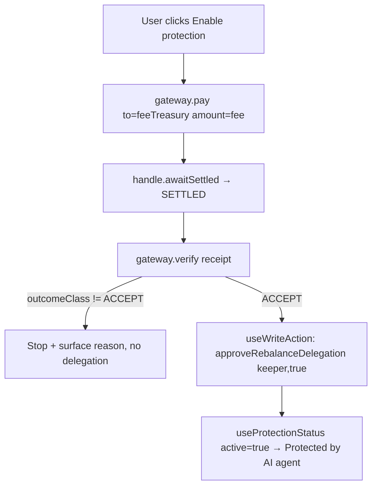

# feat: HSP-gated AI agent protection

**Target repo:** `paboxo-fe` (React 19 + Vite + TypeScript, wagmi/viem, @tanstack/react-query, vitest). Work on the current orca branch `ghozzza/hsp-protection`. Do NOT push/merge/PR — commit on the branch only.

## Summary

Add an opt-in **AI Agent Protection** feature to the lending UI. A user clicks **"Enable protection"**, pays a small stablecoin fee via **HSP** (HashKey Settlement Protocol), and — only when the HSP verifier returns **ACCEPT** — the app grants **rebalance-delegation** to the AI keeper wallet, letting the keeper protect (rebalance) the user's position when the oracle drops. This is the payment leg of the "DeFi + AI + payment" demo story: `Enable protection → HSP mandate signed → USDC settles from the user's own wallet (zero-custody) → verifier ACCEPT → delegation active → agent starts protecting`.

The on-chain primitive already exists: `LendingPool.approveRebalanceDelegation(delegate, allowed)` sets `rebalanceDelegation[user][delegate]`, and `rebalancePosition(...)` checks it. The FE contract ABI (`src/lib/contracts/abis/lendingPool.ts`) already has `approveRebalanceDelegation`, the `rebalanceDelegation` getter, and `rebalancePosition`.

## Problem Frame

- **HSP is pre-1.0, testnet-only, and NOT yet released.** The `@hsp/*` SDK is **not on npm**; the Coordinator URL, API key, faucet, and adapter address are placeholders the organizer supplies later. Verified against the HSP dev guide (`contents/docs/HSP/index.mdx`): it pins `resolveChain('hashkey-testnet')` + testnet USDC, no mainnet/177 mention. So we CANNOT call a real coordinator yet — but we can build the full UX behind a swappable abstraction with a **mock** default.
- **No coupling to a moving target.** HSP's own note: "pre-1.0 — the wire format may change between releases." Therefore all HSP access must sit behind a thin `PaymentGateway` interface (mirroring this repo's existing `ChainAdapter` mock/live swap), so wiring the real `@hsp/sdk` later is a one-file change, not a refactor.
- **The app must build & run with zero HSP credentials.** Default mode = mock; nothing may break when HSP is absent.
- **Off-chain gate, stated honestly.** The HSP receipt is an adapter-signed *observation*, not an on-chain proof. "verifier ACCEPT → delegation active" is orchestrated in the app, not enforced by the LendingPool contract. The UI must be honest about this (fee settles on HSP testnet sandbox).

## Requirements

- **R1** — A `PaymentGateway` abstraction under `src/lib/payments/` mirroring `src/lib/data/registry.ts`'s mock/live swap. Default = mock; `hsp` mode selectable via `VITE_PAYMENT_MODE`.
- **R2** — `getPaymentGateway()` returns a gateway exposing `pay(req)`, `verify(receipt)`, `explorerUrl(id)`, mirroring HSP's real surface (`hsp.pay()` returns `{ paymentId(=mandateHash), txHash, status, awaitSettled() }`; verifier decision `{ ok, outcomeClass }` with `outcomeClass ∈ {ACCEPT,RETRYABLE,POLICY,PERMANENT}`).
- **R3** — The mock gateway settles deterministically to `ACCEPT` (no `Math.random`/`Date.now`); the hsp gateway is a stub that throws a clear "awaiting sandbox" error and sketches the real `@hsp/sdk` calls in comments. **No `@hsp/*` import or install.**
- **R4** — Chain adapter gains `approveRebalanceDelegation(pool, delegate, allowed)` (write) and `getRebalanceDelegation(pool, owner, delegate)` (read) across the interface + mock + live impls, mirroring the existing `approveBorrowDelegation`/`getBorrowDelegation`.
- **R5** — A `protection` feature: `useProtection(market)` orchestrates `pay → awaitSettled → verify(ACCEPT) → approveRebalanceDelegation(keeper,true)` reusing `useWriteAction` for the on-chain leg; `useProtectionStatus(market)` reads whether protection is active. A `ProtectionPanel` renders the flow, an ACCEPT badge, an HSP Explorer link, and active/disable states.
- **R6** — Fee recipient + keeper address + fee token/amount live in one config (`PROTECTION` in `addresses.ts`). The two account addresses are placeholders the user fills; the UI/hook guard against the unconfigured (zero-address) state.
- **R7** — Tests (vitest) prove: registry defaults to mock; mock `verify` → ACCEPT; `enableProtection` happy path calls `approveRebalanceDelegation(pool, agentKeeper, true)`.
- **R8** — typecheck + lint + test + build all green (new files clean; pre-existing unrelated failures noted, not added to).

## Key Technical Decisions

- **KTD1 — Mirror the `ChainAdapter` registry pattern for payments.** `src/lib/payments/registry.ts` = `resolvePaymentGateway(mode)` (pure) + `getPaymentGateway()` (bound to `PAYMENT_MODE`), exactly like `src/lib/data/registry.ts`. Domain code calls `getPaymentGateway()` and never imports a concrete gateway → mock↔hsp is a one-line env flip.
- **KTD2 — The gateway interface mirrors HSP's real API 1:1** so swapping in `@hsp/sdk` is mechanical: `pay({to,amount,compliance?}) → PaymentHandle{paymentId,txHash,status,awaitSettled()}`, `verify(receipt) → {ok,outcomeClass}`. `paymentId === mandateHash`.
- **KTD3 — Reuse `useWriteAction` for the on-chain delegation leg.** The HSP pay/verify legs are their own async phases (`paying`/`verifying`); only the final `approveRebalanceDelegation` goes through the standard write wrapper (chain guard + tx state + query invalidation), consistent with `useDelegation`.
- **KTD4 — Fee recipient = the buyback / fee-sink wallet.** Reuse the existing treasury sink rather than inventing a custody path — reinforces the zero-custody story (wallet → treasury directly). Address is a config placeholder the user sets.
- **KTD5 — Honest off-chain gating in the UI.** Show that the fee settles on HSP (testnet sandbox) and that the keeper independently verifies the ACCEPT receipt; do not claim on-chain enforcement.

## High-Level Technical Design



## Output Structure

```
src/lib/payments/
  types.ts          # PaymentGateway + PayRequest/PaymentHandle/PaymentReceipt/Decision/OutcomeClass
  gateway.mock.ts   # mockPaymentGateway (deterministic ACCEPT)
  gateway.hsp.ts    # hspPaymentGateway (stub; real @hsp/sdk sketched in comments)
  registry.ts       # resolvePaymentGateway(mode) + getPaymentGateway()
  index.ts
  registry.test.ts
src/features/protection/
  hooks/useProtection.ts
  components/ProtectionPanel.tsx
  protection.test.tsx
src/lib/config/env.ts        # + PAYMENT_MODE, HSP_COORDINATOR_URL, HSP_CHAIN
src/lib/contracts/addresses.ts  # + PROTECTION config + PROTECTION_UNCONFIGURED
src/lib/data/types.ts / chain/chainAdapter.ts / chain/chainAdapter.mock.ts  # + 2 methods
.env.example                 # + VITE_PAYMENT_MODE / VITE_HSP_* (commented)
```

## Implementation Units

### U0. Install deps + orient
**Goal:** Working tree ready; conventions internalized.
**Approach:** Install deps (fresh worktree, no node_modules): detect lockfile — `pnpm-lock.yaml`→`pnpm install`, else `npm install`. READ `src/lib/data/registry.ts`, `src/lib/data/types.ts` (ChainAdapter ~104/152), `src/lib/data/chain/chainAdapter.ts` (getBorrowDelegation ~739, approveBorrowDelegation ~879), `src/lib/data/chain/chainAdapter.mock.ts` (resolve/MOCK_TX_HASH, delegation ~199/234), `src/lib/config/env.ts`, `src/lib/contracts/addresses.ts`, `src/features/delegation/hooks/useDelegation.ts`, `src/features/delegation/components/DelegationPanel.tsx`, `src/lib/tx/useWriteAction.ts`, and a hook test (`src/features/delegation/delegation.test.tsx`, `src/features/repay/hooks/useRepay.test.tsx`).
**Verification:** `pnpm typecheck` runs on a clean tree before changes.

### U1. PaymentGateway abstraction (`src/lib/payments/`) + env
**Goal:** A swappable payment gateway, mock default, mirroring the data registry.
**Requirements:** R1, R2, R3. **Dependencies:** U0.
**Files:** `src/lib/payments/{types,gateway.mock,gateway.hsp,registry,index}.ts`, `src/lib/config/env.ts`, `.env.example`.
**Approach:**
- `types.ts`: `OutcomeClass = 'ACCEPT'|'RETRYABLE'|'POLICY'|'PERMANENT'`; `ComplianceCap = 'kyc'|'sanctions'`; `PayRequest { to: Address; amount: bigint; compliance?: ComplianceCap[] }`; `PaymentReceipt { paymentId: string; mandate: unknown; receipt: unknown; attestations: unknown[] }`; `SettledPayment { status: string; receipt: PaymentReceipt }`; `PaymentHandle { paymentId: string; txHash?: string; status: string; awaitSettled: () => Promise<SettledPayment> }`; `Decision { ok: boolean; outcomeClass: OutcomeClass; reason?: string }`; `PaymentGateway { pay: (r:PayRequest)=>Promise<PaymentHandle>; verify: (r:PaymentReceipt)=>Promise<Decision>; explorerUrl: (id:string)=>string|undefined }`. Import `Address` from `#/lib/contracts`.
- `gateway.mock.ts`: `mockPaymentGateway` — `pay` returns handle with a deterministic pseudo-id from `to`+`amount` (no random/Date), `status:'PENDING'`, `awaitSettled()`→`{status:'SETTLED', receipt:{paymentId,mandate:{},receipt:{},attestations:[]}}`; `verify`→`{ok:true,outcomeClass:'ACCEPT'}`; `explorerUrl(id)`→`https://hsp.example/explorer/${id}`. Comment the real behavior.
- `gateway.hsp.ts`: `hspPaymentGateway` — each method throws `Error('HSP gateway not wired — awaiting HSP sandbox release (@hsp/sdk, coordinator URL, API key, adapter address)')`; commented real sketch (`new HSPClient({coordinatorUrl,apiKey,signer,chain}).pay({to,amount,profile})`, `handle.awaitSettled()`, `new HSPVerifier({chain,adapterAddress}).verify(mandate,receipt,attestations)`), with the rule `ACCEPT iff requiredCapabilities ⊆ satisfiedCapabilities`. No `@hsp` import.
- `registry.ts` (mirror data/registry.ts): `resolvePaymentGateway(mode:PaymentMode)` + `getPaymentGateway()` bound to `PAYMENT_MODE`.
- `env.ts`: `PaymentMode='mock'|'hsp'`; `PAYMENT_MODE = import.meta.env.VITE_PAYMENT_MODE==='hsp'?'hsp':'mock'`; `HSP_COORDINATOR_URL = import.meta.env.VITE_HSP_COORDINATOR_URL||undefined`; `HSP_CHAIN = import.meta.env.VITE_HSP_CHAIN||'hashkey-testnet'`.
- `.env.example`: commented `VITE_PAYMENT_MODE=mock` + `# VITE_HSP_COORDINATOR_URL=` + `# VITE_HSP_CHAIN=hashkey-testnet`, matching existing comment style.
**Test scenarios:** `registry.test.ts` — `resolvePaymentGateway('mock')===mockPaymentGateway`; default `getPaymentGateway()` is mock; `mockPaymentGateway.verify(...)` → ACCEPT; `pay().awaitSettled()` → 'SETTLED'.
**Verification:** typecheck + the registry test green.

### U2. PROTECTION config in addresses.ts
**Goal:** One config for keeper + fee recipient + fee token/amount, with an unconfigured guard.
**Requirements:** R6. **Dependencies:** U0.
**Files:** `src/lib/contracts/addresses.ts`.
**Approach:** Append `ProtectionConfig { agentKeeper: Address; feeTreasury: Address; feeToken: Address; feeAmount: bigint }` and `PROTECTION` with `agentKeeper`/`feeTreasury` = zero-address placeholders (loud TODO comments: AI keeper wallet / buyback fee-sink), `feeToken: TOKENS.pxUSDT.address`, `feeAmount: 1_000_000n` (1 pxUSDT, 6dp). Add `const ZERO = '0x0000000000000000000000000000000000000000'` and `export const PROTECTION_UNCONFIGURED = (c: ProtectionConfig) => c.agentKeeper === ZERO || c.feeTreasury === ZERO`.
**Verification:** typecheck green; `PROTECTION_UNCONFIGURED(PROTECTION)` is `true` until addresses are set.

### U3. ChainAdapter rebalance-delegation methods
**Goal:** Read/write rebalance delegation through the adapter (mock + live).
**Requirements:** R4. **Dependencies:** U0.
**Files:** `src/lib/data/types.ts`, `src/lib/data/chain/chainAdapter.ts`, `src/lib/data/chain/chainAdapter.mock.ts` (+ any conformance test).
**Approach:** Interface: add `getRebalanceDelegation: (pool,owner,delegate)=>Promise<boolean>` after `getWithdrawDelegation`, and `approveRebalanceDelegation: (pool,delegate,allowed)=>Promise<Hash>` after `approveWithdrawDelegation`. Mock: `getRebalanceDelegation()→resolve(false)`, `approveRebalanceDelegation(_p,_d,_a)→resolve(MOCK_TX_HASH)`. Live: read `functionName:'rebalanceDelegation', args:[owner,delegate]` (mirror getBorrowDelegation); write via `writeWithGas` `functionName:'approveRebalanceDelegation', args:[delegate,allowed]` (mirror approveBorrowDelegation). Update any adapter/registry conformance test that asserts method presence.
**Verification:** typecheck + existing adapter tests green.

### U4. useProtection + useProtectionStatus
**Goal:** Orchestrate pay → verify(ACCEPT) → grant delegation; read active state.
**Requirements:** R5. **Dependencies:** U1, U2, U3.
**Files:** `src/features/protection/hooks/useProtection.ts`.
**Approach (mirror `useDelegation.ts` + reuse `useWriteAction`):** `useProtection(market)` exposes `{...write, phase, receipt, decision, explorerHref, enableProtection, disableProtection }`. `phase: 'idle'|'paying'|'verifying'|'activating'`. `enableProtection({compliance?})`: guard `PROTECTION_UNCONFIGURED` → early message; phase 'paying' `const handle = await getPaymentGateway().pay({to:PROTECTION.feeTreasury, amount:PROTECTION.feeAmount, compliance})`; `const settled = await handle.awaitSettled()`; phase 'verifying' `const decision = await getPaymentGateway().verify(settled.receipt)`; store `receipt/decision`, `explorerHref = gateway.explorerUrl(handle.paymentId)`; if `decision.outcomeClass!=='ACCEPT'` stop with reason; phase 'activating' `await write.run({ send: () => getAdapters().chain.approveRebalanceDelegation(market.poolAddress, PROTECTION.agentKeeper, true), invalidateKeys: [['protection', market.poolAddress]] })`; reset 'idle'. Wrap pay/verify in try/catch → friendly message. `disableProtection()` → `approveRebalanceDelegation(...,false)`. `useProtectionStatus(market)` → `useQuery(['protection', market.poolAddress, address, PROTECTION.agentKeeper], enabled: address && !PROTECTION_UNCONFIGURED, queryFn: () => getAdapters().chain.getRebalanceDelegation(market.poolAddress, address!, PROTECTION.agentKeeper))` → `{ active, isLoading }`.
**Test scenarios:** happy path in mock mode reaches 'activating' and calls `approveRebalanceDelegation(pool, agentKeeper, true)` (see U6).
**Verification:** typecheck green.

### U5. ProtectionPanel component
**Goal:** UI for the flow; honest about HSP testnet + off-chain gate.
**Requirements:** R5. **Dependencies:** U4.
**Files:** `src/features/protection/components/ProtectionPanel.tsx`.
**Approach (mirror `DelegationPanel.tsx` primitives — reuse its TxStatus/buttons):** inactive → "Enable protection (pay fee)" button showing the fee (format `PROTECTION.feeAmount` at 6dp) + running phase labels (Paying fee… / Verifying receipt… / Activating protection…). After ACCEPT → green "ACCEPT" badge + external "View receipt on HSP Explorer" link (`explorerHref`, when defined). Active (`useProtectionStatus.active`) → "Protected by AI agent" + Disable button. Muted honesty line: "Fee settles via HSP (testnet sandbox)." If `PROTECTION_UNCONFIGURED`, disable + show "Set PROTECTION.agentKeeper / feeTreasury in addresses.ts". If straightforward, surface the panel where `DelegationPanel` is already rendered; otherwise leave it exported for wiring.
**Verification:** typecheck + lint green; component renders in a test env.

### U6. Tests + full verification
**Goal:** Prove the happy path and keep the suite green.
**Requirements:** R7, R8. **Dependencies:** U1–U5.
**Files:** `src/lib/payments/registry.test.ts` (from U1), `src/features/protection/protection.test.tsx`.
**Approach:** `protection.test.tsx` (mirror `delegation.test.tsx`): with a non-zero `PROTECTION` (mock/spy the module so the guard passes), `enableProtection()` in mock mode calls the adapter `approveRebalanceDelegation` with `(pool, agentKeeper, true)`; `useProtectionStatus` reflects the mock adapter. Then run the full gate.
**Verification (REQUIRED — report exact commands + pass/fail):** discover scripts from `package.json`; run typecheck, lint, test, build. New files must be clean; note (do not add to) any pre-existing unrelated failures.

## Scope Boundaries

- **In scope:** the FE payment abstraction + protection feature + adapter methods + config + tests, all mock-default.
- **Out of scope (non-goals):** real `@hsp/sdk` wiring (blocked on sandbox release); the keeper-side ACCEPT gate (separate repo `paboxo-keeper`, branch `ghozzza/hsp-verify-gate`); any contract change (the on-chain `approveRebalanceDelegation`/`rebalancePosition` already exist); x402 paywall and autonomous-agent payment (later, optional).

## Risks & Mitigations

- **HSP wire format changes (pre-1.0)** → all HSP access behind `PaymentGateway`; only `gateway.hsp.ts` changes when the SDK lands.
- **Unconfigured keeper/treasury addresses** → `PROTECTION_UNCONFIGURED` guard disables the action and explains, so the demo never sends to `0x0`.
- **Mistaking mock ACCEPT for real settlement** → UI clearly labels HSP testnet sandbox; hsp gateway throws loudly rather than silently faking.

## Verification Contract

- `pnpm typecheck` (or `tsc --noEmit`): green.
- lint (`pnpm lint`/`lint:check`): green on new files.
- tests (`pnpm test`/`vitest run`): green, incl. the 2 new tests.
- `pnpm build`: succeeds.

## Definition of Done

- All units complete; Verification Contract green.
- App builds & runs in default (mock) mode with no HSP creds; no `@hsp/*` import anywhere.
- Work committed on `ghozzza/hsp-protection` (NOT pushed/merged).
- Final report lists files changed, verification results, and the exact `PROTECTION.agentKeeper` / `PROTECTION.feeTreasury` placeholders the user must fill.

## Sources & Research

- HSP dev guide: `github.com/HashkeyHSK/documentation` → `contents/docs/HSP/index.mdx` (verified: testnet-only, `resolveChain('hashkey-testnet')`, `hsp.pay()`/`HSPVerifier` shapes, ACCEPT rule).
- This repo: `src/lib/data/registry.ts`, `types.ts`, `chain/chainAdapter*.ts`, `features/delegation/*`, `lib/tx/useWriteAction.ts`, `lib/contracts/abis/lendingPool.ts` (has `approveRebalanceDelegation` + `rebalanceDelegation` + `rebalancePosition`).
