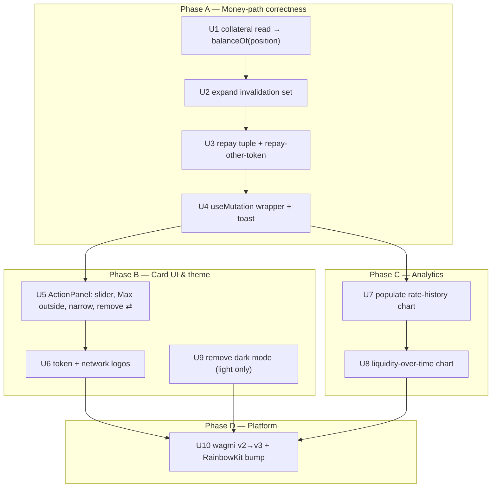
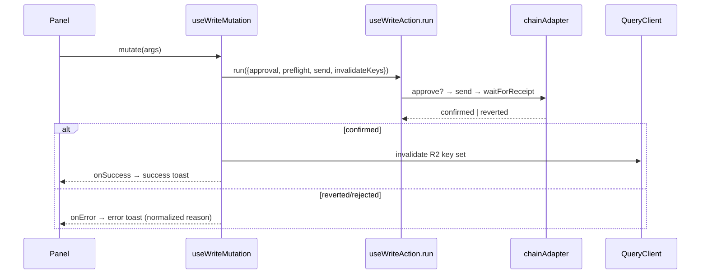

# Senja Hooks Parity, Mutation Writes & Supply Card Redesign - Plan

> **Product Contract preservation:** unchanged. Planning enriched HOW without altering the WHAT (R1–R17 intact).

## Goal Capsule

- **Objective:** Make the praboxo money path behave correctly by grafting senja-fe-v2's proven read/write behavior into praboxo's existing hook architecture, wrap writes in TanStack `useMutation` (error handling + toast + correct invalidation), redesign the Supply/Withdraw card (slider, external Max, logos), populate the rate-history and add a liquidity chart, drop dark mode, and upgrade to wagmi v3. Deliver in one pass, internally ordered so a breaking upgrade lands last.
- **Product authority:** the user (repo owner). senja-fe-v2 (`/Users/shinrai/production/senja/senja-fe-v2`, wagmi ^3.5.0) is the canonical behavioral reference for all money-path formulas and contract calls.
- **Open blockers:** (1) RainbowKit's wagmi-v3 compatibility is unconfirmed — praboxo's config uses RainbowKit `getDefaultConfig` (`src/lib/web3/config.ts`), and senja uses `@reown/appkit-adapter-wagmi`, not RainbowKit, so senja validates nothing on this path (KTD3, U10). (2) The indexer has no liquidity time-series today, so R16's data source is unresolved (KTD4, U8). Both are named risks with fallbacks, not silent assumptions.

---

## Product Contract

### Summary

Praboxo's supply/borrow/repay/withdraw flow has a solid foundation (a single `useWriteAction` wrapper, a live `@wagmi/core` chain adapter, shares conversion, preflight, tests) but diverges from senja in three bug-producing spots and lacks mutation ergonomics. We keep the architecture and graft senja's exact behavior: read collateral via `balanceOf(position)`, invalidate the full key set so wallet balance and per-market position refresh, and send the correct `repayWithSelectedToken` tuple so repay-with-another-token works. Writes gain a `useMutation` wrapper for TanStack error handling and success/error toasts. Alongside, the Supply/Withdraw card is narrowed and re-shaped (drag slider replacing percentage chips, Max button pulled outside the input, token + network logos added, the confusing `⇄` glyph removed), the empty rate-history chart is wired to live data, a liquidity-over-time chart is added, wagmi is upgraded to v3, and dark mode is removed in favor of light-only.

### Problem Frame

A prior attempt on this branch built praboxo's own write abstraction but did not faithfully port senja's money-path behavior, so real bugs persist: after supplying collateral the borrow flow still says "supply collateral first"; wallet balance does not refresh after a transaction; and repaying a pxUSDT loan with a different token (e.g. WETH) is not wired. The user repeatedly pointed to senja-fe-v2 as the complete, working reference and asked that its hooks be adapted rather than reinvented. Root causes are confirmed in code (see Sources), so the fix is targeted, not a rewrite.

### Key Decisions (product framing)

- **Graft, don't replace.** Keep praboxo's `useWriteAction` + chain-adapter + tests. Port senja's formulas, contract signatures, reads, and full invalidation set into the existing feature hooks. senja's file-for-file style (direct `useWriteContract`, no adapter) is not adopted — it would discard tested abstractions and the mock/live split.
- **Mutation is praboxo's addition, not senja's.** senja uses `useWriteContract` + `useWaitForTransactionReceipt` with no `useMutation`. Praboxo wraps its write path in `useMutation` for centralized error handling, `onSuccess` invalidation, and toast.
- **senja is the formula source of truth.** All shares/assets/price math and the `repayWithSelectedToken` tuple mirror senja exactly.
- **One pass, internally ordered.** Money-path correctness lands first on a green build, then card UI + logos + light-mode, then charts, then the wagmi v3 upgrade.

### Requirements

**Money-path correctness (hooks)**

- R1. Collateral / position detection reads the position's on-chain balance directly — `positionCollateralBalance = collateralToken.balanceOf(router.addressPositions(user))`, with `hasPosition = addressPositions(user) !== zeroAddress` — instead of `HelperUtils.getCollateralValue`, which returns 0 when the HelperUtils address is unset and causes the false "supply collateral first" gate.
- R2. The write-success invalidation set covers every query whose data shifts after a money-path write: wallet balances (`['token-balances', address]`, `['token-balance', token, address]`), per-market position (`['market-position', id, address]`), plus the existing `['markets']`, `['position']`, `['protocol-stats']`, and a newly added `['allowances', ...]` prefix where relevant.
- R3. Withdraw-liquidity input is denominated in **shares** (18 decimals); withdraw-collateral remains a token amount. The shares path matches senja's `withdrawLiquidity(shares)` and `sharesToUnderlying` conversion for previews.
- R4. Repay converts the entered asset amount to live debt shares (`shares = assets * totalBorrowShares / totalBorrowAssets`) and sends `repayWithSelectedToken` with `fee = 3000` (Uniswap 0.3% tier) and a live `isCollateral`/`fromPosition` flag — not the current hardcoded `fee: 0, fromPosition: false`.
- R5. Repay-with-another-token works: paying a pxUSDT loan with a different wallet token (e.g. WETH) sets the tuple's token field to the chosen token, USD-normalizes the input via the price oracle to a borrow-share amount, and uses the 0.3% fee tier so the contract can swap. Collateral-source repay skips approval; other tokens approve when allowance is short.
- R6. Every write hook exposes a TanStack `useMutation` surface (`mutate`/`isPending`/`isError`/`error`) that composes `useWriteAction`. On confirmed success it invalidates the R2 key set and fires a success toast; on revert/error it surfaces the normalized reason as an error toast.
- R7. All money-path formulas (shares↔assets, repay USD normalization, borrow amount from shares) match senja-fe-v2 verbatim.

**Platform**

- R8. Upgrade wagmi from `^2.19.5` to v3.x (with matching viem) per senja-fe-v2, migrating the breaking API changes across the wagmi config, connectors, and the `@wagmi/core` chain adapter while keeping every read/write path working.

**Supply / Withdraw card UI**

- R9. Narrow the card and drop low-value filler content, keeping the input, the amount control, and the primary action.
- R10. Replace the 25% / 50% / 75% chips with a draggable slider (Binance-style) that fills the input by fraction of balance, with the percentage markers (25 / 50 / 75 / 100) shown above the track.
- R11. Keep a distinct **Max** button at the far right, outside/separate from the input field (not one of the slider markers).
- R12. Remove the `⇄` glyph shown next to the token symbol in the panel header (users find it unclear).

**Token & network identity**

- R13. Show the token logo beside the token name in the panel header, sourced from `TOKEN_REGISTRY.logo` (e.g. `/tokens/usdt.webp`).
- R14. Show the network identity as `network: <logo>` (HashKey), reusing the whsx token logo (`/tokens/whsx.webp`) as the HashKey mark.

**Analytics**

- R15. Populate the currently-empty rate-history chart with live indexer data (`['rate-history', pool]`).
- R16. Add a liquidity-over-time chart so users can see how pool liquidity develops.

**Theme**

- R17. Remove dark mode entirely — delete `ThemeToggle`, strip `dark:` variants and any theme-provider/`data-theme` wiring in `__root.tsx` and `styles.css`, and render light mode only.

### Acceptance Examples

- AE1. **Covers R1, R2.** Given a connected wallet with no position, when the user supplies collateral and the tx confirms, then `['market-position', id, address]` refetches, the borrow panel reads a non-zero collateral balance, the "supply collateral first" gate clears without a manual refresh, and a subsequent borrow of a valid amount passes preflight (non-zero max-borrow) and confirms.
- AE2. **Covers R2, R6.** Given a supply of pxUSDT that confirms, then the wallet balance shown in the panel header decreases on the next render because `['token-balances', address]` was invalidated, and a success toast appears.
- AE3. **Covers R4, R5.** Given a pxUSDT debt and a WETH wallet balance, when the user selects WETH as the repay token and confirms, then the entered amount is USD-normalized to debt shares, `repayWithSelectedToken` is sent with the WETH token and `fee = 3000`, and the debt decreases after confirmation.
- AE4. **Covers R6.** Given a write that reverts on-chain, then the mutation resolves in an error state and an error toast shows the normalized revert reason, while the tx is not reported as success.
- AE5. **Covers R10, R11.** Given the Supply card, when the user drags the slider to the 50 marker, then the input fills to 50% of balance; the separate Max button at the far right fills to the full max (gas-reserved where applicable).

---

## Planning Contract

### Key Technical Decisions

- **KTD1 — Mutation wraps, not replaces, `useWriteAction`.** Add a thin `useWriteMutation` (or extend `useWriteAction`) that runs `useWriteAction.run(input)` inside a TanStack `useMutation` `mutationFn`, moving invalidation + toast into `onSuccess`/`onError`. The tx-state machine and revert normalization stay intact; hooks (`useSupplyCollateral`, `useBorrow`, `useRepay`, `useWithdraw`, `useSupplyLiquidity`, `useCrossChainSupply`) expose the mutation surface. Rationale: preserves tested behavior, adds tanstack ergonomics the user asked for.
- **KTD2 — Collateral AND max-borrow reads move off HelperUtils in the chain adapter.** The collateral-detection read resolves `router().addressPositions(user)` then `collateralToken.balanceOf(position)`, matching senja, instead of `HelperUtils.getCollateralValue` (degrades to 0). Critically, `HELPER_UTILS` is unset, so `getMaxBorrowAmount` also degrades to `0n` and `preflightBorrow` then rejects every borrow ("exceeds your borrowing power") even with real collateral. So this KTD additionally ports senja's **client-side** max-borrow derivation (`positionCollateralBalance × collateralPrice × LTV / borrowPrice − userBorrowAmount`, senja `useBorrowPoolData.ts:315`) into `getMaxBorrowAmount`, using oracle prices and pool LTV already reachable via the adapter. Public signatures stay stable; only the internal sources change. Rationale: fixing detection alone clears the gate but leaves borrows blocked — both reads must move for AE1 to truly pass.
- **KTD3 — wagmi v3 upgrade; RainbowKit compatibility must be verified before committing.** v3 unbundles connector deps (add `@wagmi/connectors`, bump `wagmi`/`@wagmi/core` to v3 and viem to the matching peer). praboxo builds its config via RainbowKit `getDefaultConfig` (`src/lib/web3/config.ts`), which internally bundles the connectors v3 unbundles — so U10 must first confirm a `@rainbow-me/rainbowkit` release declares wagmi `^3` as a peer and that `getDefaultConfig` works under v3. If none does, the fallback is a wallet-layer migration off RainbowKit (senja uses `@reown/appkit-adapter-wagmi`; or a plain `createConfig` + `@wagmi/connectors` setup) touching `ConnectButton`/`WalletControls`/`Web3Provider`/config — budget it explicitly, not as a "small fork". Common hook imports/signatures appear stable, but the full v2→v3 delta must be enumerated against every used `@wagmi/core`/`wagmi` surface, not assumed. Rationale: user chose "bump RainbowKit if needed" — this keeps wallet UX intact when a compatible line exists and names the rewrite risk when it does not.
- **KTD4 — Liquidity series needs a backend source; client-only derivation is not possible today.** The indexed rate snapshots carry only `timestamp/borrowApy/supplyApy` (no supply/borrow totals), and pool totals come from the router via RPC as a single current value — so a liquidity time-series cannot be derived from what is indexed now. R16 depends on the indexer persisting `totalSupplyAssets`/`totalBorrowAssets` per snapshot (or a new liquidity-snapshot entity); until that exists, U8 ships a current-value-only indicator rather than a fabricated series. Add a `LiquidityPoint` type mirroring `RatePoint`. Rationale: user chose endpoint-if-available-else-derive — this states the honest data dependency instead of assuming derivation removes backend work.
- **KTD5 — Repay tuple parametrized by repay-token source.** `useRepay` accepts the chosen repay token; sets `fee = 3000`, `fromPosition/isCollateral` from whether the token is the position collateral, and USD-normalizes non-borrow tokens to debt shares via the price oracle (mirroring senja's `repayBorrowEquivalent` → shares path). Rationale: enables R5 without a new hook.
- **KTD6 — Charts stay on recharts.** Rate and liquidity charts reuse the existing recharts stack and blue-palette theming (`RateChart` pattern). Rationale: no new dependency; light-mode-only theming simplifies.

### High-Level Technical Design

Delivery phases (internal ordering; single pass). Money-path lands on a green build before the breaking wagmi upgrade.

Write-path shape after U4:

### Implementation Units

#### U1. Fix collateral detection AND max-borrow at the adapter

- **Goal:** After supplying collateral, the borrow flow reads a non-zero collateral balance, the "supply collateral first" gate clears, AND a valid borrow is accepted (max-borrow no longer degrades to 0).
- **Requirements:** R1, R7. **Covers AE1 (partial).**
- **Dependencies:** none.
- **Files:** `src/lib/data/chain/chainAdapter.ts`, `src/lib/data/chain/chainAdapter.test.ts`, `src/lib/contracts/addresses.ts` (`HELPER_UTILS`), `src/lib/tx/preflight.ts` (verify borrow gate), `src/lib/data/types.ts` (if a position-address read is added to the interface).
- **Approach:** In the collateral-detection read, resolve `router().addressPositions(user)`; if non-zero, read `collateralToken.balanceOf(position)`; treat zero-address as "no position". Also replace the HelperUtils-backed `getMaxBorrowAmount` with senja's client-side derivation (`collateralBalance × collateralPrice × LTV / borrowPrice − userBorrowAmount`) so borrows are not blocked by a `0n` max while `HELPER_UTILS` is unset. Keep public signatures stable so `useBorrow`/preflight callers are unchanged — swap only the internal sources. Mirror senja `useBorrowPoolData.ts:155-199, :315`.
- **Patterns to follow:** existing `readContract`/`readContracts` usage in `chainAdapter.ts`; senja `addressPositions` + `balanceOf(position)` and client-side `maxBorrowable`.
- **Test scenarios:**
  - Covers AE1. Given a user with a created position holding collateral, the adapter returns that collateral balance (not 0) and `hasPosition = true`.
  - Covers AE1. Given a supplied position, `getMaxBorrowAmount` returns a non-zero power derived from `collateral × price × LTV`, and a borrow within it passes `preflightBorrow`.
  - Given a user with no position (addressPositions → zero), the adapter returns 0 collateral and `hasPosition = false`.
  - Given `HELPER_UTILS` unset, both the collateral read and max-borrow succeed via the position/oracle paths (regression guard against the degrade-to-0 bug).
- **Verification:** In live/mock, supplying collateral then borrowing a valid amount succeeds — no "supply collateral first" and no "exceeds your borrowing power" with real collateral.

#### U2. Expand the write-success invalidation set

- **Goal:** Wallet balance and per-market position refresh automatically after every money-path write.
- **Requirements:** R2. **Covers AE1, AE2 (partial).**
- **Dependencies:** U1.
- **Files:** `src/features/shared/writeKeys.ts`, and a test asserting the key set (`src/features/shared/writeKeys.test.ts` — new).
- **Approach:** Add `['token-balances']`, `['token-balance']`, `['market-position']`, and `['allowances']` (prefix form) to `WRITE_INVALIDATE_KEYS`. Confirm prefix-matching semantics: `['position']` already covers `['position', address, empty]`, but `['market-position', id, address]` needs its own prefix entry. Keep keys as broad prefixes so per-arg queries all match.
- **Patterns to follow:** query keys defined in `src/features/shared/useTokenBalances.ts`, `src/routes/borrow.$id.tsx` (`market-position`).
- **Test scenarios:**
  - Covers AE2. The exported key set includes prefixes that prefix-match `['token-balances', addr]`, `['token-balance', token, addr]`, and `['market-position', id, addr]`.
  - Regression: the existing `['markets']`, `['position']`, `['protocol-stats']` keys remain present.
- **Verification:** After a confirmed supply, the header balance decreases without manual refresh.

#### U3. Repay tuple parity + repay-with-another-token

- **Goal:** Repay uses live debt shares and the correct tuple; paying a pxUSDT loan with a different token (e.g. WETH) works.
- **Requirements:** R3 (verify), R4, R5, R7. **Covers AE3.**
- **Dependencies:** U1.
- **Files:** `src/features/repay/hooks/useRepay.ts`, `src/features/repay/hooks/useRepay.test.ts`, `src/features/repay/components/RepayPanel.tsx`, `src/lib/math.ts` (USD-normalize helper if missing), possibly `src/lib/data/chain/chainAdapter.ts` (`repayWithSelectedToken` arg mapping to `fee`/`fromPosition`).
- **Approach:** Accept the chosen repay token in `repay(assets, token)`. For the borrow token, convert assets→shares (existing `debtSharesForAssets`). For another token, USD-normalize input via price oracle to a borrow-token amount, then to shares (senja `useBorrowActions.ts:444-470`). Send `repayWithSelectedToken` with `fee = 3000`, `fromPosition/isCollateral` set from whether the token is the position collateral. For the swap path (repay with a non-borrow token), pass a **non-zero** `amountOutMinimum` derived from the oracle price × a bounded slippage tolerance (default 0.5–1%, product-set) rather than `0n`, unless it is verified on-chain that `repayWithSelectedToken` enforces its own min-out — see Risks. Approvals are exact-amount to the pool: borrow-token uses the pxUSDT asset amount; another token uses `parseUnits(enteredAmount, thatToken.decimals)` (never `maxUint256`); collateral-source repay skips approval. Confirm `withdrawLiquidity` already takes shares (R3) — no change expected, add a test to lock it.
- **Patterns to follow:** senja `repayWithSelectedToken` tuple `{v0..v5}`, `getRepayTokenPrice`/`getRepayTokenBalance`; existing `useRepay` approval flow.
- **Test scenarios:**
  - Covers AE3. Repaying with the borrow token converts assets→shares and sends `fee=3000`, `fromPosition=false`.
  - Covers AE3. Repaying with a non-collateral other token (WETH) USD-normalizes to shares, sets the token field, passes `amountOutMinimum > 0`, and approves the chosen token in its own decimals (exact-amount, not `maxUint256`) when allowance is short.
  - Repaying from collateral sets `fromPosition/isCollateral=true` and skips approval.
  - R3 lock: `withdrawLiquidity` is called with a shares (18-dec) argument, not a token amount.
  - Zero/negative amount is blocked by preflight.
- **Verification:** A WETH-funded wallet can repay a pxUSDT debt; debt decreases after confirmation.

#### U4. `useMutation` wrapper + success/error toasts

- **Goal:** Writes expose a TanStack mutation surface with centralized invalidation and toasts.
- **Requirements:** R6, R2, R7. **Covers AE2, AE4.**
- **Dependencies:** U2 (key set), U3 (repay), U1.
- **Files:** `src/lib/tx/useWriteMutation.ts` (new) + `src/lib/tx/useWriteMutation.test.tsx` (new), `src/components/ui/TxToast.tsx` (reuse/extend), and each write hook: `src/features/supply/hooks/useSupplyCollateral.ts`, `useSupplyLiquidity.ts`, `src/features/borrow/hooks/useBorrow.ts`, `src/features/repay/hooks/useRepay.ts`, `src/features/withdraw/hooks/useWithdraw.ts`, `src/features/crosschain/hooks/useCrossChainSupply.ts` (+ their tests).
- **Approach:** `useWriteMutation` wraps `useWriteAction.run` in `useMutation`; `onSuccess` (only when `run` resolved `true`) invalidates the R2 key set and fires a success toast; `onError` and a `false` resolution fire an error toast with the normalized revert reason. Refactor each hook to return the mutation (`mutate`, `isPending`, `isError`, `error`) while keeping its current callable action for compatibility. Do not double-invalidate (drop per-call `invalidateKeys` when the mutation owns it, or keep it idempotent).
- **Execution note:** Start with a failing test for the success→invalidate→toast and revert→error-toast contract of `useWriteMutation`.
- **Patterns to follow:** `useWriteAction.ts` state machine; existing `TxToast.tsx`; TanStack `useMutation` `onSuccess`/`onError`.
- **Test scenarios:**
  - Covers AE2. On confirmed success, the R2 key set is invalidated and a success toast fires exactly once.
  - Covers AE4. On on-chain revert, `isError` is set, an error toast shows the normalized reason, and success is not reported.
  - On wallet rejection, no error toast for revert; state reflects rejection (distinct from error).
  - No duplicate invalidation when both the wrapper and a legacy `invalidateKeys` are present.
- **Verification:** Each panel shows a success toast and refreshed balances on confirm; a reverting tx shows an error toast.

#### U5. Redesign the Supply/Withdraw card (slider, external Max, narrow, remove ⇄)

- **Goal:** A narrower card with a Binance-style drag slider replacing the percentage chips, a Max button outside the input, and the confusing `⇄` glyph removed.
- **Requirements:** R9, R10, R11, R12. **Covers AE5.**
- **Dependencies:** U4 (panels stable).
- **Files:** `src/components/action/ActionPanel.tsx` (+ test), `src/components/ui/AmountChips.tsx` (replace with a slider component or add `src/components/ui/AmountSlider.tsx` + test), the panel header where the token symbol + `⇄` render (locate in `ActionPanel`/header), `src/components/ui/a11y.test.tsx`.
- **Approach:** Add `AmountSlider` (native styled `input[type=range]` with 25/50/75/100 markers labeled above the track; on change, fill input to that fraction of balance). Keep a separate Max button at the far right, outside the input row (reuse `maxLabel`/`onMax` semantics from `AmountChips`). Narrow the card container and drop filler. Remove the `⇄` glyph next to the token symbol. Keep the slider keyboard-accessible (arrow keys, focus ring, `aria-label`, `aria-valuetext` as percent).
- **Patterns to follow:** `AmountChips` fraction/max callbacks; existing `ActionPanel` layout and blue-palette CSS vars.
- **Test scenarios:**
  - Covers AE5. Dragging/keying the slider to the 50 marker fills the input to 50% of balance.
  - Covers AE5. The Max button (separate, far right) fills to the full max.
  - The `⇄` glyph is no longer rendered in the panel header.
  - a11y: slider has an accessible name and percent `aria-valuetext`; Max button is focusable and labeled.
- **Verification:** Card is visibly narrower; slider + external Max behave; no `⇄`.

#### U6. Token + network logos in the panel header

- **Goal:** The panel header shows the token logo beside the name and a HashKey network mark.
- **Requirements:** R13, R14.
- **Dependencies:** U5.
- **Files:** `src/components/action/ActionPanel.tsx` (or a header subcomponent) + test, `src/lib/tokens/registry.ts` (read `logo`), a small `TokenLogo`/`NetworkBadge` in `src/components/ui/` if warranted.
- **Approach:** Look up `TOKEN_REGISTRY[address].logo` for the token image beside the symbol. Render `network: <HashKey logo>` reusing `/tokens/whsx.webp`. Provide `alt` text; fall back gracefully when a logo path is missing (initial or generic glyph). 64×64 WebP, sized down in CSS.
- **Patterns to follow:** `TokenGlyph.tsx`/`TokenPairGlyph.tsx` existing logo rendering; `TOKEN_REGISTRY` shape.
- **Test scenarios:**
  - The token logo renders from the registry with correct `alt`.
  - The HashKey network mark renders beside a `network:` label.
  - A token missing a logo path renders the fallback without breaking layout.
- **Verification:** Header shows token + network logos in the Supply/Withdraw card.

#### U7. Populate the rate-history chart from live indexer

- **Goal:** The rate-history chart shows real data instead of empty.
- **Requirements:** R15.
- **Dependencies:** U4.
- **Files:** `src/features/analytics/components/RateChart.tsx` / `MarketRateChart.tsx` (consumers), the `['rate-history', pool]` query hook (locate under `src/features/analytics` or `src/lib/data`), `src/lib/data/indexer/indexerAdapter.ts`, `src/lib/data/indexer/indexerAdapter.mock.ts`.
- **Approach:** Wire the rate-history query to `createLiveIndexerAdapter` output so `RatePoint[]` is non-empty in live mode; ensure the mock adapter returns representative points for dev. Render three distinct states: loading (skeleton/placeholder line while the query is pending), error (caption/retry on indexer failure), and empty (no data yet) — a pending or failed fetch must not read as "empty". No new chart component.
- **Patterns to follow:** `RatePoint` type; `RateChart` recharts usage.
- **Test scenarios:**
  - Given indexer rate points, the chart receives a non-empty `RatePoint[]`.
  - While the query is pending the chart shows a loading state, not the empty state.
  - On indexer fetch error the chart shows a defined error state, not a broken axis.
  - Given an empty series, the chart shows a defined empty state.
  - Mock adapter returns representative points in dev mode.
- **Verification:** Rate history renders a line in live and mock modes.

#### U8. Liquidity-over-time chart

- **Goal:** Users can see liquidity develop over time.
- **Requirements:** R16.
- **Dependencies:** U7.
- **Files:** `src/features/analytics/components/LiquidityChart.tsx` (new) + test, `src/lib/data/types.ts` (`LiquidityPoint`), `src/lib/data/indexer/indexerAdapter.ts` + `.mock.ts`, the consuming route/panel (e.g. `src/routes/earn.$id.tsx`).
- **Approach:** Add a `LiquidityPoint { timestamp, liquidity }` type. Prefer an indexer liquidity-series endpoint. Per KTD4, existing rate snapshots carry no supply/borrow totals, so a series **cannot** be derived client-side today — if no endpoint exists, this unit is blocked on a backend liquidity-snapshot entity (persist `totalSupply/BorrowAssets` per snapshot) and ships a current-value-only indicator (`availableLiquidity` from live totals) as the interim, not a fabricated series. Build `LiquidityChart` on recharts mirroring `RateChart` theming (light palette), with the same loading/error/empty states as U7. Add a `['liquidity-history', pool]` query when the series exists.
- **Patterns to follow:** `RateChart.tsx`; `availableLiquidity` in `src/lib/math.ts`; indexer adapter read shape.
- **Test scenarios:**
  - Given a liquidity series from the backend snapshot entity, the chart receives a non-empty `LiquidityPoint[]`.
  - When no series entity exists, U8 renders the interim current-value indicator (not a fabricated series).
  - Loading and error states render distinctly from empty.
- **Verification:** A liquidity chart renders on the pool/earn detail view.

#### U9. Remove dark mode (light-only)

- **Goal:** The app renders light mode only; no theme toggle.
- **Requirements:** R17.
- **Dependencies:** none (independent; sequence before U10 to reduce churn).
- **Files:** `src/components/ThemeToggle.tsx` (delete + remove usages), `src/routes/__root.tsx` (remove theme provider/`data-theme` wiring), `src/styles.css` (strip `dark:` variants / dark tokens), any `ThemeToggle` import sites (`AppHeader`, etc.), related tests.
- **Approach:** Remove the toggle component and its header usage; force the light token set; delete `dark:` utility variants and `prefers-color-scheme` dark handling. Keep CSS variables that light mode uses. Ensure no dangling imports.
- **Patterns to follow:** existing light-palette CSS variables in `styles.css`.
- **Test scenarios:** `Test expectation: none — removal/config; covered by build + existing panel/a11y tests still passing (no `ThemeToggle` import errors, light rendering intact).`
- **Verification:** No theme toggle in the header; app renders light regardless of OS setting.

#### U10. Upgrade wagmi v2 → v3 + RainbowKit bump

- **Goal:** The app runs on wagmi v3 with wallet connection intact.
- **Requirements:** R8.
- **Dependencies:** U1–U9 landed on a green build (upgrade last).
- **Files:** `package.json`, `bun.lock`, the wagmi config (locate: `src/lib/wallet`/`src/lib/wagmi`/`__root.tsx`), `src/lib/data/chain/chainAdapter.ts` (`@wagmi/core` v3 API check), connector setup, RainbowKit provider setup.
- **Approach:** Add `@wagmi/connectors`; bump `wagmi`/`@wagmi/core` to v3 and `viem` to the matching peer; bump `@rainbow-me/rainbowkit` to the wagmi-v3-compatible line (KTD3). Move connector imports to `@wagmi/connectors`. Verify `createConfig`, `useReadContract`, `useWriteContract`, `useWaitForTransactionReceipt`, `readContract`/`writeContract`/`waitForTransactionReceipt` (`@wagmi/core`) signatures against v3 docs. Run the full type-check and test suite; fix breakages.
- **Execution note:** Land after all other units are green so a breaking upgrade never blocks a bug fix; treat as an isolated commit.
- **Patterns to follow:** senja-fe-v2 `createConfig` + `@wagmi/connectors` setup (wagmi ^3.5.0); wagmi v3 migration guide (Sources).
- **Test scenarios:**
  - Type-check passes on v3 across all read/write hooks and the chain adapter.
  - Existing hook tests pass unchanged (imports/signatures stable).
  - Wallet connect/disconnect and a sample read+write path work end-to-end in dev.
- **Verification:** `bun run` builds; wallet connects; a supply/borrow round-trips on v3.

### Verification Contract

- Type-check and lint clean (`tsc`, eslint) after each phase; the full suite green before U10 and after U10.
- Unit tests: all new/updated hook and component tests pass (`vitest`).
- Manual money-path smoke on HashKey (live mode): supply collateral → borrow (no false gate, AE1); supply liquidity → balance refresh + toast (AE2); repay with WETH (AE3); reverting tx → error toast (AE4); slider + Max fill (AE5).
- Visual check: card narrower, slider + external Max, token/network logos, no `⇄`, light mode only; rate + liquidity charts render.

### Definition of Done

Split into two independently-shippable milestones so the confirmed bug fixes can reach "done" even if the wagmi-v3 / RainbowKit fork balloons (per Risks & the scope guard).

**Milestone 1 — money-path + UI (R1–R7, R9–R17):**
- R1–R7 satisfied; AE1–AE5 pass in live mode — including a real borrow succeeding after supplying collateral, not just the gate clearing.
- Money-path writes go through `useMutation` with correct invalidation (wallet balance + market-position refresh) and success/error toasts.
- Repay-with-another-token works with a non-zero slippage floor; collateral detection **and** max-borrow fixed at the adapter.
- Supply/Withdraw card redesigned (slider, external Max, logos, no `⇄`), dark mode removed.
- Rate-history populated; liquidity chart present, or the interim current-value indicator when the backend series is unavailable (KTD4).

**Milestone 2 — wagmi v3 (R8, U10):**
- App runs on wagmi v3 with wallet connection intact; suite green.
- Milestone 1 reaches "done" independently even if the RainbowKit-v3 fork forces a wallet-layer migration.

---

## Risks & Dependencies

- **wagmi v3 × RainbowKit compatibility (highest risk).** If no RainbowKit line supports wagmi v3 cleanly, U10 may need a connector-only path (drop RainbowKit) — surfaced as a fork if hit. Mitigation: U10 is last and isolated; money-path value ships regardless.
- **Liquidity endpoint may not exist.** Derivation fallback (KTD4) removes the hard dependency, but derived points are only as granular as indexed snapshots.
- **Invalidation prefix semantics.** Over-broad prefixes could refetch more than needed; acceptable for correctness, watch for extra network chatter.
- **`repayWithSelectedToken` on-chain swap** assumes a Uniswap 0.3% pool exists for the chosen token pair; if not, the tx reverts (surfaced via error toast, not a silent failure).
- **Swap-repay slippage / MEV (adverse execution).** The swap with a zero `amountOutMinimum` exposes the repayer to sandwich/MEV loss on thin HashKey pools — the tx succeeds while the user overpays. KTD5/U3 pass a non-zero oracle-derived min-out unless the pool is verified to enforce its own bound; confirm the on-chain behavior during implementation.
- **Borrow stays blocked if only detection is fixed.** `HELPER_UTILS` is unset, so `getMaxBorrowAmount` returns `0n` and preflight rejects every borrow; U1 must port the client-side max-borrow derivation, not only the collateral read (verified via AE1's borrow-confirms assertion).

## Sources & Research

- Grounding dossier (senja money-path, verbatim quotes + file:line): session scratchpad only (ephemeral, not in-repo). R7's "verbatim match" verifies against the real senja files listed below, not the dossier.
- praboxo write wrapper: `src/lib/tx/useWriteAction.ts`; invalidation set: `src/features/shared/writeKeys.ts`; wallet-balance keys: `src/features/shared/useTokenBalances.ts`.
- praboxo hooks: `src/features/withdraw/hooks/useWithdraw.ts`, `src/features/repay/hooks/useRepay.ts`, `src/features/supply/hooks/useSupplyCollateral.ts`, `src/features/borrow/hooks/useBorrow.ts`.
- praboxo live chain adapter (HelperUtils degrade-to-0 note): `src/lib/data/chain/chainAdapter.ts`.
- Card UI: `src/features/supply/components/SupplyPanel.tsx`, `src/components/action/ActionPanel.tsx`, `src/components/ui/AmountChips.tsx`.
- Token/network logos: `src/lib/tokens/registry.ts`; existing logo glyphs: `src/components/ui/TokenGlyph.tsx`, `TokenPairGlyph.tsx`.
- Theme: `src/components/ThemeToggle.tsx`, `src/routes/__root.tsx`, `src/styles.css`.
- Charts: `src/features/analytics/components/RateChart.tsx`, `MarketRateChart.tsx` (recharts); indexer: `src/lib/data/indexer/indexerAdapter.ts`, types `src/lib/data/types.ts` (`RatePoint`).
- senja reference: `senja-fe-v2/src/hooks/useBorrowActions.ts`, `useBorrowPoolData.ts`, `useEarnPoolData.ts`, `src/app/earn/[address]/page.tsx`, `src/lib/abis/lending-pool-abi.ts`.
- wagmi v3 migration (breaking change: unbundled connectors, install `@wagmi/connectors`, bump `@wagmi/core@3`): wagmi docs `core/guides/migrate-from-v2-to-v3` (via Context7 `/wevm/wagmi`, 2026-07-11).
