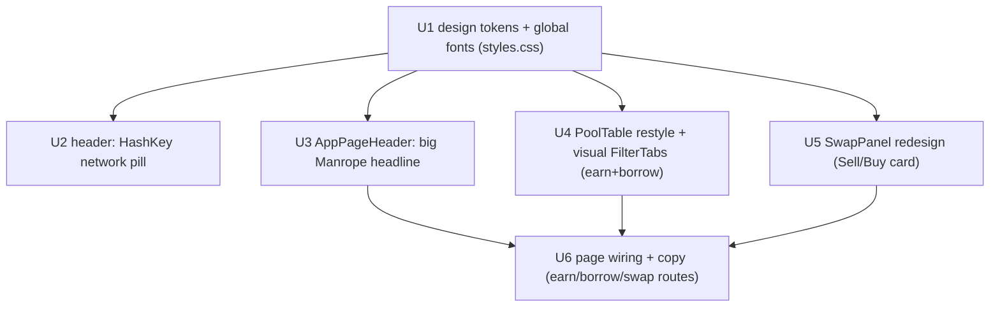

# Luminous Professional Page Redesign - Plan

## Goal Capsule

- **Objective:** Restyle the Earn list, Swap, and Borrow list pages to the "Luminous Professional" design in `docs/ui/earn/` and `docs/ui/swap/` (screen.png + code.html + DESIGN.md), plus the shared design tokens and header — a visual/layout redesign with no change to data hooks, wallet gating, or money-path behavior.
- **Product authority:** the user. Design source of truth: `docs/ui/earn/` and `docs/ui/swap/` (Borrow reuses the Earn table design).
- **Open blockers:** none. Two forks resolved: fonts roll out **globally** (KTD1); filter tabs are **visual-only** for now (KTD2).

---

## Product Contract

### Summary

Apply the "Luminous Professional" look — light-only, primary `#0690D4`, white background, off-white `#F8FAFC` cards with 1px `#E2E8F0` borders (no heavy shadows), small radii, and a Manrope / Inter / JetBrains Mono type system — to the Earn list, Borrow list, and Swap pages. Earn and Borrow render a big Manrope headline over a card holding a search field, a segmented filter control (All Pools / High APY / Stablecoins), and the pool table (mono uppercase headers, token-pair glyphs, blue numeric values, thin row separators, a PRICE STALE badge). Swap renders a centered card with a Select-Market pair dropdown, Sell and Buy sub-cards, a circular swap-direction button, an Exchange Rate / Network Fee / Slippage block, and a full-width primary button. The header gains a "● HashKey Chain" network pill. Nothing about data fetching, `NetworkGuard` gating, or the money path changes.

### Problem Frame

The current pages work but predate the "Luminous Professional" spec: the app uses a Fraunces serif display face + IBM Plex Mono, the Earn/Borrow pages lead with a small kicker rather than a large headline and carry no filter control, and the Swap panel is a plain stacked form rather than the Sell/Buy card in the design. The redesign aligns the three highest-traffic pages (and the global type system) with the provided mockups without touching behavior.

### Key Technical Decisions

- **KTD1 — Fonts change globally via `styles.css` theme tokens.** Swap the `@import` to Manrope + Inter + JetBrains Mono (drop Fraunces + IBM Plex Mono); set `--font-sans` to Inter (body/UI), add a display token used by `.display-title` set to Manrope, and set `--font-mono` to JetBrains Mono. This restyles every page (the user chose global), so heading/body/mono change app-wide in one place.
- **KTD2 — Filter tabs are visual-only.** Render the All Pools / High APY / Stablecoins segmented control per the design with only "All Pools" active; the other two are inert (non-interactive or no-op) and wired so real filtering can be added later. No list-filtering logic in this plan.
- **KTD3 — Restyle the shared `PoolTable` once; Borrow inherits it.** Both Earn and Borrow render through `PoolTable`, so the table restyle (headers, separators, card shell, filter-tab slot) lands in one component; each surface keeps its own columns. "Borrow reuses the Earn design" = the same restyled `PoolTable`, not a new table.
- **KTD4 — Keep the Swap panel's swap-collateral behavior; restyle only.** The "Sell" side is the existing amount input (collateral); the "Buy" side shows the derived output as a read-only amount; slippage chips reuse the existing slippage state. No swap-direction reversal logic is added — the circular button is decorative/disabled unless trivially wired, per Open Questions.
- **KTD5 — Reuse existing glyph/badge components.** `TokenGlyph` / `TokenPairGlyph` for token art, `NetworkBadge` for the HashKey mark, `StaleBadge` for PRICE STALE — restyle in place rather than introducing new art.

### Requirements

**Design system (global)**

- R1. Type system: Manrope for headlines, Inter for body/UI, JetBrains Mono for data labels/metadata; Fraunces and IBM Plex Mono are removed. Applied app-wide via `styles.css`.
- R2. Color & shape tokens match the spec: white background, off-white `#F8FAFC` card surfaces, 1px `#E2E8F0` borders with no heavy shadows, small radii (≈4px inputs/buttons, ≈8px cards). Light-only.

**Header**

- R3. A "● HashKey Chain" network pill renders in the header next to the wallet controls.

**Earn / Borrow list**

- R4. Each page leads with a large Manrope headline and a subtitle (no kicker label), matching the design copy.
- R5. The list sits in a card with a search field and a segmented filter control (All Pools / High APY / Stablecoins); only All Pools is active (KTD2).
- R6. The table uses JetBrains-Mono uppercase column headers, a token-pair glyph + symbol identity cell, blue numeric values, thin row separators, and a PRICE STALE badge on stale pools. Borrow renders the same styled table with its own columns.

**Swap**

- R7. Swap renders a centered card containing: a Select-Market pair dropdown; a Sell sub-card and a Buy sub-card (each with a label, large amount, ~USD line, token-selector pill, and balance line); a circular swap-direction button between them; an Exchange Rate / Network Fee / Slippage-tolerance (0.1% / 0.5% / 1.0% chips) block; and a full-width primary action button.

**Constraints**

- R8. Visual/layout only: data hooks, `NetworkGuard` wallet gating, and money-path behavior are unchanged; the app stays light-only.

### Acceptance Examples

- AE1. **Covers R1.** After the redesign, computed `font-family` on a heading resolves to Manrope, on body text to Inter, and on a `.num` financial figure to JetBrains Mono; Fraunces and IBM Plex Mono no longer load.
- AE2. **Covers R3.** With the app rendered, the header shows a pill reading "HashKey Chain" with a leading status dot, beside the Connect Wallet / wallet controls.
- AE3. **Covers R5, R6.** On the Earn page, the pool card shows a search input and a three-segment filter with "All Pools" selected; the table headers read POOL / TOTAL SUPPLY / SUPPLY APY / INTEREST RATE / UTILIZATION / LIQUIDITY, and a stale pool row shows a PRICE STALE badge.
- AE4. **Covers R7.** On the Swap page, the card shows Sell and Buy sub-cards with token pills, a swap-direction button between them, and a Slippage row with 0.1% / 0.5% / 1.0% chips where the active one is highlighted.
- AE5. **Covers R8.** Typing in the Earn search still filters the list, the Swap amount still drives the action button's enabled state, and disconnected users still see the `NetworkGuard` connect prompt on Swap — none of that behavior changed.

---

## Planning Contract

### High-Level Technical Design

Dependency order — tokens first (everything reads them), then the shared/leaf components, then the pages:

### Implementation Units

#### U1. Design tokens + global fonts

- **Goal:** The app-wide type system and surface/border/radius tokens match the spec; every page inherits them.
- **Requirements:** R1, R2. **Covers AE1.**
- **Dependencies:** none.
- **Files:** `src/styles.css`.
- **Approach:** Replace the Google Fonts `@import` with Manrope + Inter + JetBrains Mono (drop Fraunces + IBM Plex Mono). In `@theme`, set `--font-sans` to Inter, `--font-mono` to JetBrains Mono, and add a display token (e.g. `--font-display: Manrope`); point `.display-title` at the display token instead of Fraunces. Tune the existing color tokens toward the spec (card surface `#F8FAFC`, border `#E2E8F0`, remove/soften the `.island-shell`/`.feature-card` box-shadows toward the flat outline look) and standardize radii (cards ~8px, inputs/buttons ~4px) — keep the primary blue (`--palm`/`#0690D4`). Do not rename tokens that many components read; adjust values in place.
- **Patterns to follow:** existing `@theme` + `:root` token block and `.display-title` / `.num` rules in `src/styles.css`.
- **Test scenarios:**
  - Covers AE1. A rendered heading's `font-family` resolves to Manrope; body to Inter; a `.num` element to JetBrains Mono.
  - The stylesheet no longer references Fraunces or IBM Plex Mono.
  - `Test expectation: mostly visual` — pair the font assertion above with the existing suite staying green (no token renamed out from under a consumer).
- **Verification:** Every page renders with the new fonts and flatter cards; no console/font 404s; full suite still green.

#### U2. Header HashKey network pill

- **Goal:** The header shows a "● HashKey Chain" pill beside the wallet controls.
- **Requirements:** R3. **Covers AE2.**
- **Dependencies:** U1.
- **Files:** `src/components/layout/AppHeader.tsx`, a small `src/components/wallet/NetworkPill.tsx` (new) + its test, `src/components/layout/AppHeader.test.tsx`.
- **Approach:** Add a presentational `NetworkPill` (status dot + "HashKey Chain", pill-shaped, off-white bg + border) and render it in `AppHeader` just before `WalletControls`. Static label from `HASHKEY.name` — no new wallet hook (keep it SSR-safe / not gated).
- **Patterns to follow:** `NetworkBadge` (existing HashKey mark), the header's chip class contract in `WalletControls`.
- **Test scenarios:**
  - Covers AE2. The header renders text "HashKey Chain" with a decorative status dot.
  - The pill renders whether or not a wallet is connected (it is not wallet-gated).
- **Verification:** Header matches the design (pill left of Connect Wallet) on desktop and collapses gracefully on mobile.

#### U3. AppPageHeader — large Manrope headline

- **Goal:** Pages lead with a big Manrope headline + subtitle, no kicker.
- **Requirements:** R4. **Covers AE3 (headline).**
- **Dependencies:** U1.
- **Files:** `src/components/layout/AppPageHeader.tsx`, `src/components/layout/AppPageHeader.test.tsx` (if present; else add).
- **Approach:** Scale the `display-title` h1 up (headline-lg ≈ 48px desktop / 32px mobile) and drop the kicker from the visual lead (keep the prop optional/back-compat but unused by the redesigned pages). Subtitle in the muted body color.
- **Patterns to follow:** current `AppPageHeader` structure; the design's headline/subtitle sizes in `docs/ui/*/DESIGN.md` typography.
- **Test scenarios:**
  - The headline text renders in an `h1`; the subtitle renders when provided.
  - No kicker element renders when `kicker` is omitted.
- **Verification:** Earn/Borrow/Swap headlines match the mockups' scale and weight.

#### U4. PoolTable restyle + visual filter tabs

- **Goal:** The Earn and Borrow pool tables match the design — carded, mono uppercase headers, blue values, thin separators, a PRICE STALE badge — with a visual All Pools / High APY / Stablecoins segmented control.
- **Requirements:** R5, R6. **Covers AE3.**
- **Dependencies:** U1.
- **Files:** `src/features/markets/components/PoolTable.tsx`, a new `src/features/markets/components/PoolFilterTabs.tsx` + its test, `src/features/markets/components/PoolBadges.tsx` (PRICE STALE styling), `src/features/markets/components/PoolTable.test.tsx` (if present), `src/features/earn/components/EarnList.test.tsx` / `src/features/borrow/components/BorrowList.test.tsx` (adjust only if they assert removed markup).
- **Approach:** Wrap the table in the spec card (rounded-lg, `#E2E8F0` border, off-white surface). Put the existing `PoolSearch` on the left and a new presentational `PoolFilterTabs` (segmented control, All Pools active, other two inert) on the right of the card header. Restyle `thead` to JetBrains-Mono uppercase small labels; keep the blue value styling the columns already apply; use thin `#F1F5F9` row separators and the specified hover. Restyle `StaleBadge` to read "PRICE STALE" with the error tint. Do not change `PoolTable`'s search/sort/pagination/state logic. Column definitions in `EarnList`/`BorrowList` stay as-is.
- **Patterns to follow:** existing `PoolTable` table/thead/tbody markup, `PoolSearch`, the `numColumn` blue-value pattern in `EarnList`/`BorrowList`.
- **Test scenarios:**
  - Covers AE3. The table headers render the expected labels; a stale pool renders a "PRICE STALE" badge.
  - `PoolFilterTabs` renders three segments with "All Pools" selected; High APY / Stablecoins do not change the list (inert).
  - Covers AE5. Regression: typing in `PoolSearch` still filters rows; pagination still appears past 10 pools (existing `PoolTable` behavior unchanged).
- **Verification:** Earn and Borrow tables visually match the mockup; search/sort/pagination behave exactly as before.

#### U5. SwapPanel redesign (Sell/Buy card)

- **Goal:** The Swap panel matches the design — Select Market, Sell/Buy sub-cards, swap-direction button, details block, primary button — with unchanged swap behavior.
- **Requirements:** R7. **Covers AE4.**
- **Dependencies:** U1.
- **Files:** `src/features/swap/components/SwapPanel.tsx`, `src/features/swap/components/TokenSelectButton.tsx` (pill restyle), `src/features/swap/components/SwapPanel.test.tsx`.
- **Approach:** Restructure the panel layout: a "Select Market" pair dropdown at top (styled `select`, pair glyph); a **Sell** sub-card (label, the existing amount input as the big value, ~USD line, the `TokenSelectButton` pill for the collateral token, balance line); a circular swap-direction button; a **Buy** sub-card (label, derived output amount read-only, ~USD, the token-out pill, balance line); a details block with Exchange Rate, Network Fee (info icon), and the existing slippage as 0.1% / 0.5% / 1.0% chips; a full-width primary `ActionButton`. Keep `useSwapCollateral`, the amount/slippage/tokenOut state, and `onSwap` wiring intact; the Buy amount is display-only (derive from amount × rate if available, else placeholder). The swap-direction button is decorative/disabled unless reversing is trivial (Open Questions).
- **Patterns to follow:** current `SwapPanel` state + `useSwapCollateral` wiring; `MoneyInput`/`TokenSelectButton`/`TokenSelectDialog`; the slippage-chip pattern from `MoneyInput`/`ActionPanel`.
- **Test scenarios:**
  - Covers AE4. The panel renders Sell and Buy sub-cards, a swap-direction control, and slippage chips (0.1/0.5/1.0%) with the active one highlighted.
  - Covers AE5. Regression: an empty/zero amount disables the action button; a valid amount enables it; choosing the same token as collateral keeps it disabled (existing rule).
  - The market dropdown lists the configured markets and updates the selected market (existing behavior).
- **Verification:** Swap page matches the mockup; connecting/disconnected gating via `NetworkGuard` and the swap action still work.

#### U6. Page wiring + copy

- **Goal:** The three routes render the redesigned pieces with the design's headings/copy and layout (centered swap).
- **Requirements:** R4, R8. **Covers AE5.**
- **Dependencies:** U3, U4, U5.
- **Files:** `src/routes/earn.index.tsx`, `src/routes/borrow.index.tsx`, `src/routes/swap.tsx`.
- **Approach:** Update `AppPageHeader` usage (drop kicker, set the design's titles/subtitles: "Earn on your pxUSDT", "Borrow pxUSDT", "Swap Tokens" + subtitles). Ensure the Swap page is centered per the design (max-width card, centered headline). Leave `EarnList`/`BorrowList`/`NetworkGuard`/`SwapPanel` composition otherwise intact.
- **Patterns to follow:** current `earn.index`/`borrow.index`/`swap.tsx` route composition.
- **Test scenarios:**
  - `Test expectation: none — thin route wiring; covered by U3/U4/U5 component tests and the existing route/render smoke tests.`
- **Verification:** Visiting `/earn`, `/borrow`, `/swap` renders pages matching the mockups; disconnected Swap shows the connect prompt.

### Verification Contract

- `tsc --noEmit`, `eslint`, and `vitest run` all green after each unit; the full suite green at the end.
- Build (`vite build`) succeeds; dev SSR renders `/earn`, `/borrow`, `/swap` without errors.
- Visual check against `docs/ui/earn/screen.png` and `docs/ui/swap/screen.png` at desktop + mobile widths: fonts, card surfaces/borders, table headers/values, filter tabs, swap Sell/Buy layout, header network pill.
- Behavior regression: Earn search filters; Swap amount gates the button; `NetworkGuard` still gates Swap when disconnected.

### Definition of Done

- Earn, Borrow, and Swap pages match the "Luminous Professional" mockups; the header shows the HashKey network pill.
- Global type system is Manrope / Inter / JetBrains Mono; Fraunces and IBM Plex Mono removed; light-only.
- Filter tabs render per design (All Pools active; others inert).
- No change to data hooks, wallet gating, or money-path behavior; suite + build + SSR green.

---

## Risks & Dependencies

- **Global font swap touches every page.** Changing `--font-sans` and `.display-title` app-wide can shift spacing/line-height on untouched pages (Portfolio, panels). Mitigation: U1 lands first and is eyeballed across pages; sizes come from the design's typography scale.
- **Existing component tests may assert old markup.** `AppHeader.test`, `PoolTable`/`EarnList`/`SwapPanel` tests may check text/structure that the restyle moves. Mitigation: update only assertions that break due to intentional markup changes; keep behavior tests intact.
- **Swap semantics vs. design.** The design reads like a generic token swap, but the panel is "swap collateral". The redesign keeps swap-collateral behavior under the new layout; a true buy/sell reversal is out of scope (Open Questions).

## Open Questions

**Deferred to Planning/Implementation**

- Should the Swap "swap-direction" circular button actually reverse Sell/Buy, or stay decorative/disabled? Default: decorative/disabled (behavior unchanged) unless reversing is trivial with the existing hook.
- Do High APY / Stablecoins tabs need a defined (even if deferred) filter semantics recorded now, or purely visual? Default per KTD2: purely visual this pass.
- Exact "Buy" amount source on Swap (live quote vs. amount × oracle rate vs. placeholder) — resolve against `useSwapCollateral`'s available outputs during implementation.

## Sources & Research

- Design source of truth: `docs/ui/earn/{screen.png,code.html,DESIGN.md}`, `docs/ui/swap/{screen.png,code.html,DESIGN.md}`.
- Shared table: `src/features/markets/components/PoolTable.tsx`, `PoolBadges.tsx`, `PoolSearch.tsx`, `columns.ts`; lists: `src/features/earn/components/EarnList.tsx`, `src/features/borrow/components/BorrowList.tsx`.
- Swap: `src/features/swap/components/{SwapPanel,TokenSelectButton,TokenSelectDialog}.tsx`, `src/features/swap/hooks/useSwapCollateral.ts`.
- Layout/tokens: `src/components/layout/{AppHeader,AppPageHeader}.tsx`, `src/components/wallet/{WalletControls,NetworkGuard}.tsx`, `src/components/ui/NetworkBadge.tsx`, `src/styles.css`.
- Routes: `src/routes/{earn.index,borrow.index,swap}.tsx`.
