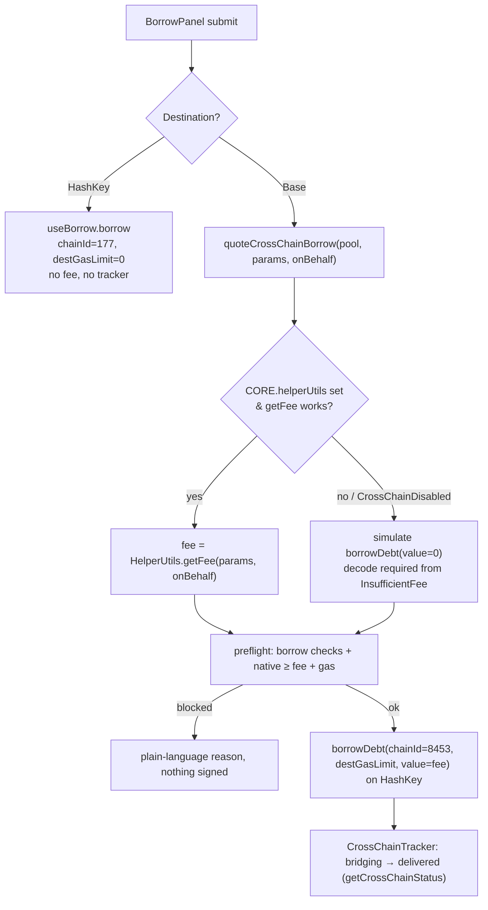

# Cross-Chain Borrow to Base - Plan

**Product Contract preservation:** Product Contract unchanged — R1–R11 and all product scope carried forward verbatim from the requirements-only version. Planning added the Planning Contract, Implementation Units, Verification Contract, and Definition of Done below.

## Goal Capsule

- **Objective:** Let a user borrow pxUSDT against their HashKey collateral and receive it on Base, exposed as a destination-chain picker inside the existing borrow flow, wired to the live CCIP rail (not mock).
- **Product authority:** Frontend owner (brainstorm). Contract side is shipped and the borrow rail is enabled on the owner's live deployment.
- **Open blockers:** None. The rail is verified enabled on-chain (2026-07-11): the `LendingPoolFactory` has `ccipRouter` and `chainIdToSelector(8453)` set, so cross-chain `borrowDebt` clears its `CrossChainDisabled` gate. The fee is quoted via the revert-probe (`HelperUtils.getFee` is a permanent stub); excess `msg.value` is refunded by the contract. Final sign-off still needs one real mainnet cross-chain borrow to confirm `destGasLimit` on a market with a fresh collateral price feed (see Verification Contract / Open Questions).

---

## Product Contract

### Summary

Add a "Receive on" destination-chain selector to the existing `BorrowPanel`. HashKey (default) keeps today's same-chain borrow. Choosing Base routes `borrowDebt` through the live CCIP rail — `chainId=8453`, a generous `destGasLimit`, and the quoted CCIP fee attached as `msg.value` — so the borrowed pxUSDT is bridged to the user's EOA on Base, with a two-hop tracker shown until it arrives.

### Problem Frame

Borrowing only pays out on HashKey today. A user whose liquidity, trading, or downstream DeFi lives on Base has to borrow on HashKey and then bridge the pxUSDT out themselves — a second manual hop with its own fees, waiting, and failure surface. The contract now folds that hop into the borrow itself: one HashKey transaction borrows against collateral and delivers the asset on Base. The frontend is the missing half — the rail exists but nothing in the UI lets a user pick a destination or reason about the cross-chain fee before signing.

### Key Decisions

- **Real write path, mocked delivery status.** The borrow rail is live, so the write is wired real — quote the fee, call the payable `borrowDebt`, attach `msg.value`. The destination-side delivery observation stays modeled through the indexer adapter (mock) until the indexer ships, mirroring `useCrossChainSupply`.
- **Picker inside `BorrowPanel`, not a separate panel.** Cross-chain is one option of the borrow flow, not a parallel feature. This differs from cross-chain supply, which lives in its own `CrossChainSupplyPanel` because supply originates on Base.
- **Base-only destination.** Only the HashKey↔Base lane is live, so the picker lists HashKey and Base only. The dialog shape (mirroring swap's `TokenSelectDialog`) leaves room to add lanes later without a redesign.
- **Fee paid in HashKey native gas, on the borrow tx itself.** Unlike cross-chain supply (fee paid on Base), the cross-chain borrow fee is `msg.value` on the HashKey `borrowDebt` call. Pre-flight must guard the user's native HashKey balance, or the payable call reverts after the user has already committed.
- **No approval step.** The user receives funds rather than sending a token, so there is no ERC-20 approval — again unlike cross-chain supply.

### Requirements

**Destination selection**

- R1. `BorrowPanel` gains a "Receive on" destination-chain selector rendered as a button that opens a chain-picker dialog, following the interaction pattern of swap's `TokenSelectDialog`.
- R2. The picker lists HashKey (default, pre-selected) and Base. The Base option is gated on `CROSS_CHAIN.borrowBridge.enabled` — hidden or disabled when the rail is off.
- R3. Selecting HashKey keeps the current same-chain borrow behavior unchanged (no fee, no bridge, no tracker).

**Cross-chain borrow execution**

- R4. Selecting Base marks the borrow as cross-chain: `borrowDebt` is called with `chainId = 8453` and a generous fixed `destGasLimit`, so the borrowed pxUSDT is bridged to the user's EOA on Base.
- R5. The quoted CCIP fee is attached as `msg.value` on the `borrowDebt` call.
- R6. The user stays on HashKey (chain 177) for the entire action — no network switch is required at any step.
- R7. No token-approval step is performed for the cross-chain borrow.

**Fee and pre-flight safety**

- R8. Before the user signs, the CCIP fee is quoted and displayed in the panel alongside the borrow amount.
- R9. Pre-flight validates that the user's native HashKey balance covers the fee plus transaction gas, in addition to the existing borrow checks (live max-borrow, available pool liquidity, price freshness). Insufficient native balance blocks the action with a plain-language reason before anything is signed.

**Delivery tracking**

- R10. After the HashKey borrow tx confirms, the panel shows a two-hop tracker (HashKey → Base) reusing `CrossChainTracker` and the `useCrossChainTransfer` persistence, so an in-flight transfer survives navigation and reload.
- R11. Delivery status resolves through the indexer adapter keyed by the CCIP `messageId`. The tracker reaches its "arrived" state only when a real indexer row observes delivery on Base. In live data mode with no real indexer (the mock fallback) or a non-real `messageId`, the tracker must NOT promote to "arrived" — it caps at "bridging" and surfaces the CCIP explorer link (`https://ccip.chain.link/msg/<messageId>`) so the user verifies delivery themselves.

### Scope Boundaries

- **Deferred for later:**
  - Cross-chain repay (the reverse direction — repaying HashKey debt from Base).
  - Destination chains beyond Base — only the HashKey↔Base lane is live today.
  - Real indexer-driven delivery status — stays mock until the indexer ships.
- **Not in scope:** any change to same-chain borrow behavior; the cross-chain path is additive.

---

## Planning Contract

### Key Technical Decisions

- KTD1. **Fee quote is real and two-tier — never mock in live mode.** `quoteCrossChainBorrow` resolves the CCIP fee against the live chain:
  1. **Primary — `HelperUtils.getFee(params, onBehalf)`** (a `view`) when `CORE.helperUtils` is configured with the live, rail-enabled address. The FE already ships this ABI (`src/lib/contracts/abis/helperUtils.ts`).
  2. **Fallback — revert-probe.** `simulateContract` on `LendingPool.borrowDebt` with `value: 0n`; the payable path reverts `InsufficientFee(required, provided)`, and `required` is decoded as the fee. This needs no new address and works directly against the live pool discovered via the indexer. Used when `helperUtils` is unset or `getFee` reverts `CrossChainDisabled`.

  Rationale: the owner's SC deployment has the rail enabled, but the HelperUtils address in the reachable source/broadcast was a stale, disabled build (`getFee` reverts `CrossChainDisabled` on-chain today). Anchoring only to a single quote address would be brittle; the fallback keeps the feature real without depending on an address that may have changed across the redeploy.

- KTD2. **Extend the adapter seam, don't bypass it.** Add `quoteCrossChainBorrow(pool, params, onBehalf) => Promise<bigint>` to `ChainAdapter`, and extend `borrowDebt` to accept an optional `value`. The live adapter implements both real; the mock returns a deterministic fee and ignores `value`. Preserves the single mock↔live swap point (`getAdapters`) so no domain hook imports a concrete adapter.

- KTD3. **Borrow stays on HashKey; no approval.** Reuse `useWriteAction` with its default `requiredChainId: HASHKEY.id`; pass no `approval` spec (the user receives funds). `send()` calls `chain.borrowDebt(pool, { amount, chainId: BASE.id, destGasLimit }, onBehalf, fee)`. `BASE.id` (8453) is already a config constant; Base is deliberately NOT added to the wallet `chains` list.

- KTD4. **Native-gas sufficiency is a pre-flight gate.** The fee is `msg.value` in native HSK on the HashKey tx. Add a pure check composed with `preflightBorrow`: block when `nativeBalance < fee + gasHeadroom`. The hook reads native balance via wagmi `getBalance` on HashKey and feeds it in, keeping `preflight.ts` pure and unit-testable.

- KTD5. **Destination picker via `ActionPanel.headerRight`.** `BorrowPanel` holds destination state and renders a `ChainSelectButton` in `ActionPanel`'s existing `headerRight` slot; the button opens a `ChainSelectDialog` mirroring `TokenSelectDialog`. When `CROSS_CHAIN.borrowBridge.enabled` is false, the Base row renders **disabled with an explanatory caption** (mirroring `TokenSelectDialog`'s disabled-row copy, e.g. "Cross-chain borrow unavailable"), not hidden — the `ChainSelectButton` still renders so the affordance is discoverable.

- KTD8. **Fee quote fires only for a valid borrow amount, with explicit UI states.** The only currently-operative quote path is the revert-probe, which reaches the `InsufficientFee` check *after* the contract validates the borrow — so a fee cannot be quoted for an empty, mid-typing, or over-max-borrow amount (R8's "reactive display" is bounded by this). The fee query therefore fires only once the amount passes the local borrow gates (positive, within `getMaxBorrowAmount`, fresh price). While the query is pending, the fee row shows a loading state and the Borrow button stays disabled; on a quote error (rail disabled on-chain, or probe unreachable), the panel shows a plain "Cross-chain fee unavailable right now" message and blocks submit. The R9 native-gas gate treats an unresolved `fee` as not-ready and keeps submit disabled — the user can never sign before both the fee and the native-gas check resolve.

- KTD6. **Delivery tracking reuses the supply machinery, namespaced per feature.** `CrossChainTracker` + `useCrossChainTransfer` (localStorage-persisted) + indexer `getCrossChainStatus(messageId)`. `useCrossChainTransfer` currently persists to a single hardcoded key (`paboxo:crosschain`) already consumed by `CrossChainSupplyPanel`; reused as-is, an in-flight supply and an in-flight borrow would collide in one slot and render the wrong direction. So the hook must be namespaced (per-feature key/param, e.g. `paboxo:crosschain:borrow`) before the borrow panel consumes it. The `messageId` must be parsed from the real `BorrowDebtCrossChain` receipt before the live write path ships — a mock id must never drive a real-mode "arrived" (see R11); the mock id is acceptable only in `VITE_DATA_MODE=mock`.

- KTD7. **`destGasLimit` is a named constant, conservative, and mainnet-verified.** A cross-chain borrow mints pxUSDT to the EOA on Base and does not deploy a Position, so it needs less than supply's `5_000_000`. Start from a conservative default and confirm the real floor with a mainnet transfer before finalizing.

### High-Level Technical Design

Submit-time branch and the two-tier real fee quote (directional guidance, not implementation spec):

### Assumptions

- Cross-chain `borrowDebt` (`chainId=8453`) is **enabled and verified on-chain (2026-07-11)**: the `LendingPoolFactory` (`0xF0D1c6…`) has `ccipRouter = 0xf2Fd62…` and `chainIdToSelector(8453) = 15971525489660198786`, so `_borrowDebtCrosschain`'s `CrossChainDisabled` gate is cleared. The fee is `IRouterClient.getFee(destSelector, message)` computed inside the contract, paid via `msg.value`, reverting `InsufficientFee(required, provided)` on shortfall.
- `HelperUtils.getFee` is a permanent `pure`-revert stub in this deployment (always `CrossChainDisabled`), so the fee is quoted via the **revert-probe** (`simulateContract borrowDebt(value:0)` → decode `InsufficientFee`). The probe reaches the fee check only for a valid borrow (the contract validates before the CCIP send) — true at real submit time; the reactive display simply shows no fee until the amount is valid (KTD8).
- Excess `msg.value` is **refunded** by the contract (`_borrowDebtCrosschain` returns `msg.value - fee`), so the hook attaches a +20% buffer over the quote to survive fee drift.

### Sequencing

U1 → (U2, U4, U5 in parallel) → U3 → U6. U3 depends on U2 and U4; U6 depends on U3 and U5.

---

## Implementation Units

### U1. Config: HelperUtils address and CCIP selector

- **Goal:** Make the live rail addressable from FE config without hardcoding into adapters.
- **Requirements:** R4, R8 (enables the real quote path).
- **Dependencies:** none.
- **Files:** `src/lib/contracts/addresses.ts` (add `helperUtils: Address` to `CoreAddresses` + `CORE`; keep the HashKey→Base CCIP selector `15971525489660198786` as a named constant if the revert-probe/quote needs it). Confirm `BASE` and `BASE.id` are exported from `#/lib/contracts`.
- **Approach:** Add the optional `helperUtils` field. If the live address is not yet supplied, leave it unset and document that the adapter falls back to the revert-probe (KTD1) — the field being empty is a supported state, not a build blocker.
- **Patterns to follow:** the existing `CORE` / `CROSS_CHAIN` shapes in the same file.
- **Test scenarios:** `Test expectation: none — pure config/address wiring; behavior is exercised through U2's adapter tests.`
- **Verification:** typecheck passes; `CORE.helperUtils` and `BASE.id` are importable where U2 uses them.

### U2. Adapter seam: cross-chain borrow quote and payable send

- **Goal:** Add a real fee quote and a value-carrying `borrowDebt` behind the `ChainAdapter` interface, with mock parity.
- **Requirements:** R4, R5, R7, R8.
- **Dependencies:** U1.
- **Files:** `src/lib/data/types.ts` (add `quoteCrossChainBorrow`; extend `borrowDebt` with optional `value`), `src/lib/data/chain/chainAdapter.ts` (live impl), `src/lib/data/chain/chainAdapter.mock.ts` (mock impl), `src/lib/data/chain/chainAdapter.test.ts`.
- **Approach:** `quoteCrossChainBorrow` implements KTD1's two tiers — read `HelperUtils.getFee` when `CORE.helperUtils` is set and it does not revert `CrossChainDisabled`, else `simulateContract` `borrowDebt` with `value: 0n` and decode `required` from the `InsufficientFee` error (viem surfaces the decoded error name/args on the thrown error's `cause`). Extend live `borrowDebt` to pass `value` through `writeWithGas` → `writeContract`. Mock: return a deterministic small fee; accept and ignore `value`.
- **Patterns to follow:** existing `borrowDebt` live impl (`chainAdapter.ts`), the `quoteCrossChainSupply`/`supplyToHashKey` interface entries, and the mock adapter's other cross-chain stubs.
- **Test scenarios:**
  - Covers R8. `quoteCrossChainBorrow` returns the fee from `HelperUtils.getFee` when `helperUtils` is configured and the read succeeds.
  - Covers R8. When `getFee` reverts `CrossChainDisabled` (or `helperUtils` is unset), it falls back to the revert-probe and returns the `required` value decoded from `InsufficientFee(required, provided)`.
  - When the revert-probe reverts with a non-fee error (e.g. a borrow-validation error), it rethrows rather than returning a bogus fee.
  - Covers R5, R7. Live `borrowDebt` forwards `value` to the write call and issues no approval.
  - Mock `quoteCrossChainBorrow` returns a deterministic fee and mock `borrowDebt` resolves without a value dependency.
- **Verification:** unit tests green; live and mock both satisfy the extended `ChainAdapter` type.

### U3. `useCrossChainBorrow` hook

- **Goal:** Own the cross-chain borrow flow — reactive fee quote, pre-flight, payable send, delivery status.
- **Requirements:** R4, R5, R6, R7, R8, R9, R10, R11.
- **Dependencies:** U2, U4.
- **Files:** `src/features/borrow/hooks/useCrossChainBorrow.ts`, `src/features/borrow/hooks/useCrossChainBorrow.test.tsx`.
- **Approach:** Mirror `useCrossChainSupply`. Expose `fee`, a fee query status (`loading` / `ready` / `error`), `bridgeStatus`, `messageId`, and a `borrow(amount, onBehalf?)`. The fee query is debounced and keyed on pool/amount/destination/onBehalf, and fires **only when the amount already passes the local borrow gates** (positive, within `getMaxBorrowAmount`, fresh price) — the revert-probe cannot return a fee for an invalid borrow (KTD8), so quoting a not-yet-valid amount is skipped rather than surfaced as an error. Compose `preflightBorrow` with the native-gas check from U4, treating an unresolved/errored `fee` as not-ready. Call `write.run` with default `requiredChainId: HASHKEY.id`, no `approval`, `send: () => chain.borrowDebt(pool, { amount, chainId: BASE.id, destGasLimit: DEST_GAS_LIMIT }, borrower, fee)`. After confirm, drive `bridgeStatus` via `indexer.getCrossChainStatus`, but never promote to "delivered" from a mock/non-real `messageId` in live mode (R11, KTD6).
- **Execution note:** Start from a failing test asserting the Base send uses `chainId = BASE.id` and attaches `value = fee`; that contract is the crux of the unit.
- **Patterns to follow:** `src/features/crosschain/hooks/useCrossChainSupply.ts`, `src/features/borrow/hooks/useBorrow.ts`.
- **Test scenarios:**
  - Covers R4, R5. Sends `borrowDebt` with `chainId = BASE.id`, a non-zero `destGasLimit`, and `value = fee`.
  - Covers R6, R7. Runs on HashKey with no chain switch and no approval issued.
  - Covers R9. Blocks when native balance is below `fee + headroom`, surfacing a plain reason before signing.
  - Covers R9. Blocks on the existing borrow gates (over max-borrow, insufficient liquidity, stale price).
  - Covers R8, KTD8. The fee query does not fire (no error surfaced) for an empty or over-max-borrow amount; it fires once the amount is locally valid; submit stays disabled while the fee is loading or errored.
  - Covers R10, R11. On confirm, `bridgeStatus` goes `bridging` then `delivered` when a real indexer row reports delivery; in live mode with the mock indexer or a non-real `messageId`, it caps at `bridging` and never reports `delivered`.
- **Verification:** hook tests green; a same-chain borrow through `useBorrow` is untouched.

### U4. Native-gas sufficiency pre-flight

- **Goal:** A pure gate that blocks a cross-chain borrow the user cannot pay the fee for.
- **Requirements:** R9.
- **Dependencies:** none (parallel with U2).
- **Files:** `src/lib/tx/preflight.ts` (add a native-fee check + extend/compose `BorrowContext`), `src/lib/tx/preflight.test.ts`.
- **Approach:** Add a pure `nativeFee`/`preflightCrossChainBorrow` check taking `nativeBalance`, `fee`, and a `gasHeadroom`; compose it with `preflightBorrow`. The hook (U3) supplies the live native balance; `preflight.ts` reads nothing itself (KTD4).
- **Patterns to follow:** the existing per-action gates and `firstBlock` composition in `preflight.ts`.
- **Test scenarios:**
  - Covers R9. Blocks when `nativeBalance < fee + gasHeadroom`, with a message naming the native-gas shortfall.
  - Covers R9. Passes when native balance covers fee plus headroom and all borrow gates pass.
  - Ordering: an existing borrow block (e.g. over max-borrow) still takes precedence when both fail.
- **Verification:** unit tests green; pure functions, no chain reads.

### U5. Chain-select dialog and button

- **Goal:** The destination picker UI, gated on the rail flag.
- **Requirements:** R1, R2.
- **Dependencies:** none (parallel).
- **Files:** `src/features/borrow/components/ChainSelectDialog.tsx`, `src/features/borrow/components/ChainSelectButton.tsx`, `src/features/borrow/components/ChainSelectDialog.test.tsx`.
- **Approach:** Mirror `TokenSelectDialog`/`TokenSelectButton` over the `Dialog` primitive. Rows: HashKey (default) and Base. When `CROSS_CHAIN.borrowBridge.enabled` is false, the Base row is **disabled with an explanatory caption** (not omitted), mirroring `TokenSelectDialog`'s disabled-row copy; the `ChainSelectButton` still renders. The button shows the current destination and opens the dialog.
- **Patterns to follow:** `src/features/swap/components/TokenSelectDialog.tsx`, `TokenSelectButton.tsx`, `src/components/ui/Dialog`.
- **Test scenarios:**
  - Covers R1. Selecting Base fires `onSelect('base')` and closes the dialog.
  - Covers R2. HashKey is the default/pre-selected row.
  - Covers R2. Base is absent or disabled when `borrowBridge.enabled` is false.
- **Verification:** component tests green; dialog is keyboard-accessible like its swap sibling.

### U6. Wire BorrowPanel

- **Goal:** Compose the picker, fee display, dual submit routing, and tracker into the existing panel.
- **Requirements:** R1, R2, R3, R6, R8, R10, R11.
- **Dependencies:** U3, U5.
- **Files:** `src/features/borrow/components/BorrowPanel.tsx`, `src/features/borrow/components/BorrowPanel.test.tsx`, `src/features/crosschain/useCrossChainTransfer.ts` (add a per-feature namespace/key param; update `CrossChainSupplyPanel` to pass the supply namespace).
- **Approach:** Add destination state (`'hashkey' | 'base'`, default HashKey). Render `ChainSelectButton` via `ActionPanel`'s `headerRight`. Route `onSubmit`: HashKey → existing `useBorrow.borrow`; Base → `useCrossChainBorrow.borrow`. For Base, render the fee row with its loading/ready/error state (KTD8) and keep Borrow disabled until the fee resolves; once a transfer is in flight, render `CrossChainTracker` fed by the **borrow-namespaced** `useCrossChainTransfer` (KTD6) so it never collides with an in-flight supply transfer. HashKey path is byte-for-byte the current behavior.
- **Patterns to follow:** current `BorrowPanel.tsx`, `CrossChainSupplyPanel.tsx` (tracker + persisted transfer wiring).
- **Test scenarios:**
  - Covers R3. With HashKey selected, submit calls the same-chain borrow with no fee row and no tracker.
  - Covers R1, R8. With Base selected, the fee is shown and submit routes to the cross-chain hook; while the fee is loading or errored, Borrow stays disabled.
  - Covers R10, R11. An in-flight Base transfer renders the two-hop tracker and survives a remount (persisted), and does not surface an in-flight *supply* transfer (separate namespace).
  - Covers R2. When the rail flag is off, the Base row is disabled with a caption (not omitted) and submit stays on the same-chain path.
- **Verification:** panel tests green; manual smoke of both destinations in `VITE_DATA_MODE=mock`.

---

## Open Questions

Resolve during implementation or the mainnet verification run — none block starting the build:

- **Non-EOA recipient safety.** Confirmed against the contract source: `_borrowDebtCrosschain` sets the CCIP `receiver = abi.encode(_msgSender())`, so funds land at the caller's own address on Base. A smart-contract/AA wallet may not control the same address on Base — real funds could land somewhere unrecoverable. Decide whether to gate the Base destination to EOAs (detect via bytecode / connector type) or accept the risk with a warning.
- **Fee drift (refund confirmed).** Resolved in part: the contract refunds any excess `msg.value` (`_borrowDebtCrosschain` returns `msg.value - fee`), so the +20% buffer the hook attaches is safe. A fee *spike* beyond the buffer between quote and mining still reverts `InsufficientFee` after signing — acceptable (failed tx, negligible gas) but re-quoting immediately before send would shrink the window further.
- **`destGasLimit` under-provisioning = debt without delivery.** If the destination `ccipReceive` runs out of gas, the pxUSDT is never minted on Base but the HashKey debt is already booked (irreversible). The message uses `allowOutOfOrderExecution: true` (EVMExtraArgsV2). Confirm the floor on mainnet (KTD7) and document whether CCIP manual re-execution is available on this lane as the recovery path.
- **Tracker failure terminal state.** `CrossChainTracker` models `sent`/`relaying`/`arrived` plus an overdue nudge but no `failed` state. Decide whether a delivery failure surfaces a distinct terminal state and next step (inherited gap from the supply tracker).
- **Receipt `messageId` parsing ownership.** Parsing the real `messageId` from the `BorrowDebtCrossChain` receipt is required before the live write path ships (R11); confirm it lands inside U3 rather than floating as unassigned work.
- **Verification market — avoid the stale-feed market.** On-chain check (2026-07-11): the keeper is live and refreshes pxUSDT / pxWHSK-market / pxWBTC / pxWETH feeds (~1 min old), but the dedicated cross-chain market's collateral (`pxWHSK-xchain`, `0x7c9c…`) feed is ~41h stale, so any borrow there reverts `PriceStale`. Run the mainnet verification on a fresh-feed pxUSDT market (e.g. pxWBTC or pxWETH collateral), not the pxWHSK-xchain market — and flag to the keeper team that the cross-chain collateral feed is not being refreshed.

## Verification Contract

| Gate | Command / action | Applies to |
|---|---|---|
| Unit tests | `bun run test` | U2, U3, U4, U5, U6 |
| Types | `bun run typecheck` | all units |
| Lint | `bun run lint` | all units |
| Mock smoke | `bun run dev`, borrow with destination = Base in `VITE_DATA_MODE=mock` | U6 |
| Live confirmation | With `VITE_DATA_MODE=live` and a funded position, execute one real cross-chain borrow; confirm the quoted fee matches, the tx succeeds, and pxUSDT arrives on Base (verify the `messageId` at `https://ccip.chain.link/msg/<messageId>`) | KTD1, KTD7, Assumptions |

The live confirmation run is what promotes the fee path and `destGasLimit` from "wired" to "proven," and settles the excess-`msg.value` refund question.

## Definition of Done

- R1–R11 satisfied and covered by the unit/component tests above.
- `quoteCrossChainBorrow` resolves a real fee on the live chain via `HelperUtils.getFee` (when configured) or the `InsufficientFee` revert-probe; mock mode returns a deterministic fee.
- `bun run test`, `bun run typecheck`, and `bun run lint` pass.
- The same-chain borrow path is unchanged.
- In live mode the tracker never reports "arrived" from a mock/non-real `messageId`; delivery promotion requires a real indexer observation, and the CCIP explorer link is surfaced meanwhile (R11).
- The cross-chain transfer tracker is namespaced so a borrow transfer and a supply transfer never collide.
- One real mainnet cross-chain borrow verified end-to-end (fee correct, delivery on Base observed), with `destGasLimit` confirmed and the excess-`msg.value` behavior settled.

---

## Sources / Research

- `src/lib/contracts/addresses.ts:103-147` — `CrossChainAddresses` and `CROSS_CHAIN.borrowBridge` (token + burn&mint pool per chain, `enabled`); `CORE` lacks a `helperUtils` field (U1 adds it).
- `src/lib/contracts/abis/lendingPool.ts:124-156` — `borrowDebt(BorrowParams, _onBehalf)` `payable`, `BorrowParams { amount, chainId, destGasLimit }`; `:713` — `BorrowDebtCrossChain` event; `InsufficientFee` / `CrossChainDisabled` errors.
- `src/lib/contracts/abis/helperUtils.ts:111` — `getFee(BorrowParams, address)` view (fee quote); `CrossChainDisabled` error at `:299`.
- `src/features/borrow/hooks/useBorrow.ts` — same-chain borrow (`chainId: HASHKEY.id, destGasLimit: 0`); the cross-chain variant branches from here.
- `src/features/crosschain/hooks/useCrossChainSupply.ts`, `src/features/crosschain/components/CrossChainSupplyPanel.tsx`, `src/features/crosschain/useCrossChainTransfer.ts` — mirror pattern for quote → payable send → `bridging` state and the persisted two-hop tracker.
- `src/components/action/ActionPanel.tsx` — `headerRight` and `belowSlider` slots used by U6; `src/features/swap/components/TokenSelectDialog.tsx` — picker pattern for U5.
- `src/lib/tx/useWriteAction.ts` — the write wrapper (chain guard, optional approval, tx state); `src/lib/tx/preflight.ts` — pure per-action gates U4 extends.
- `src/lib/data/types.ts:164-219` — adapter seam (`borrowDebt`, `quoteCrossChainSupply`, `supplyToHashKey`); `getCrossChainStatus` / `CrossChainStatus:249`; `src/lib/data/registry.ts` — mock↔live swap point.
- Live verification (2026-07-11): `HelperUtils` at `0x02a66b51…9212` returns `CrossChainDisabled()` (`0x8ecd0542`) for `getFee` — a stale build; the owner confirms the rail is enabled on their current deployment, so U2's quote is address-configurable with the revert-probe fallback. CCIP HashKey→Base selector `15971525489660198786` (contract `DEPLOYMENT.md`).
