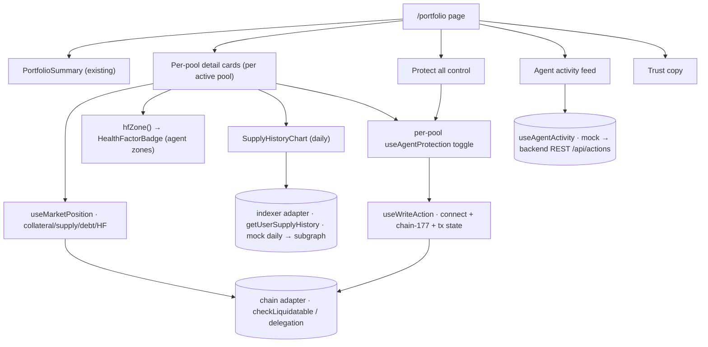

# Portfolio Dashboard + Rebalance-Agent Protection - Plan

## Goal Capsule

- **Objective:** Finish the `/portfolio` page as a detailed per-pool position dashboard, and surface the Rebalance Agent — a Health Factor readout, a free "protect my position" opt-in (all + per-pool), and an AI activity/reasoning feed — using the data that is already on-chain today, with the agent's off-chain feed mocked until its backend is ready.
- **Product authority:** ahmadzz (frontend owner).
- **Open blockers (external, not FE code):**
  - Agent backend REST (`/api/actions`, `/api/positions/{user}`, `/api/alerts`) base URL + proxy not available yet — the activity/reasoning feed is mocked until then.
  - Supply-over-time history source unconfirmed (see Dependencies) — the chart is mocked/derived (daily buckets) until the per-user series is available.

## Product Contract

### Summary

Turn `/portfolio` from a summary into a detailed per-pool dashboard. For each pool the user is in, show their **collateral**, **supplied liquidity**, **debt**, and **Health Factor** (color-zoned), plus a **supply-over-time chart** (daily trend). Surface the **Rebalance Agent**: a free opt-in "🛡️ Protect my position" as both a global "protect all" and a per-pool toggle (direct `approveRebalanceDelegation`, no payment), and an AI activity + reasoning feed (`llmMessage`) that is mocked behind a swap-ready seam and badged as preview until the agent backend lands. Trust copy reassures the user throughout.

### Problem Frame

Paboxo's `/portfolio` today shows a cross-pool summary, a position dashboard, and recent activity, but stops short of what a borrower actually needs to manage risk: a per-pool breakdown of what they hold and owe, how healthy each position is, and whether the position is protected. The Rebalance Agent (an off-chain AI keeper) can protect a borrower from liquidation by rotating collateral when their Health Factor drops — but only if the user opts in (grants rebalance-delegation to the agent). The on-chain pieces for this exist (delegation reads/writes, `checkLiquidatable` for HF, the keeper address is configured); what's missing is the FE surface to opt in, see health, and see what the agent did (and why). The agent's reasoning feed depends on a backend that isn't ready, so that part must be built behind a seam and deferred.

### Key Decisions

- **Protection is a free on-chain opt-in, not an HSP payment.** Enabling protection is a direct `approveRebalanceDelegation(agentKeeper, true)`; disabling is `(…, false)`. The HSP-paid flow (`useProtection`) stays in the codebase as an optional/premium path but is not the portfolio's default toggle — HSP is hackathon/preview-grade and needs creds the free toggle doesn't.
- **Protection has two levels: "protect all" and per-pool.** A single "🛡️ Protect all my positions" iterates the delegation write across every pool the user has a position in; each pool also has its own toggle. "Protect all" is one transaction per pool (multiple signatures), not a batched call.
- **Per-pool detail, not one aggregate.** Collateral, supplied liquidity, debt, and Health Factor are shown per pool, because `checkLiquidatable` and the position reads are per user + market.
- **Health Factor uses the agent's zones.** HF = `maxCollateralValue / borrowValue`; color zones: ≥1.30 green (healthy), 1.15–1.30 yellow (the agent acts here), 1.00–1.15 orange (danger), <1.00 red (liquidatable). Copy explains the agent is active in the yellow zone.
- **The AI activity/reasoning feed is mocked behind a swap-ready seam.** The feed renders `llmMessage`, HF-at-action, lever, outcome, amount, tx link, and time from a mock now; it swaps to the backend REST (`/api/actions?user=`) when the base URL + proxy exist. The feed is badged "preview/simulation" so mock data never reads as real agent activity.
- **`dry-run` outcomes render as "simulation", not "failed".** Per the integration guide, a `dry-run` outcome is a successful simulation in the test environment.
- **FE reads the public agent address from config only.** `PROTECTION.agentKeeper` (`0x1840…9F0b`) is already set; the FE never needs the keeper private key.

### Actors

- A1. **Position holder** (borrower/lender) — views their per-pool positions, health, and supply trend; opts protection on/off (all or per-pool); reads the agent's activity.
- A2. **Rebalance Agent** (AI keeper, off-FE) — once delegated, rotates collateral to protect the position and writes an `llmMessage` explanation; the FE only opts in and displays its activity, never invokes it.

### Requirements

**Per-pool position detail**

- R1. `/portfolio` lists each pool the connected user has a position in, showing that pool's collateral, supplied liquidity, current debt, and Health Factor.
- R2. A user with no position sees an explicit empty state (not a blank or a zero-filled table).

**Health Factor**

- R3. Each per-pool row/card shows the Health Factor with a color zone: ≥1.30 green, 1.15–1.30 yellow, 1.00–1.15 orange, <1.00 red.
- R4. The yellow zone carries copy explaining the agent acts in this range (buffer 1.15 → target 1.30).

**Supply-over-time chart**

- R5. Each pool shows a supply-over-time chart (the user's supplied amount across a recent window — daily trend).
- R6. The chart specifies loading, empty (no history), and unavailable states; while the per-user series is not yet sourced, it renders from a mock/derived daily series behind the data seam.

**Rebalance-Agent protection**

- R7. A per-pool "🛡️ Protect my position" toggle reads current status via `getRebalanceDelegation(pool, user, agentKeeper)` and writes via `approveRebalanceDelegation(agentKeeper, true|false)`.
- R8. A global "Protect all my positions" control enables protection across every pool the user has a position in; it makes one delegation transaction per pool (the UI shows per-pool progress) and reflects a mixed state (some on, some off).
- R9. Every protection write goes through the app's write wrapper (connect + chain-177 verify + tx state), and protection status refreshes on success.

**Agent activity & reasoning**

- R10. An activity feed shows the agent's recent actions for the user: the `llmMessage` reasoning (lead element), HF-at-action, lever (`rotate`/`deleverage`/`signal-only`), outcome, rotated amount (token-formatted), a tx explorer link when `outcome = sent`, and a timestamp.
- R11. The feed is mocked behind a swap-ready seam (real source: the backend REST `/api/actions?user=`) and badged "preview" so mock content never reads as real agent activity; `dry-run` outcomes render as "simulation", not "failed".

**Trust**

- R12. The page carries trust copy: funds never leave the position, permission can be revoked anytime, and the LLM only writes explanations (the numeric decisions are deterministic on-chain math).

### Key Flows

- F1. **Protect a single pool**
  - **Trigger:** A1 wants the agent to guard one pool's position.
  - **Steps:** open `/portfolio` → find the pool → read current protection status → flip the toggle → `approveRebalanceDelegation(agentKeeper, true)` through the write wrapper → status refreshes to protected.
  - **Covered by:** R7, R9.
- F2. **Protect all positions**
  - **Trigger:** A1 wants every position guarded at once.
  - **Steps:** click "Protect all" → the UI iterates the not-yet-protected pools, one delegation tx per pool, showing per-pool progress → ends in an all-protected (or mixed) state.
  - **Covered by:** R8, R9.
- F3. **Understand what the agent did**
  - **Trigger:** A1 sees their HF recovered and wants to know why.
  - **Steps:** open the activity feed → read the latest action's `llmMessage` ("rotated 500 pxWHSK → pxUSDT, HF recovered to 1.31"), HF-at-action, outcome, and tx link (mocked/preview until the backend lands).
  - **Covered by:** R10, R11.

### Acceptance Examples

- AE1. **Per-pool detail.** **Given** a connected user with a position in pxWHSK, **then** the pool shows their collateral, supplied liquidity, debt, and HF for that pool only (not aggregated). **Covers R1.**
- AE2. **HF zones.** **Given** a position at HF 1.08, **then** its HF renders in the orange zone; at 1.31, green. **Covers R3.**
- AE3. **Protect single.** **Given** protection off on a pool, **when** the user flips the toggle, **then** `approveRebalanceDelegation(agentKeeper, true)` fires through the write wrapper and the toggle shows protected on success. **Covers R7, R9.**
- AE4. **Protect all (mixed).** **Given** the user has positions in three pools with one already protected, **when** they click "Protect all", **then** two delegation transactions fire (one per unprotected pool) with per-pool progress, ending all-protected. **Covers R8.**
- AE5. **Activity feed is preview.** **Given** the agent backend is not wired, **then** the activity feed renders mock actions with `llmMessage` under a "preview" badge, and a `dry-run` action reads as "simulation", not "failed". **Covers R10, R11.**
- AE6. **Empty position.** **Given** a connected user with no positions, **then** the dashboard shows an empty state, not a zero-filled table. **Covers R2.**

### Scope Boundaries

**Deferred for later**
- Real agent backend REST wiring (activity/reasoning `/api/actions`, status `/api/positions/{user}`, alerts `/api/alerts`) — mocked behind the seam until the base URL + proxy exist.
- Real per-user supply-over-time series — mocked/derived (daily) until the source is confirmed.

**Outside this product's identity (not FE work)**
- HSP-paid protection as the default opt-in path (kept as an optional/premium route only).
- The `deleverage` lever — requires the agent to be a factory operator (a protocol decision), not user-grantable from the FE.
- The agent's own execution (monitoring, rotating, LLM reasoning) — off-chain backend, not this FE.

### Dependencies / Assumptions

- On-chain reads/writes are already available and reused: per-pool position (collateral/supply/debt) + `healthFactor` via `useMarketPosition` (which calls `checkLiquidatable`), and delegation via `getRebalanceDelegation` / `approveRebalanceDelegation` on the chain adapter. `PROTECTION.agentKeeper` is configured (`0x1840…9F0b`).
- The supply-over-time series source is unconfirmed; until then it is a mock **daily** series behind the indexer seam (the agent's activity likewise mocked).
- The agent backend REST base URL is not specified for the FE (only the GraphQL indexer URL is known); the activity feed's real source is therefore deferred.
- **Security:** the FE needs only the public `AGENT_ADDRESS`. The Rebalance keeper private key and the JATEVO / DGRID API keys shared during brainstorming are secrets — they must never enter this repo, and the exposed ones should be rotated.

---

## Planning Contract

**Product Contract preservation:** unchanged. The chart granularity (daily) and the free-toggle-vs-HSP split were already captured as R5/R6 and the Key Decisions; this enrichment adds HOW only. Plan depth **Deep**; target repo `praboxo-fe`.

### Key Technical Decisions

- KTD1. **A new free protection hook, separate from the HSP-gated one.** `src/features/protection/hooks/useProtection.ts` pays an HSP fee before delegating; the portfolio needs a *free* opt-in. Add `useAgentProtection(market)` that reads status via `chain.getRebalanceDelegation` and writes `chain.approveRebalanceDelegation(agentKeeper, on)` through the one `useWriteAction` wrapper — no payment leg. `useProtectionStatus` (read-only) can be reused as-is. `PROTECTION.agentKeeper` is the target.
- KTD2. **Per-pool detail reuses `useMarketPosition`.** It already returns a single pool's supplies/borrows/`healthFactor` (from `checkLiquidatable`). The dashboard maps the user's active pools (from `useMarkets` + per-pool position) to detail cards; no new position read logic.
- KTD3. **One HF-zone helper drives all HF UI.** A pure `hfZone(hf)` util returns `healthy | watch | danger | liquidatable` for the agent thresholds (≥1.30 / 1.15–1.30 / 1.00–1.15 / <1.00). The existing `HealthMeter` is aligned to these zones (or a thin `HealthFactorBadge` wraps it) so the portfolio and the agent copy agree.
- KTD4. **Supply-over-time is a mock daily series behind the indexer seam.** Add an indexer-adapter read (e.g. `getUserSupplyHistory(user, pool)`) returning daily `{ ts, suppliedUsd }` points; the mock impl generates a plausible daily series, the real impl (later) queries the subgraph. A recharts component mirrors `MarketRateChart` / `MarketLiquidityChart`.
- KTD5. **The agent activity feed is its own mock-backed hook.** Add `useAgentActivity(user)` returning `AgentAction[]` (`llmMessage`, `hf`, `lever`, `outcome`, `amountIn`, `txHash`, `ts`) from a mock module now, swappable to the backend REST later. The feed component badges "preview" and maps `dry-run` → "simulation". This is a **new off-chain seam** (REST), parallel to the chain/indexer adapters — not the GraphQL indexer.
- KTD6. **"Protect all" is sequential per-pool writes with visible progress.** No batched multicall; iterate the not-yet-protected pools, each a `useAgentProtection` write, surfacing per-pool pending/confirmed/failed so a partial failure leaves a clear mixed state.

### High-Level Technical Design

---

## Implementation Units

### U1. HF-zone helper + HealthFactorBadge
- **Goal:** One place that maps a Health Factor to the agent's color zone, used by every HF surface.
- **Requirements:** R3, R4.
- **Dependencies:** none.
- **Files:** `src/lib/risk/hfZone.ts`, `src/lib/risk/hfZone.test.ts`, `src/components/ui/HealthFactorBadge.tsx`; align `src/components/ui/HealthMeter.tsx` to the same zones.
- **Approach:** `hfZone(hf)` → `'healthy' | 'watch' | 'danger' | 'liquidatable'` at ≥1.30 / 1.15–1.30 / 1.00–1.15 / <1.00. `HealthFactorBadge` renders the value + zone color + a short label; the `watch` zone carries the "agent acts here (1.15→1.30)" copy. Reuse the existing risk-color tokens.
- **Patterns to follow:** `src/lib/risk/health.ts`, `src/components/ui/HealthMeter.tsx`.
- **Test scenarios:** `Covers AE2.` hf 1.31→healthy(green), 1.20→watch(yellow), 1.08→danger(orange), 0.98→liquidatable(red); boundary values 1.30 and 1.15 land in the higher-safety zone; the watch zone renders the agent-range copy.
- **Verification:** every HF surface routes through `hfZone`; zones match the agent thresholds.

### U2. Free agent-protection hook
- **Goal:** A free (no-payment) per-pool protection opt-in over the existing delegation calls.
- **Requirements:** R7, R9.
- **Dependencies:** none.
- **Files:** `src/features/protection/hooks/useAgentProtection.ts`, `src/features/protection/hooks/useAgentProtection.test.tsx`; reuse `useProtectionStatus`, `PROTECTION`, `useWriteAction`, chain `approveRebalanceDelegation` / `getRebalanceDelegation`.
- **Approach:** `useAgentProtection(market)` exposes `active` (from `getRebalanceDelegation(pool, user, agentKeeper)`), `enable()` / `disable()` that call `approveRebalanceDelegation(agentKeeper, true|false)` through `useWriteAction`, and the tx state. No HSP `pay`/`verify` leg. Invalidate the `['protection', pool]` key on success so status refreshes.
- **Patterns to follow:** `src/features/protection/hooks/useProtection.ts` (minus the gateway legs), `src/features/delegation/hooks/useDelegation.ts`.
- **Test scenarios:** `Covers AE3.` `enable()` fires `approveRebalanceDelegation(agentKeeper, true)` through the wrapper and flips `active` on success; `disable()` sends `false`; a wallet on the wrong chain prompts a switch before send; status reads from `getRebalanceDelegation`.
- **Verification:** toggling protection changes on-chain delegation via the mock adapter with no payment step.

### U3. Per-pool position detail cards
- **Goal:** For each pool the user is in, a card showing collateral, supplied liquidity, debt, and HF.
- **Requirements:** R1, R2, R3.
- **Dependencies:** U1.
- **Files:** `src/features/portfolio/components/PoolPositionCard.tsx`, `src/features/portfolio/components/PoolPositionList.tsx`, `src/features/portfolio/components/PoolPositionList.test.tsx`; reuse `src/features/position/hooks/usePosition.ts` (`useMarketPosition`), `useMarkets`, `HealthFactorBadge`, state components.
- **Approach:** Resolve the user's active pools (markets where their position is non-empty), render a `PoolPositionCard` each: collateral (per-pool), supplied liquidity, debt, and `HealthFactorBadge`. Empty state when the user has no positions; loading/error states per the existing state components.
- **Patterns to follow:** `src/features/position/components/PositionDashboard.tsx`, `src/features/markets/components/MarketDetail.tsx` StatTiles.
- **Test scenarios:** `Covers AE1.` a user with a pxWHSK position sees that pool's collateral/supply/debt/HF, scoped to the pool (not aggregated); `Covers AE6.` a user with no positions sees the empty state; the HF badge zone reflects the pool's HF; loading and error states render.
- **Verification:** per-pool cards render each active pool's figures from `useMarketPosition`.

### U4. Supply-over-time chart (daily, mock series)
- **Goal:** A daily supply-history chart per pool, backed by a swap-ready indexer read.
- **Requirements:** R5, R6.
- **Dependencies:** U3.
- **Files:** `src/features/portfolio/components/SupplyHistoryChart.tsx`, `src/features/portfolio/hooks/useSupplyHistory.ts`, `src/features/portfolio/hooks/useSupplyHistory.test.tsx`; extend `src/lib/data/types.ts` (`IndexerAdapter` + a `SupplyPoint` type), `src/lib/data/indexer/indexerAdapter.mock.ts` (mock daily series), `src/lib/data/indexer/indexerAdapter.ts` (real stub/deferred).
- **Approach:** Add `getUserSupplyHistory(user, pool)` to the indexer adapter returning daily `{ ts, suppliedUsd }` points; the mock generates a plausible daily series, the real impl is a deferred subgraph query. `useSupplyHistory` wraps it via TanStack Query; `SupplyHistoryChart` renders a recharts area/line mirroring the analytics charts, with loading/empty/unavailable states.
- **Patterns to follow:** `src/features/analytics/components/MarketRateChart.tsx`, `MarketLiquidityChart.tsx`; the indexer mock pattern in `indexerAdapter.mock.ts`.
- **Test scenarios:** `Covers R5, R6.` the chart renders daily points from the mock series; empty history renders the empty state; an adapter error renders the unavailable state; the series is daily-bucketed (one point per day, not hourly).
- **Verification:** each pool card shows a daily supply trend; swapping the indexer to real needs no component change.

### U5. Protection controls (per-pool + protect all)
- **Goal:** A per-pool protection toggle on each card and a global "Protect all" control.
- **Requirements:** R7, R8, R9.
- **Dependencies:** U2, U3.
- **Files:** `src/features/protection/components/ProtectionToggle.tsx`, `src/features/protection/components/ProtectAllButton.tsx`, `src/features/protection/components/ProtectAllButton.test.tsx`; reuse `useAgentProtection` (U2).
- **Approach:** `ProtectionToggle` binds one pool's `useAgentProtection` to a switch (protected/unprotected + pending). `ProtectAllButton` iterates the user's not-yet-protected pools, firing one `enable()` per pool sequentially, surfacing per-pool progress and a mixed end state (some on/off). No batched multicall (KTD6).
- **Patterns to follow:** existing toggle/action components; `useWriteAction` tx-state UI.
- **Test scenarios:** `Covers AE3.` the per-pool toggle enables/disables protection for that pool; `Covers AE4.` with three pools and one already protected, "Protect all" fires two writes (one per unprotected pool) with per-pool progress and ends all-protected; a failed pool leaves a visible mixed state, not a silent all-or-nothing.
- **Verification:** protection can be toggled per pool and applied across all pools with visible progress.

### U6. Agent activity feed (mock, preview)
- **Goal:** A feed of the agent's recent actions with LLM reasoning, mocked and badged preview.
- **Requirements:** R10, R11.
- **Dependencies:** none.
- **Files:** `src/features/protection/hooks/useAgentActivity.ts`, `src/features/protection/agent/activity.mock.ts`, `src/features/protection/agent/types.ts`, `src/features/protection/components/AgentActivityFeed.tsx`, `src/features/protection/components/AgentActivityFeed.test.tsx`.
- **Approach:** Define `AgentAction` (`id`, `llmMessage`, `hf`, `lever`, `outcome`, `amountIn`, `token`, `txHash?`, `ts`). `useAgentActivity(user)` returns actions from a mock module now, behind a seam that swaps to the backend REST `/api/actions?user=` later. `AgentActivityFeed` renders each action with `llmMessage` leading, `HealthFactorBadge` for `hf`, a formatted amount, an explorer link when `outcome = sent`, and a timestamp; a "preview" badge sits on the section; `dry-run` renders as "simulation".
- **Patterns to follow:** `src/features/history/components/HistoryList.tsx`; the mock-adapter seam pattern.
- **Test scenarios:** `Covers AE5.` the feed renders mock actions with their `llmMessage` under a preview badge; a `sent` action shows an explorer link, a `dry-run` action reads as "simulation" (not "failed"); the rotated amount is token-formatted; empty history renders an empty state.
- **Verification:** the feed shows agent reasoning from the mock; swapping to the REST source needs no component change.

### U7. Assemble the Portfolio page + trust copy
- **Goal:** Wire the per-pool cards, protect-all control, activity feed, and trust copy into `/portfolio`.
- **Requirements:** R1, R2, R4, R8, R10, R12.
- **Dependencies:** U3, U4, U5, U6.
- **Files:** `src/routes/portfolio.tsx`, `src/features/portfolio/components/TrustNote.tsx`, `src/features/portfolio/components/PortfolioSummary.tsx` (kept).
- **Approach:** Compose the page: existing `PortfolioSummary` on top, then the `ProtectAllButton`, the `PoolPositionList` (each card with its supply chart + protection toggle), the `AgentActivityFeed`, and a `TrustNote` (funds never leave the position, revoke anytime, LLM advisory). Keep the existing `NetworkGuard` connect gate. Retire or fold the standalone `PositionDashboard`/`HistoryList` if the per-pool cards + activity feed supersede them (decide during implementation; do not duplicate the same data twice).
- **Patterns to follow:** current `src/routes/portfolio.tsx` composition.
- **Test scenarios:** `Covers R12.` the page renders the trust copy; the protect-all control, per-pool cards, and activity feed are present for a connected user with positions; the empty state shows when the user has none.
- **Verification:** `/portfolio` is a complete per-pool dashboard with HF, supply trend, protection (all + per-pool), and the agent activity feed.

---

## Verification Contract

| Gate | Command | Applies to | Done signal |
|---|---|---|---|
| Unit tests | `bun run test` | U1–U7 | all scenarios green |
| Typecheck | `bun run typecheck` | all units | no type errors |
| Lint | `bun run lint` | all units | clean |
| Format | `bun run check` | all units | clean |
| Manual smoke (mock) | `bun run dev` | all | connect wallet → `/portfolio` shows per-pool cards (collateral/supply/debt/HF zones) + daily supply chart; toggle protection per pool and via "Protect all" (per-pool progress) through the write wrapper; activity feed shows mock `llmMessage` under a preview badge with `dry-run` as "simulation"; empty state for a user with no positions |

## Definition of Done

- `/portfolio` lists each active pool with its collateral, supplied liquidity, debt, and Health Factor (agent color zones), with an explicit empty state (R1–R4).
- Each pool shows a daily supply-over-time chart backed by a swap-ready indexer read (mock now) (R5, R6).
- Protection is a free opt-in: a per-pool toggle and a "Protect all" control that iterates one delegation write per pool with visible per-pool progress and a mixed-state result, all through the write wrapper (R7–R9).
- An agent activity feed renders the mock `llmMessage` reasoning under a "preview" badge, `dry-run` as "simulation", with explorer links on `sent` (R10, R11).
- Trust copy is present (funds never leave the position, revoke anytime, LLM advisory) (R12).
- No HSP payment is in the portfolio path (HSP `useProtection` kept only as an optional route); the FE uses only the public agent address.
- All Verification Contract gates pass in mock mode; every R1–R12 is advanced by at least one unit.
